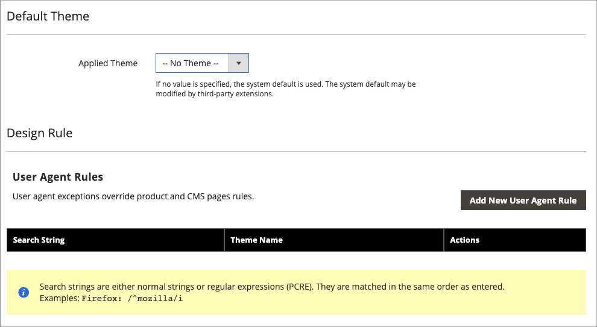

# Design-Konfiguration

Die Design-Konfiguration erleichtert die Bearbeitung von Design-bezogenen Regeln und Konfigurationseinstellungen, indem die Einstellungen auf einer einzelnen Seite angezeigt werden.

{width="700" zoomable="yes"}

## Ändern der Design-Konfiguration

1. Navigieren Sie in _Admin_-Seitenleiste zu **[!UICONTROL Content]** > _[!UICONTROL Design]_>**[!UICONTROL Configuration]**.

1. Suchen Sie die Store-Ansicht, die Sie konfigurieren möchten, und klicken Sie in der Spalte _[!UICONTROL Action]_auf **[!UICONTROL Edit]**.

   Auf der Seite werden die aktuellen Design-Einstellungen für die Store-Ansicht angezeigt.

1. Um das Standarddesign zu ändern, legen Sie **[!UICONTROL Applied Theme]** auf das Design fest, das Sie auf die Ansicht anwenden möchten.

   Wenn kein Design angegeben ist, wird das Standard-Design des Systems verwendet. Einige Erweiterungen von Drittanbietern ändern das Standarddesign des Systems.

1. [!BADGE Nur PaaS]{type=Informative url="https://experienceleague.adobe.com/en/docs/commerce/user-guides/product-solutions" tooltip="Gilt nur für Adobe Commerce in Cloud-Projekten (von Adobe verwaltete PaaS-Infrastruktur) und lokale Projekte."} Wenn das Design nur für ein bestimmtes Gerät verwendet werden soll, legen Sie die **[!UICONTROL User Agent Rules]** fest.

   {width="400" zoomable="yes"}

   Für jeden Gerätetyp, bei dem Sie ein Design angeben möchten:

   - Klicken Sie auf **[!UICONTROL Add New User Agent Rule]**.

   - Geben Sie **[!UICONTROL Search String]** die Browser-ID für das jeweilige Gerät ein.

     Eine Suchzeichenfolge kann entweder ein normaler Ausdruck oder ein mit Perl kompatibler regulärer Ausdruck (PCRE) sein (weitere Informationen finden Sie [Benutzeragent](https://en.wikipedia.org/wiki/User_agent)). Die folgende Suchzeichenfolge identifiziert Firefox:

         /^Mozilla/i
     
   - Wählen Sie **[!UICONTROL Theme Name]** das Design, das für das angegebene Gerät verwendet werden soll.

   >[!NOTE]
   >
   >Sie können beliebig viele Regeln für die Geräte hinzufügen, die Sie festlegen möchten. Die Suchzeichenfolgen werden in der Reihenfolge abgeglichen, in der sie eingegeben werden.

1. Erweitern Sie unter _[!UICONTROL Other Settings]_jeden Abschnitt und befolgen Sie die Anweisungen in den verknüpften Themen, um die Einstellungen nach Bedarf zu bearbeiten.

   - [!BADGE Nur PaaS]{type=Informative url="https://experienceleague.adobe.com/en/docs/commerce/user-guides/product-solutions" tooltip="Gilt nur für Adobe Commerce in Cloud-Projekten (von Adobe verwaltete PaaS-Infrastruktur) und lokale Projekte."} [[!UICONTROL Pagination]](../catalog/navigation-product-listings.md#pagination-controls)
   - [!BADGE Nur PaaS]{type=Informative url="https://experienceleague.adobe.com/en/docs/commerce/user-guides/product-solutions" tooltip="Gilt nur für Adobe Commerce in Cloud-Projekten (von Adobe verwaltete PaaS-Infrastruktur) und lokale Projekte."} [[!UICONTROL HTML Head]](page-setup.md#html-head)
   - [!BADGE Nur PaaS]{type=Informative url="https://experienceleague.adobe.com/en/docs/commerce/user-guides/product-solutions" tooltip="Gilt nur für Adobe Commerce in Cloud-Projekten (von Adobe verwaltete PaaS-Infrastruktur) und lokale Projekte."} [[!UICONTROL Header]](page-setup.md#header)
   - [!BADGE Nur PaaS]{type=Informative url="https://experienceleague.adobe.com/en/docs/commerce/user-guides/product-solutions" tooltip="Gilt nur für Adobe Commerce in Cloud-Projekten (von Adobe verwaltete PaaS-Infrastruktur) und lokale Projekte."} [[!UICONTROL Footer]](page-setup.md#footer)
   - [!BADGE Nur PaaS]{type=Informative url="https://experienceleague.adobe.com/en/docs/commerce/user-guides/product-solutions" tooltip="Gilt nur für Adobe Commerce in Cloud-Projekten (von Adobe verwaltete PaaS-Infrastruktur) und lokale Projekte."} [[!UICONTROL Search Engine Robots]](../merchandising-promotions/seo-overview.md#search-engine-robots)
   - [[!UICONTROL Product Image Watermarks]](../catalog/product-image.md#watermarks)
   - [[!UICONTROL Transactional Emails]](../systems/email-templates.md#configure-email-templates)

   {width="500" zoomable="yes"}

1. Klicken Sie abschließend auf **[!UICONTROL Save Configuration]**.
