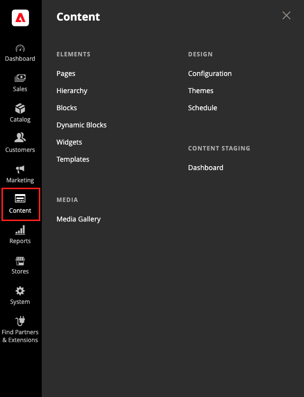

# Menü [!UICONTROL Content]

{width="400" zoomable="yes"} angezeigte Menü [!UICONTROL Content]

>[!NOTE]
>
>Wenn der neue [[!DNL Media Gallery]](media-gallery.md) aktiviert ist, wird der Abschnitt _[!UICONTROL Media]_mit einer einzigen Option für den Zugriff auf die [!DNL Media Gallery] angezeigt. Sie können die **[!UICONTROL Enable Old Media Gallery]**-Option auf `No` setzen, indem Sie zu **[!UICONTROL Stores]**>_[!UICONTROL Settings]_ > **[!UICONTROL Configuration]** gehen und im linken Bereich **[!UICONTROL Advanced]** > **[!UICONTROL System]** auswählen.

## Anzeigen des Menüs [!UICONTROL Content]

Wählen Sie in der Seitenleiste _Admin_ die Option **[!UICONTROL Content]** aus.

## [!UICONTROL Elements]

- Erstellen Sie [Seiten](pages.md) mit Text, Bildern, Blöcken, Variablen und Widgets. Ihre Seiten können in die Navigation Ihres Stores integriert und mit anderen Seiten verknüpft werden.
-  (nur Adobe Commerce) Organisieren Sie Ihre Seiten in einer [Hierarchie](page-hierarchy.md) mit Navigation.
- Erstellen Sie [Bausteine](blocks.md) des Inhalts, ohne Code zu schreiben. Blöcke können Text, Bilder und sogar Videos enthalten und beliebigen Teilen des Seitenlayouts zugewiesen werden.
-  (nur Adobe Commerce) Erstellen Sie [dynamische Bausteine](dynamic-blocks.md), um Rich-Interaktive Inhalte zu integrieren, die von Logik der [Preisregeln](../merchandising-promotions/introduction.md#promotions) und [Kundensegmente](../customers/customer-segments.md) gesteuert werden.
- Erstellen Sie [Widgets](widgets.md), die dynamische Daten anzeigen und am häufigsten in Ihrem Store Blöcke, Links und interaktive Elemente hinzufügen.
- Erstellen Sie [Vorlagen](../page-builder/templates.md) aus Ihrem Seitenaufbau-Inhalt und sparen Sie Zeit und Mühe beim Hinzufügen neuer Inhalte (oder Ersetzen älterer Inhalte).

>[!NOTE]
>
>Die _[!UICONTROL Banners]_-Option in diesem Menü wurde in Version 2.3.1 nicht mehr unterstützt und ist nun entfernt. Seine Funktionalität wird durch dynamische Blöcke ersetzt.

## [!UICONTROL Design] {#design-features}

Verwalten Sie die visuelle Präsentation Ihres Stores:

- Legen Sie die [Design-Konfiguration](configuration.md) fest, um für jede Website, jeden Store und jede Ansicht in Ihrer [!DNL Commerce]-Installation unterschiedliche Einstellungen beizubehalten.

- Verwenden Sie [Designs](themes.md), d. h. Sammlungen von Layout-Dateien, Vorlagendateien, Übersetzungsdateien und Skins, um die visuelle Präsentation Ihres Stores zu bestimmen.

- Verwenden Sie den [Zeitplan](schedule.md) , um Designänderungen im Voraus für eine Staffel oder Promotion zu planen.

## [!UICONTROL Content Staging]

{{ee-feature}}

Mit der [Staging-Umgebung für Inhalte](content-staging.md) können Ihr Geschäftsteam mühelos eine große Auswahl an Inhaltsaktualisierungen direkt vom Administrator Ihres Stores aus erstellen, in der Vorschau anzeigen und planen.
