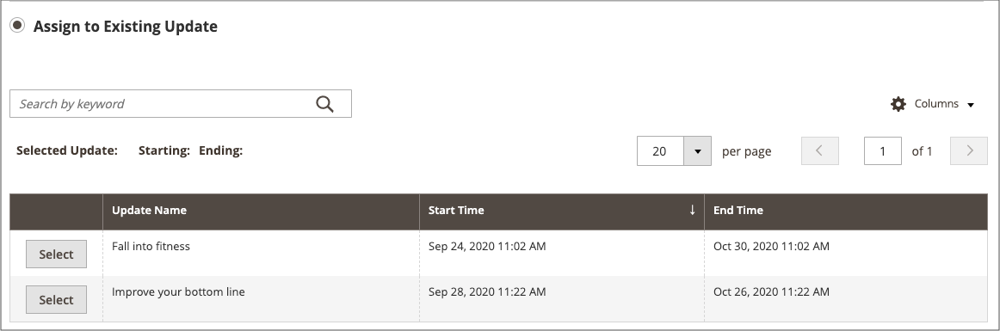

# Element zu einer Kampagne hinzufügen

{{ee-feature}}

Im folgenden Beispiel wird der Kategorieseite während der Kampagne ein Werbebild hinzugefügt. Dasselbe können Sie auch für eine Produktseite oder CMS-Seite tun.

## Hinzufügen des Kampagnenelements für eine Kategorie

1. Navigieren Sie in der _Admin_-Seitenleiste zu **[!UICONTROL Catalog]** > **[!UICONTROL Categories]**.

1. Suchen Sie die Kategorie, die Sie in der Kampagne verwenden möchten, und öffnen Sie sie im Bearbeitungsmodus.

1. Klicken Sie auf **[!UICONTROL Schedule New Update]**.

1. Wählen Sie **[!UICONTROL Assign to Existing Campaign]** aus.

1. Wählen Sie in der Liste die zu ändernde Kampagne aus.

   {width="600" zoomable="yes"}

1. Erweitern Sie  **[!UICONTROL Content]**.

1. Klicken Sie **[!UICONTROL Category Image]** auf **[!UICONTROL Upload]** und wählen Sie das Bild aus, das während der Kampagne auf der Kategorieseite angezeigt werden soll.

   {width="600" zoomable="yes"}

1. Klicken Sie abschließend auf **[!UICONTROL Save]**.

## Element validieren

1. Navigieren Sie in _Admin_-Seitenleiste zu **[!UICONTROL Content]** > _[!UICONTROL Content Staging]_>**[!UICONTROL Dashboard]**.

1. Suchen Sie die Kampagne in der angezeigten Liste oder Zeitleiste und öffnen Sie sie, um auf die Details zuzugreifen:

   - Klicken Sie zur Anzeige einer Liste auf **[!UICONTROL Select]** und dann in der Spalte _[!UICONTROL Action]_&#x200B;auf **[!UICONTROL View/Edit]**.
   - Klicken Sie für eine Zeitleisten-Anzeige einmal, um die Zusammenfassung anzuzeigen, und klicken Sie dann auf **[!UICONTROL View/Edit]**.

   {width="600" zoomable="yes"}

1. Erweitern Sie  **[!UICONTROL Categories]**, um die Liste der zugewiesenen Kategorien anzuzeigen.

1. Um die Seiten für die Kategorie zu überprüfen, wenn die Kampagne aktiv ist, kehren Sie zum Dashboard zurück, klicken Sie erneut auf die Kampagne und klicken Sie dann auf **[!UICONTROL Preview]**.
