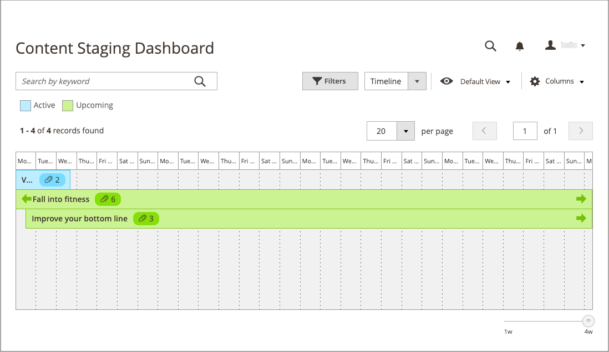
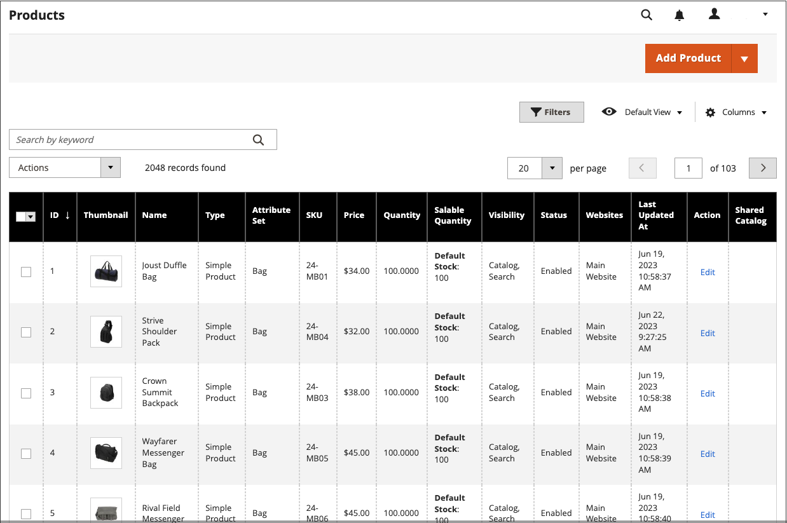

# Staging-Dashboard für Inhalte

{{ee-feature}}

Das [!UICONTROL Content Staging]-Dashboard bietet einen Überblick über alle aktiven und künftigen Kampagnen. Das Format des Dashboards kann von einem Raster in eine Timeline geändert werden. Sie können auch Filter verwenden, um Kampagnen zu finden, das Spaltenlayout anzupassen und verschiedene Ansichten des Rasters zu speichern. Weitere Informationen zu den Workspace-Steuerelementen finden Sie unter [Admin Workspace](../getting-started/admin-workspace.md).

{width="600" zoomable="yes"}

## Staging-Dashboard anzeigen

1. Navigieren Sie in _Admin_-Seitenleiste zu **[!UICONTROL Content]** > _[!UICONTROL Content Staging]_>**[!UICONTROL Dashboard]**.

1. Um das Format des Dashboards zu ändern, legen Sie das **[!UICONTROL View As]**-Steuerelement auf `list`, `Grid` oder `Timeline` fest.

   {width="600" zoomable="yes"}

   Wenn die Zeitleiste angezeigt wird, können Sie mit dem Schieberegler in der unteren rechten Ecke die Ansicht von einer bis vier Wochen anpassen. Jede Spalte steht für einen Tag.

1. Wenn die Zeitleiste angezeigt wird, ziehen Sie den Schieberegler an die `4w` ganz rechts, um eine längere Zeitspanne anzuzeigen.

   {width="600" zoomable="yes"}

1. Um allgemeine Informationen über die Kampagne anzuzeigen, klicken Sie auf ein beliebiges Element auf der Seite.

   - Um die Kampagne zu öffnen, klicken Sie auf **[!UICONTROL View/Edit]**.

   - Um zu sehen, wie die Kampagne an diesem Tag im Geschäft aussieht, klicken Sie auf **[!UICONTROL Preview]**.

   {width="600" zoomable="yes"}

## Spaltenbeschreibungen des Staging-Dashboards

| Spalte | Beschreibung |
|--- |--- |
| [!UICONTROL Status] | Status der Kampagne. `Active` oder `Upcoming`. |
| [!UICONTROL Update Name] | Der Name der Kampagne. |
| [!UICONTROL Includes] | Definiert, wie viele Objekte die Kampagne enthält. |
| [!UICONTROL Start Time] | Das Datum, an dem die Kampagne beginnt. |
| [!UICONTROL End Time] | Das Datum, an dem die Kampagne endet. |
| [!UICONTROL Description] | Zusätzliche Beschreibung jeder Kampagne. |
| [!UICONTROL Action] | Zu den Aktionen, die auf einen einzelnen Datensatz angewendet werden können, gehören: **[!UICONTROL View/Edit]**- Öffnet die Kampagne im Bearbeitungsmodus. **[!UICONTROL Preview]** : Zeigt die Kampagne im Vorschaumodus an. |

{style="table-layout:auto"}

## Bearbeiten einer Kampagne

Vorhandene Kampagnenobjekte können über das Staging-Dashboard bearbeitet werden, mit Ausnahme von Preisregelkampagnen, die keine Enddaten haben.

>[!NOTE]
>
>Wenn eine aktive Kampagne anfänglich ohne Enddatum erstellt wird, kann die Kampagne nicht später bearbeitet werden, um ein Enddatum einzuschließen. In diesem Fall müssen Sie eine doppelte Kampagne erstellen und das erforderliche Enddatum eingeben.

{width="600" zoomable="yes"}

Die Kampagne in diesem Beispiel umfasst zwei Kategorien und drei einzelne Produkte.

Gehen Sie wie folgt vor, um eines der Objekte in dieser Kampagne zu bearbeiten.

1. Navigieren Sie in _Admin_-Seitenleiste zu **[!UICONTROL Content]** > _[!UICONTROL Content Staging]_>**[!UICONTROL Dashboard]**.

1. Suchen Sie die Kampagne in der angezeigten Liste oder Zeitleiste und öffnen Sie sie, um auf die Details zuzugreifen:

   - Klicken Sie zur Anzeige einer Liste auf **[!UICONTROL Select]** und dann in der Spalte _[!UICONTROL Action]_&#x200B;auf **[!UICONTROL View/Edit]**.
   - Klicken Sie für eine Zeitleisten-Anzeige einmal, um die Zusammenfassung anzuzeigen, und klicken Sie dann auf **[!UICONTROL View/Edit]**.

1. Aktualisieren Sie nach Bedarf alle Einstellungen im Abschnitt _[!UICONTROL General]_.

1. Erweitern Sie  jeden Abschnitt, der ein zu bearbeitendes Element enthält.

   {width="600" zoomable="yes"}

1. Klicken Sie auf **[!UICONTROL Save]**.
