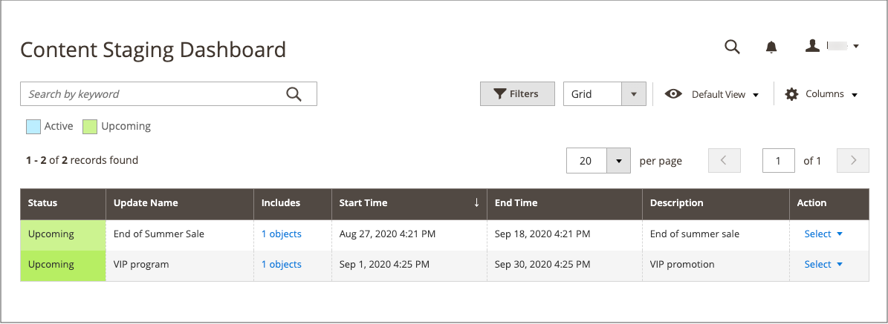

# Inhaltstaging

{{ee-feature}}

Das Staging von Inhalten bietet Ihrem Business-Team die Möglichkeit, direkt über _Admin_ eine Vielzahl von Inhaltsaktualisierungen für Ihren Store zu erstellen, in der Vorschau anzuzeigen und zu planen. Anstatt beispielsweise an eine statische Seite zu denken, sollten Sie eine Seite als Sammlung verschiedener Elemente betrachten, die basierend auf einem Zeitplan _auf_ oder _aus_ gedreht werden können. Sie können die Inhaltstaging-Umgebung verwenden, um eine Seite zu erstellen, die sich im Laufe des Jahres automatisch an einem Zeitplan ändert.

Der Begriff _campaign_ bezieht sich auf den Datensatz einer geplanten Änderung oder auf eine Sammlung von Änderungen, die über das Staging-Dashboard verwaltet werden. Die Änderungen können in einem Kalender oder einer Timeline angezeigt werden. Die Begriffe _Geplante Änderung_ und _Geplantes Update_ sind austauschbar und beziehen sich auf eine einzige Änderung.

Wenn Sie eine Inhaltsänderung für einen bestimmten Zeitraum planen, kehrt der Inhalt zur vorherigen Version zurück, wenn die geplante Änderung abläuft. Sie können mehrere Versionen desselben Grundinhalts erstellen, die für zukünftige Aktualisierungen verwendet werden. Sie können auch die Zeitleiste durchlaufen, um frühere Versionen des Inhalts anzuzeigen. Um eine Entwurfsversion zu speichern, weisen Sie einfach ein Datum in der Zeitleiste zu, das so weit in die Zukunft liegt, dass es nie in die Produktion geht.

## Content-Staging-Objekte und -Kampagnen

Felder, die sich auf das Startdatum und das Enddatum beziehen, wurden aus Adobe Commerce entfernt und können nicht direkt auf der Warenkorbpreisregel, Katalogpreisregel, Produkt, Kategorie und CMS-Seite geändert werden. Sie müssen eine geplante Aktualisierung für diese Aktivierungen erstellen.

Alle geplanten Aktualisierungen werden nacheinander angewendet, d. h. jede Entität kann nur eine geplante Aktualisierung gleichzeitig haben. Jede geplante Aktualisierung wird auf alle Store-Ansichten innerhalb des Zeitrahmens angewendet. Daher kann eine Entität nicht gleichzeitig eine andere geplante Aktualisierung für verschiedene Store-Ansichten haben. Alle Entitätsattributwerte in allen Store-Ansichten, die von der aktuellen geplanten Aktualisierung nicht betroffen sind, werden von den Standardwerten übernommen und nicht von der vorherigen geplanten Aktualisierung.

Wenn eine neue geplante Aktualisierung für eines der folgenden Objekte erstellt wird, wird eine entsprechende Kampagne als Platzhalter erstellt und das Feld _[!UICONTROL Scheduled Changes]_wird oben auf der Seite angezeigt. Die Platzhalterkampagne hat ein Startdatum, aber kein Enddatum. Sie können Aktualisierungen des Inhalts im Rahmen einer Kampagne planen und die Änderungen dann in der Vorschau anzeigen und nach Datum, Uhrzeit oder Store-Ansicht freigeben. Nachdem eine neue Kampagne für ein Objekt erstellt wurde, können Sie sie anderen Objekten als geplante Aktualisierung zuweisen.

- [Produkte](../catalog/product-scheduled-changes.md)
- [Kategorien](../catalog/category-scheduled-changes.md)
- [Katalogpreisregeln](../merchandising-promotions/price-rule-catalog-scheduled-changes.md)
- [Warenkorbpreisregeln](../merchandising-promotions/price-rule-cart-scheduled-changes.md)
- [CMS-Seiten](pages-workspace.md#scheduled-changes)
- [CMS-Blöcke](blocks.md)

## Arbeitsablauf für die Inhaltstaging-Umgebung

1. **Erstellen des Grundlinieninhalts**

   Die Grundlinie ist der Inhalt eines Assets ohne Kampagne und umfasst alle Elemente unterhalb des Bereichs _[!UICONTROL Scheduled Changes]_oben auf der Seite. Der Grundlinieninhalt wird immer verwendet, es sei denn, es gibt eine aktive Kampagne mit für diese Stelle geplanten Änderungen in der Timeline.

1. **Erstellen der ersten Kampagne**

   Erstellen Sie Ihre erste Kampagne mit dem Start- und dem Enddatum nach Bedarf. Lassen Sie das Enddatum leer, damit die Kampagne offen endet. Wenn die erste Kampagne beendet wird, wird der ursprüngliche Ausgangsinhalt wiederhergestellt.

   Das Start- und Enddatum der Kampagne muss mithilfe der Zeitzone **_default_** Admin definiert werden, die aus der lokalen Zeitzone jeder Website konvertiert wird. Betrachten wir ein Beispiel, bei dem Sie mehrere Websites in verschiedenen Zeitzonen haben, aber eine Kampagne basierend auf einer US-Zeitzone starten möchten. In diesem Fall müssen Sie für jede lokale Zeitzone ein separates Update planen und **[!UICONTROL Start Date]** und **[!UICONTROL End Date]** in Konvertierung aus jeder lokalen Website-Zeitzone in die standardmäßige Admin-Zeitzone einstellen.

1. **Fügen Sie eine zweite Kampagne hinzu**

   Erstellen Sie die zweite Kampagne mit dem Start- und dem Enddatum. Die zweite Kampagne kann einem ganz anderen Zeitraum zugewiesen werden. Beim Erstellen mehrerer Kampagnen für dasselbe Asset können sich die Kampagnen nicht überschneiden. Sie können beliebig viele Kampagnen erstellen.

   Einer bereits existierenden Kampagne, die noch nicht gestartet wurde, können mehrere Assets zugewiesen werden. Beispielsweise können zwei verschiedene Produktpreise im Rahmen derselben Kampagne mit einem zukünftigen Startdatum aktualisiert werden.

   >[!NOTE]
   >
   >Wenn eine Kampagne mit mehreren Entitäten verknüpft ist, kann die Kampagne nur über das Dashboard [Inhaltstaging-Dashboard](content-staging-dashboard.md) bearbeitet werden.

1. **Wiederherstellen des Grundlinieninhalts**

   Wenn alle Kampagnen Enddaten aufweisen, wird der Grundlinieninhalt wiederhergestellt, sobald alle aktiven Kampagnen beendet werden.

>[!NOTE]
>
>Während eine Staging-Aktualisierung für eine Entität aktiv ist, bearbeitet die Bearbeitung der Entität die aktuelle aktive Staging-Aktualisierung. Sie hat keine Auswirkungen auf den Grundlinieninhalt, der beim Ende der Staging-Aktualisierung wiederhergestellt wird.

## [!UICONTROL Content Staging] Dashboard

Das [!UICONTROL Content Staging] [Dashboard](content-staging-dashboard.md) bietet Einblick in alle geplanten Site-Änderungen und -Aktualisierungen. Jeder Tag, Zeitraum oder Zeitraum einer Kampagne kann in der Vorschau angezeigt und für andere freigegeben werden.

{width="600" zoomable="yes"}

## Demo zum Inhaltstaging

Sehen Sie sich dieses Video an, um mehr über Content Staging zu erfahren:

>[!VIDEO](https://video.tv.adobe.com/v/343784?quality=12)

## Fehlerbehebung bei Ressourcen

Hilfe zur Fehlerbehebung bei Problemen mit der Inhaltstaging-Umgebung finden Sie in den folgenden [!DNL Commerce] Support Knowledge Base-Artikeln:

- [Fehler 404 auf allen Seiten aufgrund eines Problems beim Staging von Inhalten](https://experienceleague.adobe.com/docs/commerce-knowledge-base/kb/troubleshooting/site-down-or-unresponsive/error-404-on-all-pages-due-to-content-staging-issue.html)
- [Aktualisierungen der Staging-Phase für geplante Inhalte werden nicht mit veraltetem Fastly-Cache angezeigt](https://experienceleague.adobe.com/docs/commerce-knowledge-base/kb/troubleshooting/miscellaneous/scheduled-content-staging-updates-not-displayed-with-stale-fastly-cache.html)
- [Kann ich Aktualisierungen des Content Staging für Preise in einem freigegebenen Katalog planen?](https://experienceleague.adobe.com/docs/commerce-knowledge-base/kb/faq/can-i-schedule-content-staging-updates-for-prices-in-a-shared-catalog.html)
