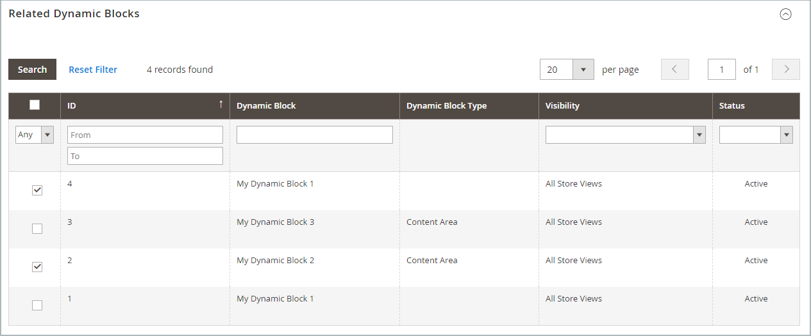

# Dynamische Blöcke in Preisregeln

{{ee-feature}}

Jeder [dynamische Block](dynamic-blocks.md) den Sie erstellen, kann mit einer Promotion verknüpft werden. Um die Zuordnung vorzunehmen, müssen Sie zunächst sowohl den dynamischen Block als auch die [Katalogpreisregel](../merchandising-promotions/price-rules-catalog.md) oder [Warenkorb-Preisregel](../merchandising-promotions/price-rules-cart.md) erstellen. Die Zuordnung kann bei der Arbeit an einer Preisregel oder bei der Arbeit an einem dynamischen Block erfolgen.

>[!IMPORTANT]
>
>Nachdem Sie diese Zuordnung erstellt haben, wird der dynamische Block (**) angezeigt** wenn die Regel ausgelöst wird. Wenn die Promotion auf Segment A ausgerichtet ist, wird der Block auf Segment A angezeigt. Wenn die Promotion nicht aktiv ist, wird der Block nicht angezeigt.

## Dynamischen Block mit einer Preisregel verknüpfen

1. Wechseln Sie in _Admin_-Seitenleiste zu **[!UICONTROL Marketing]** > _[!UICONTROL Promotions]_und wählen Sie eine der folgenden Optionen:

   - **[!UICONTROL Catalog Price Rules]**
   - **[!UICONTROL Cart Price Rules]**

1. Suchen Sie im Raster die Regel, die Sie mit dem dynamischen Block verknüpfen möchten, und öffnen Sie sie im Bearbeitungsmodus.

1. Scrollen Sie nach unten und erweitern Sie  **[!UICONTROL Related Dynamic Blocks]**.

1. Setzen Sie in der ersten Spalte den Filter auf `Any` und klicken Sie auf **[!UICONTROL Reset Filter]**.

   Im Raster werden nun alle verfügbaren dynamischen Blöcke aufgelistet.

1. Aktivieren Sie das Kontrollkästchen jedes dynamischen Blocks, den Sie mit der Regel verknüpfen möchten.

   {width="600" zoomable="yes"}

1. Klicken Sie abschließend auf **[!UICONTROL Save]**.

## Zuordnen einer Preisregel zu einem dynamischen Block

1. Navigieren Sie in _Admin_-Seitenleiste zu **[!UICONTROL Content]** > _[!UICONTROL Elements]_>**[!UICONTROL Dynamic Blocks]**.

1. Suchen Sie den dynamischen Block im Raster und öffnen Sie ihn im Bearbeitungsmodus.

1. Scrollen Sie nach unten und erweitern Sie **[!UICONTROL Related Promotions]**.

   Alle aktuell verknüpften Preisregeln werden im Raster angezeigt.

1. Fügen Sie eine neue verknüpfte Regel hinzu oder entfernen Sie eine aktuelle Verknüpfung.

   - Um eine Promotion zum Warenkorb zu verknüpfen, klicken Sie auf **[!UICONTROL Add Cart Price Rules]**.

   - Um eine produktbezogene Promotion zu verknüpfen, klicken Sie auf **[!UICONTROL Add Catalog Price Rules]**.

1. Aktivieren Sie im Raster das Kontrollkästchen jeder Regel, die Sie mit dem dynamischen Block verknüpfen möchten.

1. Klicken Sie auf **[!UICONTROL Add Selected]**.

   {width="600" zoomable="yes"}

1. Klicken Sie abschließend auf **[!UICONTROL Save]**.
