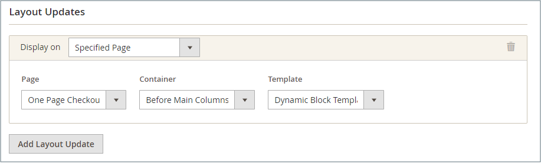
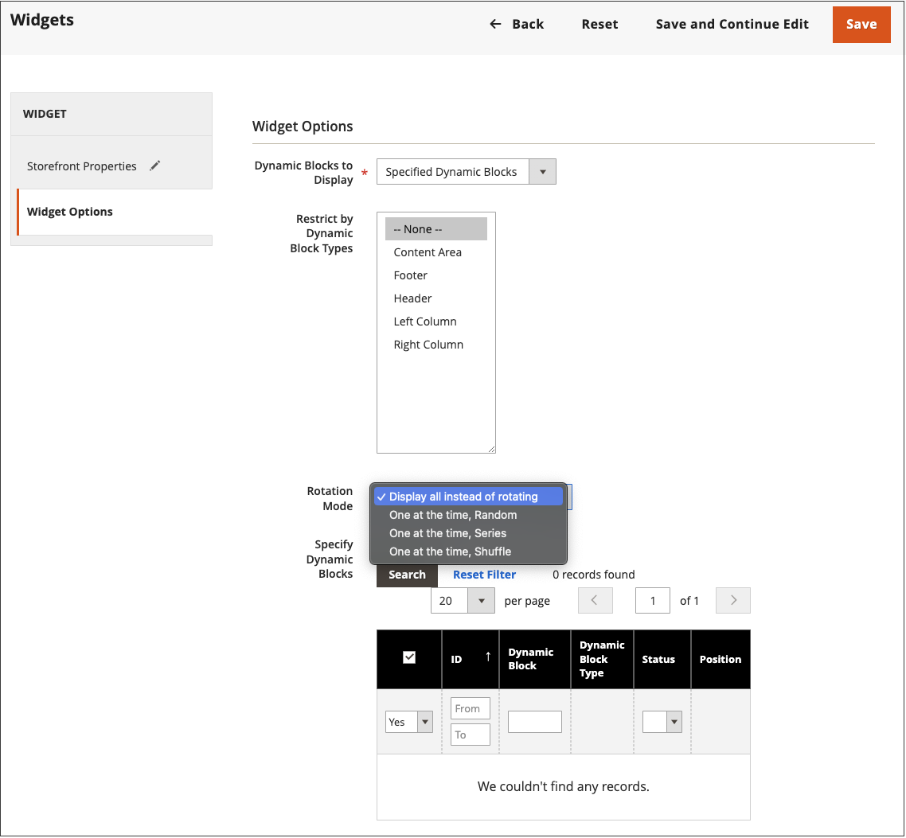

# Dynamischen Baustein hinzufügen

{{ee-feature}}

Um eine Diashow mit interaktiven Inhalten zu präsentieren, können Sie mehrere [dynamische Bausteine](dynamic-blocks.md) zu einem Rotator hinzufügen. Mit dem Tool [widget](widgets.md) können Sie den Rotator an einer bestimmten Stelle auf einer einzelnen Seite oder auf mehreren Seiten in Ihrem Store platzieren.

{width="700" zoomable="yes"}

## Schritt 1: Erstellen einzelner dynamischer Blöcke

Gehen Sie wie folgt vor, um die dynamischen Blöcke ](dynamic-blocks.md) zu erstellen, die Sie im Rotator platzieren möchten:[

## Schritt 2: Hinzufügen eines Widgets vom Typ &quot;Dynamischer Blockdreher&quot;

1. Wechseln Sie in der Seitenleiste _Admin_ zu **[!UICONTROL Content]** > _[!UICONTROL Elements]_>**[!UICONTROL Widgets]**.

1. Klicken Sie in der oberen rechten Ecke auf **[!UICONTROL Add Widget]**.

1. Setzen Sie unter _Einstellungen_ **[!UICONTROL Type]** auf `Dynamic Blocks Rotator`.

1. Wählen Sie die aktuelle **[!UICONTROL Design Theme]** des Stores aus.

   Mit dieser Einstellung wird das aktuelle Paket bzw. [Design](themes.md) identifiziert, das das Seitenlayout des Stores bestimmt.

1. Klicken Sie auf **[!UICONTROL Continue]**.

   {width="600" zoomable="yes"}

## Schritt 3: Optionen abschließen

1. Legen Sie unter _Storefront Properties_ die Optionen fest:

   - Geben Sie einen **[!UICONTROL Title]** für den Rotator ein.

   - Wählen Sie in der Liste &quot;**[!UICONTROL Assign to Store Views]**&quot;die [Ansichten speichern](../getting-started/websites-stores-views.md)&quot;, in denen der Rotator verfügbar ist.

   - (Optional) Geben Sie eine **[!UICONTROL Sort Order]**-Zahl ein, um die Position des Rotators im Zielbehälter zu bestimmen. Sie ist relativ zu anderen Widgets, die dem gleichen Container zugewiesen werden können.

   {width="600" zoomable="yes"}

1. Klicken Sie unter _Layout-Optionen_ auf **[!UICONTROL Add Layout Update]** und führen Sie die folgenden Schritte aus:

   - Setzen Sie &quot;**[!UICONTROL Display on]**&quot;auf die Seite oder den Seitentyp, auf der der Rotator angezeigt werden soll.

      - `Categories` - Zeigt den Rotator auf den Kategorieseiten [anker](../catalog/navigation-layered.md) oder Nicht-Anker an. Optionen: Ankerkategorien/Nicht-Anker-Kategorien
      - `Products` - Zeigt den Router auf einer bestimmten Produktseite oder auf allen Produktseiten an. Optionen: Alle Produkttypen / [Einfaches Produkt](../catalog/product-create-simple.md) / [virtuelles Produkt](../catalog/product-create-virtual.md) / [Paket Produkt](../catalog/product-create-bundle.md) / [herunterladbares Produkt](../catalog/product-create-downloadable.md) / [Geschenkkarte](../catalog/product-gift-card-create.md) / [Konfigurierbares Produkt](../catalog/product-create-configurable.md) / [Grouped Product](../catalog/product-create-grouped.md)
      - `Generic Pages` - Zeigt den Trichter auf allen Seiten, einer bestimmten Seite oder nur auf Seiten mit einem bestimmten Layout an. Optionen: `All Pages` / `Specified Page` / `Page Layouts`

     In diesem Beispiel soll der Rotator auf einem `Specified Page` platziert werden.

   - Wählen Sie den spezifischen **[!UICONTROL Page]** aus, an dem der Rotator angezeigt werden soll.

   - Setzen Sie &quot;**[!UICONTROL Container]**&quot;auf den Teil des [Seitenlayouts](page-layout.md#standard-page-layouts), in dem der Rotator angezeigt werden soll.

     Wenn dem gleichen Container andere Widgets zugewiesen sind, werden sie in der Reihenfolge nach der Sortierreihenfolge angezeigt.

   - Akzeptieren Sie `Dynamic Block Template` als Standard-Wert **[!UICONTROL Template]**.

     Diese Einstellung legt die Vorlage fest, die zum Formatieren des Rotators verwendet wird, je nachdem, ob der Rotator allein stehen soll oder in vorhandenen Text platziert werden soll.

     {width="600" zoomable="yes"}

   - Klicken Sie auf **[!UICONTROL Save and Continue Edit]**.

1. Wählen Sie im linken Bereich **[!UICONTROL Widget Options]** aus.

1. Für die **[!UICONTROL Dynamic Blocks to Display]** akzeptieren Sie `Specified Dynamic Blocks`.

   Diese Einstellung bestimmt den Typ der dynamischen Bausteine, die im Rotator enthalten sind.

   - `Specified Dynamic Blocks` - Umfasst nur bestimmte dynamische Blöcke.
   - `Cart Price Rule Related` - Umfasst nur dynamische Blöcke, die mit einer Warenkorbpreisregel verknüpft sind.
   - `Catalog Price Rule Related` - Umfasst nur dynamische Blöcke, die mit einer Katalogpreisregel verknüpft sind.

1. Wählen Sie &quot;`Content Area`&quot;, um den Wert &quot;**[!UICONTROL Restrict the Dynamic Block Types]**&quot; anzugeben, der mit dem Widget verwendet werden kann.

   Diese Einstellung beschränkt das Banner auf einen bestimmten Teil des Seitenlayouts.

   - `Content Area` - Setzt den dynamischen Block in den Hauptinhaltsbereich der Seite.
   - `Footer` - Platziert den dynamischen Block in der Fußzeile der Seite.
   - `Header` - Platziert den dynamischen Block in der Kopfzeile der Seite.
   - `Left Column` - Setzt den dynamischen Block in die linke Spalte des Seitenlayouts, falls verfügbar.
   - `Right Column` - Setzt den dynamischen Block in die rechte Spalte des Seitenlayouts, falls verfügbar.

1. Setzen Sie **[!UICONTROL Rotation Mode]** auf einen der folgenden Werte:

   - `Display all instead of rotating` - Zeigt einen Stapel dynamischer Blöcke an, in denen alle sichtbar sind.
   - `One at a time, Random` - Zeigt die angegebenen dynamischen Blöcke in zufälliger Reihenfolge an. Wenn die Seite aktualisiert wird, wird ein anderer (und zufälliger) dynamischer Block angezeigt.
   - `One at the time, Series` - Zeigt die angegebenen dynamischen Blöcke in der Sequenz an, in der sie hinzugefügt wurden. Wenn die Seite aktualisiert wird, wird der nächste dynamische Block in der Sequenz angezeigt.
   - `One at the time, Shuffle` - Zeigt jeweils einen dynamischen Block in einer geschwungenen Reihenfolge an. Diese Option ähnelt der Option `One at a time, Random` , allerdings wird derselbe dynamische Block nicht wiederholt.

     {width="600" zoomable="yes"}

1. Aktivieren Sie im Raster **[!UICONTROL Specify Dynamic Blocks]** das Kontrollkästchen jedes dynamischen Blocks, den Sie in den Rotator einbeziehen möchten.

1. Klicken Sie nach Abschluss des Vorgangs auf **[!UICONTROL Save]**.
