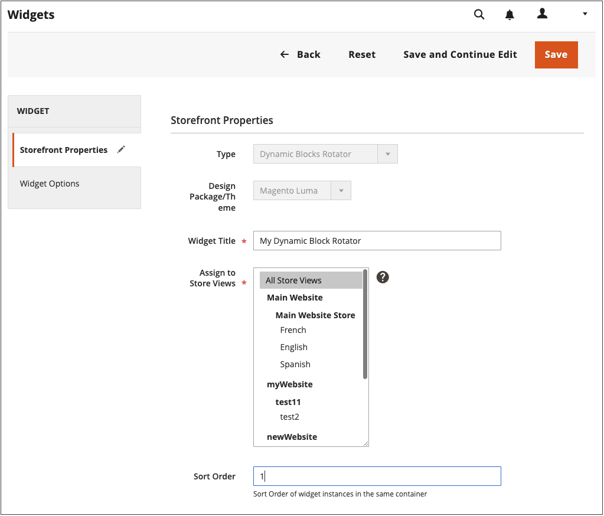

# Dynamischen Baustein hinzufügen

{{ee-feature}}

Um eine Diashow mit interaktiven Inhalten vorzustellen, können Sie mehrere [dynamische Blöcke](dynamic-blocks.md) an einen Rotator. Die [Widget](widgets.md) -Werkzeug wird verwendet, um den Rotator an einer bestimmten Stelle auf einer einzelnen Seite oder auf mehreren Seiten in Ihrem Store zu platzieren.

{width="700" zoomable="yes"}

## Schritt 1: Erstellen einzelner dynamischer Blöcke

nach [Erstellen dynamischer Bausteine](dynamic-blocks.md) Befolgen Sie die folgenden Anweisungen, wenn Sie in den Rotator einsetzen möchten:

## Schritt 2: Hinzufügen eines Widgets vom Typ &quot;Dynamischer Blockdreher&quot;

1. Im _Admin_ Seitenleiste, navigieren Sie zu **[!UICONTROL Content]** > _[!UICONTROL Elements]_>**[!UICONTROL Widgets]**.

1. Klicken Sie oben rechts auf **[!UICONTROL Add Widget]**.

1. under _Einstellungen_, set **[!UICONTROL Type]** nach `Dynamic Blocks Rotator`.

1. Aktuelle Auswahl **[!UICONTROL Design Theme]** des Stores.

   Mit dieser Einstellung wird das aktuelle Paket oder [Design](themes.md) bestimmt das Seitenlayout des Stores.

1. Klicken **[!UICONTROL Continue]**.

   {width="600" zoomable="yes"}

## Schritt 3: Optionen abschließen

1. under _Store-Eigenschaften_, legen Sie die Optionen fest:

   - Geben Sie einen **[!UICONTROL Title]** für den Rotator.

   - Im **[!UICONTROL Assign to Store Views]** Liste, wählen Sie die [Store-Ansichten](../getting-started/websites-stores-views.md) wo der Rotator verfügbar ist.

   - (Optional) Geben Sie einen **[!UICONTROL Sort Order]** Zahl zur Bestimmung der Position des Rotators im Zielbehälter. Sie ist relativ zu anderen Widgets, die dem gleichen Container zugewiesen werden können.

   {width="600" zoomable="yes"}

1. under _Layoutoptionen_ klicken **[!UICONTROL Add Layout Update]** und gehen Sie wie folgt vor:

   - Satz **[!UICONTROL Display on]** auf der Seite oder dem Seitentyp, auf der der Rotator angezeigt werden soll.

      - `Categories` - Der Router wird entweder [Anker](../catalog/navigation-layered.md) oder Nicht-Anker-Kategorieseiten Optionen: Ankerkategorien/Nicht-Anker-Kategorien
      - `Products` - Zeigt den Router entweder auf einer bestimmten Produktseite oder auf allen Produktseiten an. Optionen: Alle Produkttypen / [Einfaches Produkt](../catalog/product-create-simple.md) /  [Virtuelles Produkt](../catalog/product-create-virtual.md) / [Paket-Produkt](../catalog/product-create-bundle.md) / [herunterladbares Produkt](../catalog/product-create-downloadable.md) / [Geschenkkarte](../catalog/product-gift-card-create.md) / [Konfigurierbares Produkt](../catalog/product-create-configurable.md) / [Gruppierungsprodukt](../catalog/product-create-grouped.md)
      - `Generic Pages` - Zeigt den Drehregler auf allen Seiten, einer bestimmten Seite oder nur auf Seiten mit einem bestimmten Layout an. Optionen: `All Pages` / `Specified Page` / `Page Layouts`

     In diesem Beispiel soll der Rotator auf einem `Specified Page`.

   - Spezifische **[!UICONTROL Page]** wo der Rotator erscheinen soll.

   - Satz **[!UICONTROL Container]** dem Teil der [Seitenlayout](page-layout.md#standard-page-layouts) wo der Rotator erscheinen soll.

     Wenn dem gleichen Container andere Widgets zugewiesen sind, werden sie in der Reihenfolge nach der Sortierreihenfolge angezeigt.

   - Accept `Dynamic Block Template` als Standard **[!UICONTROL Template]**.

     Diese Einstellung legt die Vorlage fest, die zum Formatieren des Rotators verwendet wird, je nachdem, ob der Rotator allein stehen soll oder in vorhandenen Text platziert werden soll.

     {width="600" zoomable="yes"}

   - Klicken **[!UICONTROL Save and Continue Edit]**.

1. Wählen Sie im linken Bereich die Option **[!UICONTROL Widget Options]**.

1. Für **[!UICONTROL Dynamic Blocks to Display]**, akzeptieren `Specified Dynamic Blocks`.

   Diese Einstellung bestimmt den Typ der dynamischen Bausteine, die im Rotator enthalten sind.

   - `Specified Dynamic Blocks` - Umfasst nur bestimmte dynamische Blöcke.
   - `Cart Price Rule Related` - Umfasst nur dynamische Blöcke, die mit einer Warenkorbpreisregel verknüpft sind.
   - `Catalog Price Rule Related` - Umfasst nur dynamische Blöcke, die mit einer Katalogpreisregel verknüpft sind.

1. nach **[!UICONTROL Restrict the Dynamic Block Types]** die mit dem Widget verwendet werden können, wählen Sie `Content Area`.

   Diese Einstellung beschränkt das Banner auf einen bestimmten Teil des Seitenlayouts.

   - `Content Area` - Platziert den dynamischen Baustein im Hauptinhaltsbereich der Seite.
   - `Footer` - Platziert den dynamischen Block in der Fußzeile der Seite.
   - `Header` - Platziert den dynamischen Block in der Kopfzeile der Seite.
   - `Left Column` - Setzt den dynamischen Block in die linke Spalte des Seitenlayouts, falls verfügbar.
   - `Right Column` - Setzt den dynamischen Block in die rechte Spalte des Seitenlayouts, falls verfügbar.

1. Satz **[!UICONTROL Rotation Mode]** auf einen der folgenden Werte zu:

   - `Display all instead of rotating` - Zeigt einen Stapel dynamischer Blöcke an, in denen alle sichtbar sind.
   - `One at a time, Random` - Zeigt die angegebenen dynamischen Blöcke in zufälliger Reihenfolge an. Wenn die Seite aktualisiert wird, wird ein anderer (und zufälliger) dynamischer Block angezeigt.
   - `One at the time, Series` - Zeigt die angegebenen dynamischen Blöcke in der Sequenz an, zu der sie hinzugefügt wurden. Wenn die Seite aktualisiert wird, wird der nächste dynamische Block in der Sequenz angezeigt.
   - `One at the time, Shuffle` - Zeigt jeweils einen dynamischen Block in einer geteilten Reihenfolge an. Diese Option ähnelt der `One at a time, Random` -Option, allerdings wird derselbe dynamische Block nicht wiederholt.

     {width="600" zoomable="yes"}

1. Im **[!UICONTROL Specify Dynamic Blocks]** Markieren Sie das Kontrollkästchen jedes dynamischen Blocks, den Sie in den Rotator einbeziehen möchten.

1. Wenn Sie fertig sind, klicken Sie auf **[!UICONTROL Save]**.
