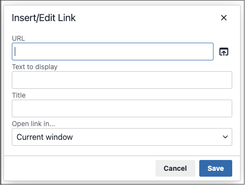

# Link in den Editor einfügen

Sie können einen Link einfach einfügen, indem Sie die Schaltfläche _Link_ in der Symbolleiste [Editor](editor.md) verwenden. Es erfordert keine Kenntnis von HTML, und das Ergebnis ist dasselbe.

1. Wählen Sie den Text aus, in dem Sie den Link erstellen möchten.

1. Klicken Sie in der Editor-Symbolleiste auf das Symbol _Link einfügen/bearbeiten_ .

   {width="700" zoomable="yes"}

   Durch diese Aktion wird das Dialogfeld &quot;_[!UICONTROL Insert link]_&quot; geöffnet.

   {width="250" zoomable="yes"}

1. Geben Sie für &quot;**[!UICONTROL Url]**&quot;eine der folgenden Optionen ein:

   - Der URL-Schlüssel einer Seite in Ihrem Store.

   - Die vollständige URL einer externen Seite, die verknüpft werden soll.

1. Ändern Sie bei Bedarf die **[!UICONTROL Text to display]**.

   Die Standardeinstellung ist der Text, den Sie für den Link ausgewählt haben. Sie können sie im Textfeld ändern.

1. Geben Sie für **[!UICONTROL Title]** den QuickInfo-Text ein, der angezeigt werden soll, wenn der Mauszeiger über den Link bewegt wird.

1. Setzen Sie **[!UICONTROL Target]** auf einen der folgenden Werte:

   - `Open link in the same window`

   - `Open in a new window`

1. Um den Link zu erstellen, klicken Sie auf **[!UICONTROL OK]**.
