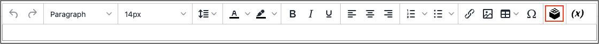

# Widget in den Editor einfügen

Die [Widget](widget-create.md) kann verwendet werden, um verschiedene Inhaltselemente zur Seite hinzuzufügen, einschließlich Links zu einer beliebigen Commerce-Inhaltsseite, einem Knoten, einem Produkt oder einer Kategorie. Links können auf der Seite in einem Blockformat positioniert oder direkt in den Inhalt integriert werden. Sie können das Widget-Tool verwenden, um Links zu den folgenden Inhaltstypen zu erstellen:

- [Inhaltsseiten](pages.md)
- [Katalogkategorien](../catalog/categories.md)
- [Katalogprodukte](../catalog/product-create.md)

Standardmäßig übernehmen Links ihren Stil vom Stylesheet des Designs.

{{$include /help/_includes/directives-caution.md}}

1. Öffnen Sie eine Seite, einen Block oder einen dynamischen Block im Bearbeitungsmodus.

1. Navigieren Sie zu _[!UICONTROL Content]_und klicken Sie auf ein Element, das den Editor unterstützt.

1. Positionieren Sie den Cursor an der Stelle, an der das Widget angezeigt werden soll, und klicken Sie auf _Widget einfügen_ Symbol.

   {width="700" zoomable="yes"}

   Wenn Sie Page Builder nicht aktiviert haben und lieber mit dem Code arbeiten möchten, klicken Sie auf **[!UICONTROL Show / Hide Editor]**. Positionieren Sie den Einfügepunkt im Text, an dem das Widget angezeigt werden soll. Klicken Sie anschließend auf **[!UICONTROL Insert Widget]**.

1. Wählen Sie die **[!UICONTROL Widget Type]**.

   Weitere Informationen zu diesen Optionen finden Sie unter [Widget-Typen](widgets.md#widget-types). Die folgenden Schritte zeigen ein Beispiel für das Einfügen eines Links zu einem Produkt.

1. Um den Produktnamen zu verwenden, lassen Sie die **[!UICONTROL Anchor Custom Text]** leer.

1. Geben Sie eine **[!UICONTROL Anchor Custom Title]** für bewährte SEO-Verfahren.

   Dieser Titel ist auf der Seite nicht sichtbar.

1. Satz **[!UICONTROL Template]** auf einen der folgenden Werte zu:

   - Um den Link in Text einzufügen, wählen Sie `Product Link Inline Template`.

   - Um den Link in einer separaten Zeile zu platzieren, wählen Sie `Product Link Block Template`.

1. Klicks **[!UICONTROL Select Product]** und gehen Sie wie folgt vor:

   - Navigieren Sie im Baum zu der gewünschten Kategorie.

   - Wählen Sie in der Liste das verknüpfte Produkt aus.

1. Klicks **[!UICONTROL Insert Widget]** , um den Link auf der Seite zu platzieren.

   Wenn Sie mit HTML-Code arbeiten, wird eine [Markup-Tag](../systems/markup-tags.md) für den Link wird oben auf der Seite angezeigt, eingeschlossen in geschweifte Klammern. Verwenden Sie bei Bedarf _Ausschneiden und Einfügen_ , um das Markup-Tag in den Code zu platzieren, in dem der Link angezeigt werden soll.

1. Klicken Sie nach Abschluss der Inhaltsbearbeitung auf **[!UICONTROL Save]**.
