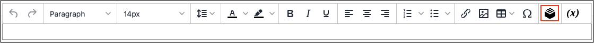

# Einfügen eines Widgets in den Editor

Mit [Widget](widget-create.md) können Sie der Seite verschiedene Inhaltselemente hinzufügen, einschließlich Links zu beliebigen Commerce-Inhaltsseiten oder -Knoten, -Produkten oder -Kategorien. Links können in einem Blockformat auf der Seite positioniert oder direkt in den Inhalt integriert werden. Sie können das Widget-Tool verwenden, um Links zu den folgenden Inhaltstypen zu erstellen:

- [Inhaltsseiten](pages.md)
- [Katalogkategorien](../catalog/categories.md)
- [Katalogprodukte](../catalog/product-create.md)

Standardmäßig übernehmen Links ihren Stil vom Stylesheet des Designs.

{{$include /help/_includes/directives-caution.md}}

1. Öffnen Sie eine Seite, einen Block oder einen dynamischen Block im Bearbeitungsmodus.

1. Gehen Sie zum Abschnitt _[!UICONTROL Content]_&#x200B;und klicken Sie auf ein beliebiges Element, das den Editor unterstützt.

1. Positionieren Sie den Cursor an der Stelle, an der das Widget angezeigt werden soll, und klicken Sie auf das Symbol _Widget einfügen_.

   {width="700" zoomable="yes"}

   Wenn Sie Page Builder nicht aktiviert haben und lieber mit dem Code arbeiten möchten, klicken Sie auf **[!UICONTROL Show / Hide Editor]**. Positionieren Sie die Einfügemarke an der Stelle, an der das Widget angezeigt werden soll. Klicken Sie dann auf **[!UICONTROL Insert Widget]**.

1. Wählen Sie die **[!UICONTROL Widget Type]** aus.

   Weitere Informationen zu diesen Optionen finden Sie unter [Widget-Typen](widgets.md#widget-types). Die folgenden Schritte verwenden ein Beispiel für das Einfügen eines Links zu einem Produkt.

1. Um den Produktnamen zu verwenden, lassen Sie das Feld **[!UICONTROL Anchor Custom Text]** leer.

1. Geben Sie eine **[!UICONTROL Anchor Custom Title]** für die Best Practice für SEO ein.

   Dieser Titel ist auf der Seite nicht sichtbar.

1. Legen Sie **[!UICONTROL Template]** auf eine der folgenden Einstellungen fest:

   - Um den Link in Text einzubinden, wählen Sie `Product Link Inline Template` aus.

   - Um den Link auf einer separaten Zeile zu platzieren, wählen Sie `Product Link Block Template` aus.

1. Klicken Sie auf **[!UICONTROL Select Product]** und führen Sie folgende Schritte aus:

   - Navigieren Sie in der Baumstruktur zur gewünschten Kategorie.

   - Wählen Sie in der Liste das verknüpfte Produkt aus.

1. Klicken Sie auf **[!UICONTROL Insert Widget]** , um den Link auf der Seite zu platzieren.

   Wenn Sie mit HTML-Code arbeiten[&#x200B; wird ein (](../systems/markup-tags.md)) für den Link oben auf der Seite angezeigt, eingeschlossen in geschweifte Klammern. Verwenden Sie bei Bedarf _Ausschneiden und Einfügen_, um das Markup-Tag in dem Code zu positionieren, in dem der Link angezeigt werden soll.

1. Wenn Ihre Inhaltsbearbeitungen abgeschlossen sind, klicken Sie auf **[!UICONTROL Save]**.

<!-- Last updated from includes: 2022-08-30 15:36:09 -->
