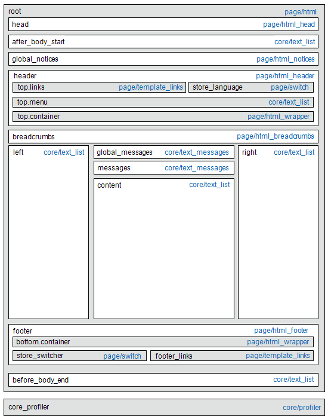
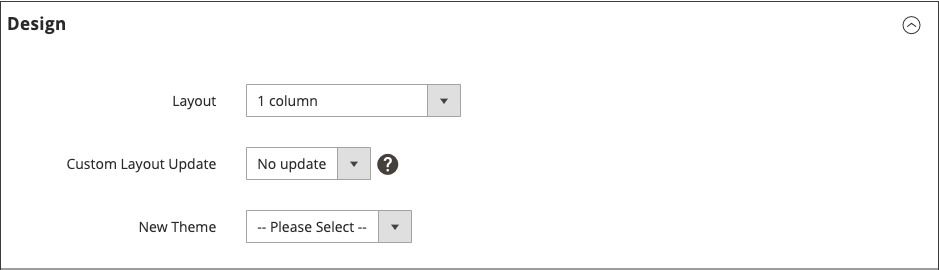

# Layout-Aktualisierungen

Bevor Sie mit benutzerdefinierten Layout-Aktualisierungen beginnen, müssen Sie wissen, wie die Seiten Ihres Stores aufgebaut sind und wie sich die Begriffe *Layout* und *Layout-Aktualisierung* unterscheiden. Layout bezieht sich auf die visuelle und strukturelle Komposition der Seite. Layout-Aktualisierungen beziehen sich auf einen bestimmten Satz von XML-Anweisungen, die die Erstellung der Seite überschreiben oder anpassen können.

Das XML-Layout Ihres [!DNL Commerce] ist eine hierarchische Struktur von Containern und Blöcken. Einige Elemente erscheinen auf jeder Seite, andere nur auf bestimmten Seiten. Weitere Informationen zu Layout, Containern und Blöcken finden Sie unter [Layouts - Übersicht](https://developer.adobe.com/commerce/frontend-core/guide/layouts/) im _Frontend-Entwicklerhandbuch_.

Das [Widget](widgets.md)-Tool bietet eine einfache Möglichkeit, einen vorhandenen [Inhaltsbaustein](blocks.md) zum Standard-Layout einer Seite hinzuzufügen. Für komplexere Aktualisierungen müssen Sie den XML-Layout-Aktualisierungs-Code auf dem Server speichern und dann die Datei vom Administrator als benutzerdefiniertes Layout-Update referenzieren. Einen Überblick über den Prozess finden Sie unter [Verwenden von Layout-Aktualisierungen](layout-updates.md#place-a-block-using-layout-updates).

Im folgenden Diagramm sind die Namen, die auf Container verweisen, schwarz und die Blocktypen bzw. Blockklassenpfade blau.

{width="500" zoomable="yes"}

| Blocktyp | Beschreibung |
|--- |--- |
| `page/html` | Der Name dieses Blocks lautet `root` und ist einer der wenigen Stammblöcke im Layout. Sie können auch einen eigenen Block erstellen und ihn `root` benennen, was der Standardname für Blöcke dieses Typs ist. Pro Seite kann es nur einen Block dieses Typs geben. |
| `page/html_head` | Der Blockname ist `head` und ein untergeordnetes Element des Stammblocks. Von diesem Typ kann pro Seite nur ein Block vorhanden sein, der nicht entfernt werden darf. |
| `page/html_notices` | Der Blockname ist `global_notices` und ein untergeordnetes Element des Stammblocks. Wenn dieser Block aus dem Layout entfernt wurde, werden die globalen Hinweise nicht auf der Seite angezeigt. Pro Seite kann es nur einen Block dieses Typs geben. |
| `page/html_header` | Der Blockname ist `header` und ein untergeordnetes Element des Stammblocks. Dieser Block entspricht der visuellen Kopfzeile am oberen Seitenrand und enthält mehrere Standardblöcke. Von diesem Typ kann pro Seite nur ein Block vorhanden sein, der nicht entfernt werden darf. |
| `page/html_wrapper` | Obwohl dieser Block im Standard-Layout enthalten ist, wird er nicht mehr unterstützt und nur aus Gründen der Abwärtskompatibilität einbezogen. Verwenden Sie keine Blöcke dieses Typs. |
| `page/html_breadcrumbs` | Der Name dieses Blocks lautet `breadcrumbs` und ist ein untergeordnetes Element des -Header-Blocks. Dieser Block zeigt Breadcrumbs für die aktuelle Seite an. Pro Seite kann es nur einen Block dieses Typs geben. |
| `page/html_footer` | Der Blockname ist `footer` und ein untergeordnetes Element des Stammblocks. Der Fußzeilenblock entspricht dem visuellen Fußzeilenblock unten auf der Seite und enthält mehrere Standardblöcke. Von diesem Typ kann pro Seite nur ein Block vorhanden sein, der nicht entfernt werden darf. |
| `page/template_links` | Im Standardlayout gibt es zwei Blöcke dieses Typs. Der `top.links` Block ist ein untergeordnetes Element des Kopfzeilenblocks und entspricht dem Navigationsmenü oben. Der `footer_links` Block ist ein untergeordnetes Element des Fußzeilenblocks und entspricht dem Navigationsmenü unten.   **_Hinweis:_** Es ist möglich, die Vorlagenverknüpfungen zu bearbeiten, wie in den Beispielen gezeigt. |
| `page/switch` | In einem Standardlayout gibt es zwei Blöcke dieses Typs. Der `store_language` Block ist ein untergeordnetes Element des Kopfzeilenblocks und entspricht dem oberen Sprachumschalter. Der `store_switcher` Block ist ein untergeordnetes Element des Fußzeilenblocks und entspricht dem Shopumschalter unten. |
| Core/Messages | In einem Standardlayout gibt es zwei Blöcke dieses Typs. Der `global_messages` zeigt globale Nachrichten an. Der `messages` wird verwendet, um alle anderen Nachrichten anzuzeigen. Wenn Sie diese Blöcke entfernen, werden dem Kunden keine Nachrichten angezeigt. |
| `core/text_list` | Dieser Blocktyp wird in [!DNL Commerce] häufig als Platzhalter für das Rendern von untergeordneten Blöcken verwendet. |
| `core/profiler` | Pro Seite gibt es nur eine Instanz dieses Blocktyps. Sie wird für den internen [!DNL Commerce]-Profiler verwendet und sollte nicht für andere Zwecke verwendet werden. |

{style="table-layout:auto"}

## Platzieren eines Blocks mithilfe von Layout-Aktualisierungen

[Layout-Aktualisierungen](layout-updates.md) ermöglichen es, das Layout einer Seite anzupassen. Layout-Aktualisierungen bieten mehr Flexibilität als [Widget](widgets.md) erfordern jedoch Zugriff auf den Server und grundlegende XML-Kenntnisse.

Die folgenden Schritte zeigen, wie Sie mit einer Layout-Aktualisierung einen Block auf einer Seite platzieren. Spezifische Beispiele und Hilfe zur Syntax finden Sie unter [Allgemeine Aufgaben zur Anpassung &#x200B;](https://developer.adobe.com/commerce/frontend-core/guide/layouts/) Layouts _im Frontend-_.

### Schritt 1: Erstellen des Blocks

1. Erstellen Sie den [Block](block-add.md), den Sie platzieren möchten.

1. Notieren Sie sich den `block_id`, da er in den Anweisungen zur Layout-Aktualisierung verwendet wird.

### Schritt 2: Layout-Aktualisierung in XML erstellen

1. Erstellen Sie die Layout-Anweisungen in XML, um [auf einen CMS-Block zu verweisen](https://developer.adobe.com/commerce/frontend-core/guide/layouts/xml-manage/).

1. Speichern Sie die [Layoutanweisungen](https://developer.adobe.com/commerce/frontend-core/guide/layouts/xml-instructions/) auf dem Server im Layout-Ordner, in dem XML-Dateien für das Design gespeichert werden.

   Beispiel:

   `<theme_dir>/<Namespace>_<Module>/layout`

   Der Layout-Handle ist der Dateiname, der mit `cms_page_view_selectable_` beginnt, gefolgt vom URL-Schlüssel der CMS-Seite, der Option zur Layout-Aktualisierung und dem `xml` Dateisuffix. Im folgenden Beispiel ist `customer-service` der URL-Schlüssel der Seite. `ChatTool` ist die Option, mit der Sie die Layout-Aktualisierung auf die Seite anwenden.

   `cms_page_view_selectable_`&lt;`customer-service`>`_`&lt;`ChatTool`>`.xml`

   | Element | Beschreibung |
   |--- |--- |
   | CMS-Seitenkennung | Der URL-Schlüssel der Seite mit einem beliebigen Schrägstrich (`/`), der durch einen Unterstrich (`_`) ersetzt wurde. |
   | Name der Layoutaktualisierung | Die Option, die für &quot;_Layout-Aktualisierung“_ wird. |

   {style="table-layout:auto"}

### Schritt 3: Verweisen Sie auf die Layout-Aktualisierung auf der Seite

1. Navigieren Sie in _Admin_-Seitenleiste zu **[!UICONTROL Content]** > _[!UICONTROL Elements]_>**[!UICONTROL Pages]**.

1. Suchen Sie die Seite, auf der Sie den Block platzieren möchten, und öffnen Sie ihn im Bearbeitungsmodus.

1. Scrollen Sie nach unten und erweitern Sie  den Abschnitt **[!UICONTROL Design]** .

1. Um alle verfügbaren Layout-Aktualisierungen anzuzeigen, die mit der Seite verknüpft sind, klicken Sie auf das Menü **[!UICONTROL Custom Layout Update]** .

   {width="400" zoomable="yes"}

1. Wählen Sie die Layout-Aktualisierung aus, die Sie auf die Seite anwenden möchten.

### Schritt 4: Speichern und aktualisieren Sie den Cache

1. Klicken Sie abschließend auf **[!UICONTROL Save & Close]**.

1. Klicken Sie in der Meldung oben im Arbeitsbereich auf **[!UICONTROL Cache Management]** und aktualisieren Sie alle ungültigen Cache-Elemente.
