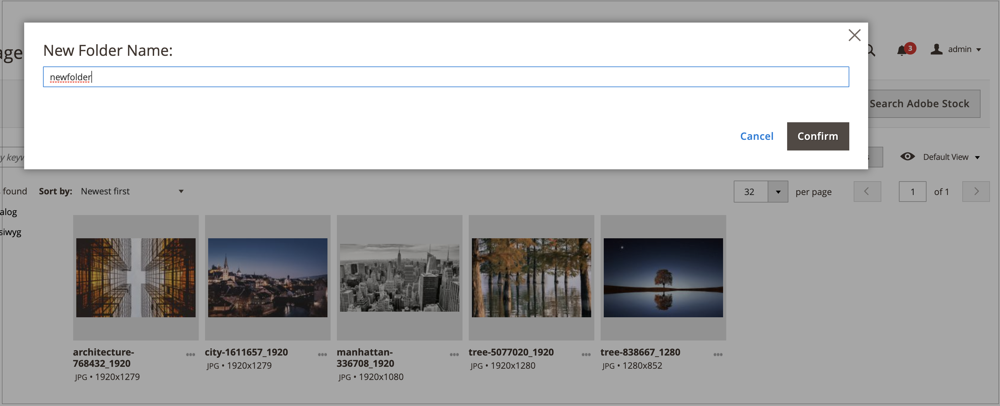

# Mediensammlungs-Ordnerverwaltung

Verwenden von Ordnern zum Organisieren von Bildern in der neuen [Mediensammlung](media-gallery.md). Mit zunehmender Anzahl von Medien-Assets erleichtern Ordner das Auffinden und Verwalten vorhandener Assets in der Mediensammlung.

## Erstellen eines Ordners

Sie können nur Ordner in den `pub/media/wysywig`, `pub/media/catalog/category` oder anderen Ordnern erstellen, die von -Modulen hinzugefügt wurden.

1. Navigieren Sie in _Admin_-Seitenleiste zu **[!UICONTROL Content]** > _[!UICONTROL Media]_>**[!UICONTROL Media Gallery]**.

1. Klicken Sie auf **[!UICONTROL Create Folder]**.

   Wenn Sie einen Unterordner erstellen möchten, wählen Sie den übergeordneten Ordner aus, bevor Sie auf **[!UICONTROL Create Folder]** klicken.

1. Geben Sie den neuen Ordnernamen ein und klicken Sie auf **[!UICONTROL Confirm]**.

   {width="600" zoomable="yes"}

## Löschen eines Ordners

>[!WARNING]
>
>Durch Löschen eines Ordners werden alle Bilder aus diesem Ordner entfernt. Sie können nur einen Ordner in den Ordnern `pub/media/wysywig` und `pub/media/catalog/category` löschen.

1. Navigieren Sie in _Admin_-Seitenleiste zu **[!UICONTROL Content]** > _[!UICONTROL Media]_>**[!UICONTROL Media Gallery]**.

1. Wählen Sie den zu löschenden Ordner aus.

   {width="600" zoomable="yes"}

1. Klicken Sie auf **[!UICONTROL Delete Folder]**.

1. Um das Löschen des Ordners zu bestätigen, klicken Sie auf **[!UICONTROL OK]**.
