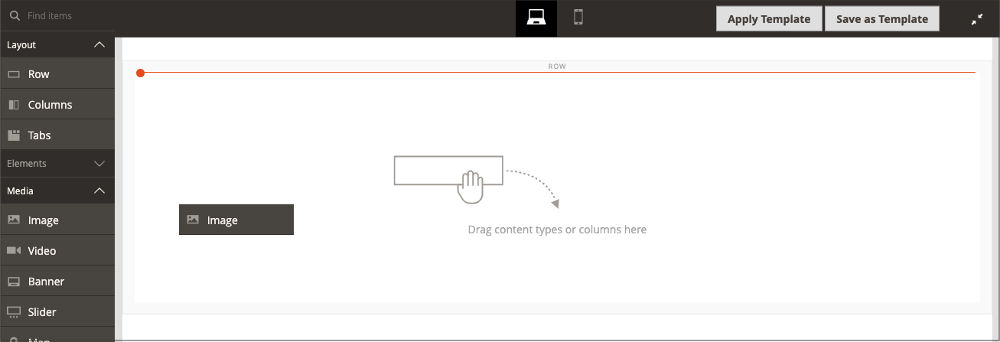

# Die [!DNL Media Gallery]

Mit Adobe Commerce oder Magento Open Source 2.4 können Händler den neuen _erweiterten_-[!DNL Media Gallery] verwenden, um ihre Mediendateien auf dem Server zu organisieren und zu verwalten. Dieser neue [!DNL Media Gallery] enthält dieselben Funktionen wie der vorhandene Medienspeicher, bietet jedoch eine verbesserte Benutzeroberfläche und eine engere Integration mit [Adobe Stock](https://stock.adobe.com).

{width="700" zoomable="yes"}

>[!NOTE]
>
>Produktbilder, die zum Abschnitt [_[!UICONTROL Images and Videos]_&#x200B;hinzugefügt &#x200B;](../catalog/product-image.md#upload-an-image), werden vom [!DNL Media Gallery] nicht verwaltet. In der neuen&#x200B;_[!UICONTROL Content]_ werden nur Bilder angezeigt und gefiltert, die im Abschnitt [!DNL Media Gallery] verwendet werden.

## Aktivieren des neuen [!DNL Media Gallery]

1. Navigieren Sie in _Admin_-Seitenleiste zu **[!UICONTROL Stores]** > _[!UICONTROL Settings]_>**[!UICONTROL Configuration]**.

1. Erweitern Sie im linken Bereich **[!UICONTROL Advanced]** und wählen Sie **[!UICONTROL System]**.

1. Erweitern Sie  **[!UICONTROL Media Gallery]**.

   ![Erweiterte Konfiguration - [!DNL Media Gallery]](./assets/system-media-gallery.png){width="600" zoomable="yes"}

1. Legen Sie **[!UICONTROL Enable Old Media Gallery]** auf `No` fest.

1. Klicken Sie auf **[!UICONTROL Save Config]**.

1. Wenn Sie dazu aufgefordert werden, klicken Sie auf den Link **[!UICONTROL Cache Management]** in der Systemmeldung und aktualisieren Sie den ungültigen Cache.

   Das [[!UICONTROL Content] zeigt &#x200B;](/help/content-design/content-menu.md) die neue _[!UICONTROL Media Gallery]_&#x200B;an.

>[!NOTE]
>
>Für die volle Funktionalität neuer [!DNL Media Gallery] müssen `media.gallery.synchronization`- und `media.content.synchronization`-Warteschlangenverbraucher für die Erstsynchronisierung gestartet werden. Weitere [&#x200B; finden Sie unter „Verwalten &#x200B;](https://experienceleague.adobe.com/docs/commerce-operations/configuration-guide/message-queues/manage-message-queues.html?lang=de) Nachrichtenwarteschlangen _im_ Konfigurationshandbuch“.

## Zugriff auf die neue [!DNL Media Gallery]

Auf die neue [!DNL Media Gallery] kann über das Menü Inhalt oder beim [Hinzufügen oder Bearbeiten einer Seite“ zugegriffen &#x200B;](/help/content-design/page-add.md). Sie können darauf auch zugreifen, wenn Sie [eine Kategorie erstellen oder bearbeiten](/help/catalog/category-create.md) oder wenn Sie [Bilder mit dem Inhaltseditor einfügen](/help/content-design/editor-insert-image.md).

So greifen Sie über das Menü [!UICONTROL Media Gallery] auf die neue [!UICONTROL Content] zu:

- Navigieren Sie in _Admin_-Seitenleiste zu **[!UICONTROL Content]** > _[!UICONTROL Media]_>**[!UICONTROL Media Gallery]**.

So greifen Sie beim Hinzufügen oder Bearbeiten einer Seite auf die neue Mediensammlung zu:

1. Navigieren Sie in _Admin_-Seitenleiste zu **[!UICONTROL Content]** > _[!UICONTROL Elements]_>**[!UICONTROL Pages]**.

1. Klicken Sie auf **[!UICONTROL Add a New Page]**.

   Wenn Sie eine vorhandene Seite bearbeiten möchten, können Sie in der Spalte _[!UICONTROL Action]_&#x200B;auf **[!UICONTROL Select]**&#x200B;klicken und **[!UICONTROL Edit]**&#x200B;auswählen.

1. Erweitern Sie  den Abschnitt **[!UICONTROL Content]** und führen Sie folgende Schritte aus:

   - Wenn [Page Builder aktiviert](../page-builder/setup.md) erweitern Sie das **[!UICONTROL Media]** Bedienfeld und ziehen Sie einen **[!UICONTROL Image]** Platzhalter in den Ziel-Container. Klicken Sie dann auf **[!UICONTROL Select from Gallery]**.

     {width="600" zoomable="yes"}

   - Wenn Sie den [WYSIWYG-Editor aktiviert haben](/help/content-design/editor.md) klicken Sie auf **[!UICONTROL Show/Hide Editor]** und dann auf **[!UICONTROL Insert Image]**.

## [!DNL Media Gallery] Demo

Weitere Informationen zum [!DNL Media Gallery] finden Sie in diesem Video:

>[!VIDEO](https://video.tv.adobe.com/v/3417562?captions=ger&quality=12&learn=on)
