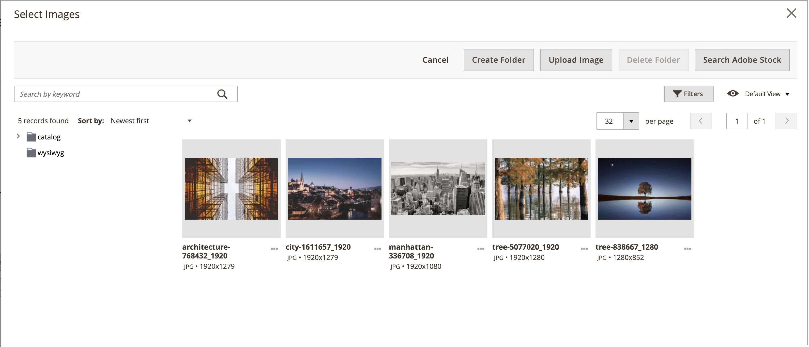

# Der [!DNL Media Gallery]

Mit Adobe Commerce oder Magento Open Source 2.4 können Händler ihre Mediendateien auf dem Server mithilfe des neuen _verbesserten_ [!DNL Media Gallery] organisieren und verwalten. Diese neue [!DNL Media Gallery] -Funktion weist dieselben Funktionen wie der vorhandene Medienspeicher auf, umfasst jedoch eine verbesserte Benutzeroberfläche und eine engere Integration in [Adobe Stock][adobe-stock].

{width="700" zoomable="yes"}

>[!NOTE]
>
>Produktbilder, die dem [_[!UICONTROL Images and Videos]_-Produktabschnitt](../catalog/product-image.md#upload-an-image) hinzugefügt wurden, werden nicht von der [!DNL Media Gallery] verwaltet. Nur Bilder, die in den Feldern des Produktabschnitts_[!UICONTROL Content]_ verwendet werden, werden in der neuen [!DNL Media Gallery] angezeigt und gefiltert.

## Aktivieren Sie die neue [!DNL Media Gallery]

1. Wechseln Sie in der Seitenleiste _Admin_ zu **[!UICONTROL Stores]** > _[!UICONTROL Settings]_>**[!UICONTROL Configuration]**.

1. Erweitern Sie im linken Bereich den Wert **[!UICONTROL Advanced]** und wählen Sie **[!UICONTROL System]** aus.

1. Erweitern Sie  **[!UICONTROL Media Gallery]**.

   ![Erweiterte Konfiguration - [!DNL Media Gallery]](./assets/system-media-gallery.png){width="600" zoomable="yes"}

1. Setzen Sie **[!UICONTROL Enable Old Media Gallery]** auf `No`.

1. Klicken Sie auf **[!UICONTROL Save Config]**.

1. Wenn Sie dazu aufgefordert werden, klicken Sie in der Systemmeldung auf den Link **[!UICONTROL Cache Management]** und aktualisieren Sie den ungültigen Cache.

   Das [[!UICONTROL Content] Menü](/help/content-design/content-menu.md) zeigt nun die neue _[!UICONTROL Media Gallery]_-Option an.

>[!NOTE]
>
>Für die volle Funktionalität für das neue [!DNL Media Gallery] müssen die Verbraucher der Warteschlange `media.gallery.synchronization` und `media.content.synchronization` für die Erstsynchronisierung gestartet werden. Weitere Informationen finden Sie unter [Verwalten von Nachrichtenwarteschlangen](https://experienceleague.adobe.com/docs/commerce-operations/configuration-guide/message-queues/manage-message-queues.html) im _Konfigurationshandbuch_ .

## Zugriff auf die neue [!DNL Media Gallery]

Auf den neuen [!DNL Media Gallery] kann über das Menü &quot;Inhalt&quot;zugegriffen werden oder wenn Sie [eine Seite hinzufügen oder bearbeiten](/help/content-design/page-add.md). Sie können auch darauf zugreifen, wenn Sie [eine Kategorie erstellen oder bearbeiten](/help/catalog/category-create.md) oder wenn Sie [Bilder mit dem Inhaltseditor einfügen](/help/content-design/editor-insert-image.md).

So greifen Sie über das Menü [!UICONTROL Content] auf die neue [!UICONTROL Media Gallery] zu:

- Wechseln Sie in der Seitenleiste _Admin_ zu **[!UICONTROL Content]** > _[!UICONTROL Media]_>**[!UICONTROL Media Gallery]**.

So greifen Sie beim Hinzufügen oder Bearbeiten einer Seite auf die neue Mediengalerie zu:

1. Wechseln Sie in der Seitenleiste _Admin_ zu **[!UICONTROL Content]** > _[!UICONTROL Elements]_>**[!UICONTROL Pages]**.

1. Klicken Sie auf **[!UICONTROL Add a New Page]**.

   Wenn Sie eine vorhandene Seite bearbeiten möchten, können Sie die Spalte _[!UICONTROL Action]_verwenden, um auf **[!UICONTROL Select]**zu klicken und **[!UICONTROL Edit]**auszuwählen.

1. Erweitern Sie den Abschnitt **[!UICONTROL Content]** des Erweiterungsselektors  und führen Sie folgende Schritte aus:

   - Wenn Sie [Seiten-Builder aktiviert haben](../page-builder/setup.md), erweitern Sie das Bedienfeld **[!UICONTROL Media]** und ziehen Sie einen **[!UICONTROL Image]** Platzhalter in den Zielcontainer. Klicken Sie dann auf **[!UICONTROL Select from Gallery]**.

     {width="600" zoomable="yes"}

   - Wenn Sie den [WYSIWYG-Editor aktiviert haben](/help/content-design/editor.md), klicken Sie auf **[!UICONTROL Show/Hide Editor]** und dann auf **[!UICONTROL Insert Image]**.

## [!DNL Media Gallery] Demo

Weitere Informationen zum [!DNL Media Gallery] finden Sie in diesem Video:

>[!VIDEO](https://video.tv.adobe.com/v/343785?quality=12)

[adobe-stock]: https://stock.adobe.com

