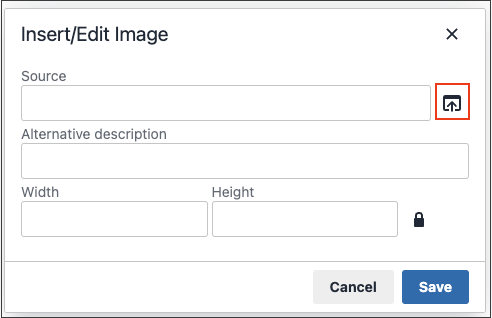

# Medienspeicher

Der Medienspeicher hilft Ihnen beim Organisieren und Empfangen von Zugriffen auf Mediendateien, die auf dem Server gespeichert sind. Der Pfad zum Speicherort der Dateien wird durch die Variable [Basis-URL](../stores-purchase/store-urls.md) Konfiguration. Der Zugriff auf Dateien im Medienspeicher ist über den Editor möglich, während Sie an Seiten und statischen Blöcken arbeiten. Normalerweise befindet sich der Medienspeicher im Dateisystem auf demselben Server wie der [!DNL Commerce] Programmdateien.

Mediendateien können auch in einer [Datenbank](media-storage-database.md)oder auf einem separaten Server oder [Content Delivery Network](media-storage-content-delivery-network.md). Der Vorteil der Verwendung von alternativem Speicher besteht darin, dass der für die Synchronisierung der Medien erforderliche Aufwand minimiert wird. Die Synchronisierungsleistung ist besonders betroffen, wenn mehrere Instanzen des Systems auf verschiedenen Servern bereitgestellt werden, die Zugriff auf dieselben Bilder, CSS-Dateien und anderen Mediendateien benötigen.

Der Editor kann so konfiguriert werden, dass er entweder statisch oder [URLs für dynamische Medien](../catalog/catalog-urls.md#configure-catalog-media-url-format) für Kataloginhalte in Kategorie- oder Produktbeschreibungen.

![[!DNL Commerce] Medienspeicher](./assets/media-storage.png){width="650" zoomable="yes"}

## Hinzufügen von Dateien zum Medienspeicher

Die ersten beiden Schritte sind dieselben wie beim Einfügen eines Bildes.

1. Im [editor](editor.md) Symbolleiste, klicken Sie auf _Bild einfügen_ Symbol.

   {width="700" zoomable="yes"}

   Diese Aktion öffnet die _[!UICONTROL Insert/edit image]_angezeigt.

1. Nachher _[!UICONTROL Source]_, klicken Sie auf die_ Suche _Symbol ({width="10" zoomable="no"}).

1. Führen Sie in der Ordnerstruktur auf der linken Seite einen der folgenden Schritte aus:

   - Navigieren Sie zu dem Ordner, in dem Sie das hochgeladene Bild speichern möchten.

   - Navigieren Sie zu dem Ort, an dem Sie einen Ordner erstellen möchten, und klicken Sie auf **Ordner erstellen**.

     Geben Sie zum Hinzufügen eines Ordners den Ordnernamen ein und klicken Sie auf **[!UICONTROL OK]**.

1. Um eine oder mehrere Dateien zum Medienspeicher hinzuzufügen, können Sie entweder die Dateien von Ihrem System hochladen oder die [Adobe Stock-Integration](adobe-stock.md):

   Um Dateien von Ihrem System hochzuladen, klicken Sie auf **[!UICONTROL Choose Files]** und gehen Sie wie folgt vor:

   - Navigieren Sie im Verzeichnis Ihres lokalen Computers zum Speicherort der Bilder.

   - Wählen Sie jedes Bild aus, das hochgeladen werden soll.

   - Klicken **[!UICONTROL Open]**.

   So verwenden Sie Assets aus Adobe Stock mithilfe der [Integration](adobe-stock.md):

   - Klicken **[!UICONTROL Search Adobe Stock]**.

   - Eine Vorschau oder ein lizenziertes Bild aus Adobe Stock hinzufügen (siehe [Verwenden von Adobe Stock-Bildern](adobe-stock-manage.md)).

Die Bilder werden in den aktuellen Ordner Medienspeicher auf dem Server hochgeladen.

![[!DNL Commerce] Medienspeicher](./assets/media-storage.png){width="650" zoomable="yes"}

## Bild aus Medienspeicher einfügen

Öffnen Sie die zu bearbeitende Seite oder den Block. Verwenden Sie dann eine der folgenden Methoden, um ein Bild aus dem Medienspeicher einzufügen:

### Methode 1: WYSIWYG-Modus

1. Im [editor](editor.md) Symbolleiste, klicken Sie auf _Bild einfügen_ Symbol.

1. Nachher _[!UICONTROL Source]_, klicken Sie auf die_ Suche _Symbol ({width="10" zoomable="no"}).

   {width="250" zoomable="yes"}

1. Navigieren Sie in der Ordnerstruktur auf der linken Seite zum Ordner, in dem das Bild gespeichert ist.

1. Wählen Sie die Kachel des Bildes aus und klicken Sie auf **[!UICONTROL Add Selected]**.

### Methode 2: HTML Modus

1. Positionieren Sie den Cursor im Code, wobei der `` -Tag eingefügt werden.

1. Klicken **[!UICONTROL Insert Image]**.

   {width="600" zoomable="yes"}
