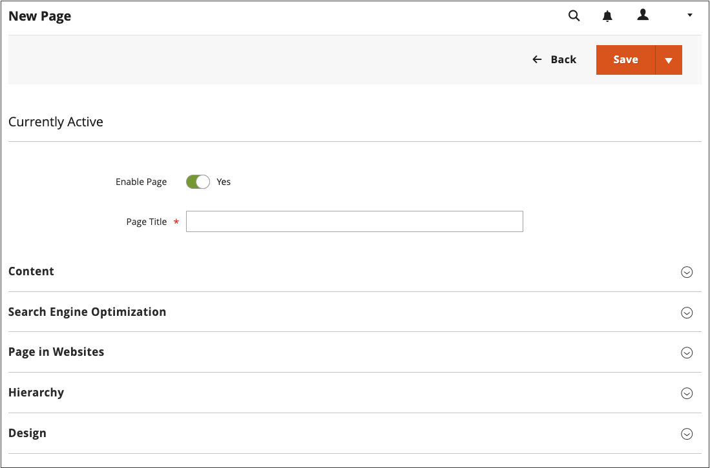
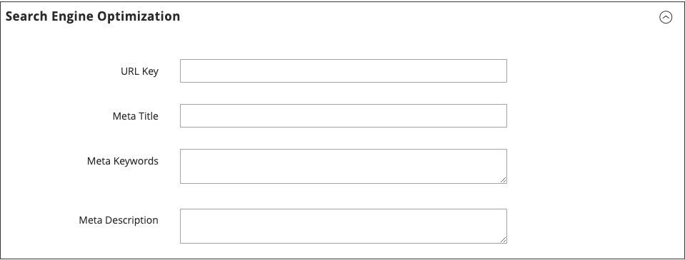

# Hinzufügen und Entfernen von Seiten

Der Prozess des Hinzufügens einer Inhaltsseite zu Ihrem Store ist für jeden Seitentyp, den Sie erstellen möchten, im Wesentlichen identisch. Sie können Text, Bilder, Inhaltsblöcke, Variablen und Widgets einschließen. Die meisten Inhaltsseiten sind so konzipiert, dass sie zuerst von Suchmaschinen und dann von Personen gelesen werden. Berücksichtigen Sie bei der Auswahl des Seitentitels und der URL sowie bei der Erstellung der Metadaten und Inhalte die Bedürfnisse jeder dieser beiden Zielgruppen. Wenn Ihre Seite vollständig ist, kann sie zur Navigation Ihres Stores hinzugefügt, mit anderen Seiten verknüpft, über die Fußzeile Ihres Stores verknüpft oder als neue ([) &#x200B;](page-home-new.md) verwendet werden.

{width="700" zoomable="yes"}

## Hinzufügen einer Seite

Die folgenden Anweisungen führen Sie durch die einzelnen Schritte zum Erstellen einer einfachen Seite. Einige erweiterte Funktionen werden übersprungen, aber in anderen Themen behandelt.

### Schritt 1: Seite erstellen

1. Navigieren Sie in _Admin_-Seitenleiste zu **[!UICONTROL Content]** > _[!UICONTROL Elements]_>**[!UICONTROL Pages]**.

1. Klicken Sie auf **[!UICONTROL Add New Page]**.

   {width="600" zoomable="yes"}

1. Wenn Sie die Seite nicht sofort veröffentlichen möchten, setzen Sie **[!UICONTROL Enable Page]** auf `No`.

1. Geben Sie die **[!UICONTROL Page Title]** ein.

   Der Seitentitel wird in der [Breadcrumb“ &#x200B;](../catalog/navigation-breadcrumb-trail.md).

### Schritt 2: Inhalt abschließen

Fügen Sie je nach [&#x200B; Konfiguration der erweiterten &#x200B;](../configuration-reference/general/content-management.md) den Seiteninhalt hinzu.

>[!NOTE]
>
>Der Inhaltseditor von Page Builder zeigt keine Vorschau der Seitenelemente von CMS an, die nicht für die standardmäßige Store-Ansicht verfügbar sind. Sie können beispielsweise keine Vorschau eines CMS-Blocks anzeigen, der nur nicht standardmäßigen Store-Ansichten zugewiesen ist. In diesem Fall müssen Sie zuerst Ihre CMS-Seite veröffentlichen. Dann können Sie diese Seite direkt in der Storefront anzeigen. Alternativ können Sie die Seite im [!UICONTROL Pages] im Admin-Bereich anzeigen, indem Sie die [!UICONTROL View] CMS in der Spalte [!UICONTROL Action] auswählen.

#### Verwenden der Inhaltstools von Page Builder

1. Erweitern Sie  **[!UICONTROL Content]**.

   {width="600" zoomable="yes"}

1. Geben Sie in das **[!UICONTROL Content Heading]** die Überschrift ein, die oben auf der Seite angezeigt werden soll.

   Wenn diese Option aktiviert ist[&#x200B; werden das &#x200B;](../page-builder/introduction.md) und Bedienfeld „Page Builder“ unter der Überschrift „Inhalt“ angezeigt. Weitere Informationen finden Sie unter [Workspace](../page-builder/workspace.md). Wenn _Page Builder_ nicht aktiviert ist, wird der Editor im WYSIWYG-Modus geöffnet, wobei die Symbolleiste oben angezeigt wird.

1. Vervollständigen Sie den Inhalt und formatieren Sie den Text nach Bedarf.

#### Verwenden der Editor-Symbolleiste

1. Erweitern Sie  **[!UICONTROL Content]**.

   {width="600" zoomable="yes"}

1. Geben Sie in das **[!UICONTROL Content Heading]** die Überschrift ein, die oben auf der Seite angezeigt werden soll.

1. Vervollständigen Sie den Inhalt und formatieren Sie den Text nach Bedarf.

   Sie können nach [&#x200B; (](media-storage.md)), [Variablen](../systems/variables-predefined.md) und [Widgets](widgets.md) hinzufügen. Weitere Informationen finden Sie unter [Verwenden des Editors](editor.md).

### Schritt 3: Vervollständigen Sie die SEO-Informationen

1. Erweitern Sie  **[!UICONTROL Search Engine Optimization]**.

   {width="600" zoomable="yes"}

1. Akzeptieren Sie entweder die Standardeinstellung oder geben Sie eine andere **[!UICONTROL URL Key]** ein, die aus Kleinbuchstaben mit Bindestrichen anstelle von Leerzeichen besteht.

   Der Standard-URL-Schlüssel wurde beim Speichern der Seite erstellt und basiert auf der Inhaltsüberschrift.

1. Geben Sie einen **[!UICONTROL Meta Title]** für die Seite ein.

   Der Meta-Titel sollte weniger als 70 Zeichen enthalten und wird in der Titelleiste und auf der Registerkarte des Browsers angezeigt.

1. Geben Sie eine Auswahl von hochwertigen **[!UICONTROL Meta Keywords]** ein, die Suchmaschinen zum Indizieren der Seite verwenden können.

   Trennen Sie mehrere Wörter durch ein Komma. Meta-Keywords werden von einigen Suchmaschinen ignoriert, von anderen jedoch verwendet.

1. Geben Sie **[!UICONTROL Meta Description]** eine kurze Beschreibung der Seite für die Liste der Suchergebnisse ein.

   Idealerweise sollte die Beschreibung 150 bis 160 Zeichen lang sein, wobei eine maximale Länge von 255 Zeichen erreicht werden sollte.

1. Klicken Sie auf **[!UICONTROL Save]**.

### Schritt 4: Festlegen des Umfangs der Seite

1. Erweitern Sie  **[!UICONTROL Page in Websites]**.

   {width="600" zoomable="yes"}

1. Wählen Sie in der **[!UICONTROL Store View]** jede Ansicht aus, in der die Seite verfügbar sein soll.

   Wenn die Installation über mehrere Websites verfügt, wählen Sie jede Website und Store-Ansicht aus, auf der die Seite verfügbar sein soll.

### Schritt 5: Übergeordnete Seite identifizieren (falls zutreffend)

{{ee-feature}}

1. Erweitern Sie  **[!UICONTROL Hierarchy]**.

   {width="600" zoomable="yes"}

1. Wenn diese Seite einer anderen Seite untergeordnet ist, aktivieren Sie das Kontrollkästchen der **[!UICONTROL Parent page]**.

### Schritt 6: Design-Änderungen eingeben (optional)

1. Um das Layout der Seite zu ändern, erweitern Sie  **[!UICONTROL Design]**.

   {width="600" zoomable="yes"}

1. Um das Spalten-Layout der Seite zu ändern, legen Sie **[!UICONTROL Layout]** auf einen der folgenden Werte fest:

   - `Empty`
   - `1 column`
   - `2 columns with left bar`
   - `2 columns with right bar`
   - `3 columns`
   - `Page -- Full Width` (erfordert [Page Builder](../page-builder/introduction.md))
   - `Category -- Full Width` (Page Builder erforderlich)
   - `Product -- Full Width` (Page Builder erforderlich)

1. Um einen **[!UICONTROL Custom Layout Update]** anzuwenden, wählen Sie den Namen der Datei aus der Liste aus.

   Weitere Informationen finden Sie unter [Layout-](layout-updates.md).

1. Um das Design der Seite zu ändern, legen Sie **[!UICONTROL New Theme]** auf einen der folgenden Werte fest:

   - `Magento Black`
   - `Magento Luma`

1.  (nur Magento Open Source) Um eine Designänderung zu planen, erweitern Sie  **[!UICONTROL Custom Design Update]** und gehen Sie folgendermaßen vor:

   {width="600" zoomable="yes"}

   - Verwenden Sie den Kalender (), um die **[!UICONTROL From]** und das **[!UICONTROL To]** Datum auszuwählen, an dem die Änderung wirksam werden soll.

   - Um ein anderes Design auf die Seite anzuwenden, wählen Sie den Namen des **[!UICONTROL New Theme]** aus.

   - Um das Spalten-Layout der Seite zu ändern, wählen Sie die **[!UICONTROL Layout]** aus, die Sie anwenden möchten.

### Schritt 7: Vorschau der Seite

1. Klicken Sie auf den **[!UICONTROL Save]** Pfeil und wählen Sie **[!UICONTROL Save & Close]** aus, um zum Seitenraster zurückzukehren.

1. Suchen Sie die Seite im Raster und wählen Sie **[!UICONTROL View]** in der Spalte _[!UICONTROL Action]_&#x200B;aus.

1. Um zum Raster zurückzukehren, klicken Sie in der oberen linken Ecke des Browser-Fensters auf **[!UICONTROL Back]** .

### Schritt 8: Veröffentlichen der Seite

1. Wählen Sie **[!UICONTROL Edit]** in der Spalte _[!UICONTROL Action]_&#x200B;des Rasters aus.

1. Legen Sie **[!UICONTROL Enable Page]** auf `Yes` fest.

1. Klicken Sie auf den **[!UICONTROL Save]** Pfeil und wählen Sie **[!UICONTROL Save & Close]** aus.

## Duplizieren einer Seite

Jede Inhaltsseite kann als Vorlage verwendet und als Duplikat gespeichert werden. Mit dieser zeitsparenden Methode können Sie ein konsistentes Design für Inhaltsseiten auf Ihrer Site erstellen. Die doppelte Seite behält den Seitentitel des Originals bei, aber die Felder URL-Schlüssel und Status müssen aktualisiert werden.

{width="600" zoomable="yes"}

1. Navigieren Sie in _Admin_-Seitenleiste zu **[!UICONTROL Content]** > _[!UICONTROL Elements]_>**[!UICONTROL Pages]**.

1. Suchen Sie im Raster die Seite, die Sie duplizieren möchten, und klicken Sie in der Spalte **[!UICONTROL Edit]** auf _[!UICONTROL Action]_.

1. Klicken Sie auf den **[!UICONTROL Save]** Pfeil und wählen Sie **[!UICONTROL Save & Duplicate]** aus.

1. Wenn Sie die Meldungen sehen, dass die Seite gespeichert und dupliziert wurde, klicken Sie in der oberen Symbolleiste auf **[!UICONTROL Back]** , um zum Raster zurückzukehren.

1. Suchen Sie die doppelte Seite im Raster und beachten Sie Folgendes:

   - Der Seitentitel entspricht dem Original.
   - Ein eindeutiger, aber temporärer URL-Schlüssel wird zugewiesen.
   - Der Status der Seite ist `Disabled`.

1. Öffnen Sie die doppelte Seite im _Bearbeiten_-Modus und führen Sie folgende Schritte aus:

   - Wenn Sie die Seite sofort veröffentlichen möchten, setzen Sie **[!UICONTROL Enable Page]** auf `Yes`.

   - Aktualisieren Sie die **[!UICONTROL Page Title]** nach Bedarf.

   - Erweitern Sie  den Abschnitt **[!UICONTROL Search Engine Optimization]** und geben Sie die eindeutige **[!UICONTROL URL Key]** ein, die Sie für die doppelte Seite verwenden möchten.

     {width="600" zoomable="yes"}

   - Aktualisieren Sie den verbleibenden Seiteninhalt nach Bedarf.

1. Klicken Sie auf den **[!UICONTROL Save]** Pfeil und wählen Sie **[!UICONTROL Save & Close]** aus.

   Die doppelte Seite im Raster spiegelt Ihre Änderungen wider.

## Menü speichern

| Befehl | Beschreibung |
|--- |--- |
| [!UICONTROL Save] | Speichert die aktuelle Seite und arbeitet weiter. |
| [!UICONTROL Save & New] | Speichern und schließen Sie die aktuelle Seite und beginnen Sie eine neue Seite. |
| [!UICONTROL Save & Duplicate] | Speichern und schließen Sie die aktuelle Seite und öffnen Sie eine neue Kopie. |
| [!UICONTROL Save & Close] | Speichern und schließen Sie die aktuelle Seite und kehren Sie zum Seitenraster zurück. |

{style="table-layout:auto"}

## Löschen einer Seite

Es gibt zwei Möglichkeiten, eine erstellte Seite zu entfernen. Sie können sie aus dem _[!UICONTROL Pages]_&#x200B;oder von der&#x200B;_[!UICONTROL Edit]_ entfernen.

### Methode 1: Entfernen einer Seite aus dem Seitenraster

1. Navigieren Sie in _Admin_-Seitenleiste zu **[!UICONTROL Content]** > _[!UICONTROL Elements]_>**[!UICONTROL Pages]**.

1. Suchen Sie die Seiten mithilfe von Filtern über dem Raster und aktivieren Sie das Kontrollkästchen für eine oder mehrere zu löschende Seiten.

1. Setzen Sie oben links in der Liste **[!UICONTROL Actions]** auf `Delete`.

1. Um die Aktion zu bestätigen, klicken Sie auf **[!UICONTROL OK]**.

### Methode 2: Entfernen einer Seite von der Bearbeitungsseite

1. Navigieren Sie in _Admin_-Seitenleiste zu **[!UICONTROL Content]** > _[!UICONTROL Elements]_>**[!UICONTROL Pages]**.

1. Suchen Sie die zu löschende Seite.

1. Klicken Sie in der Spalte _[!UICONTROL Actions]_&#x200B;für die Seitenentität auf **[!UICONTROL Select]**&#x200B;und wählen Sie **[!UICONTROL Edit]**&#x200B;aus.

1. Klicken Sie in der Schaltflächenleiste auf **[!UICONTROL Delete Page]**.

1. Um die Aktion zu bestätigen, klicken Sie auf **[!UICONTROL OK]**.
