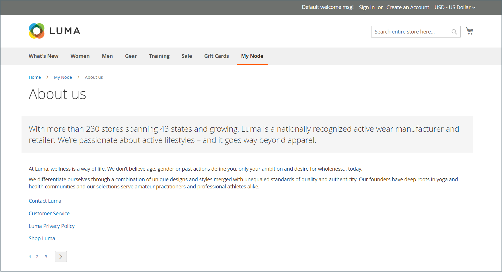
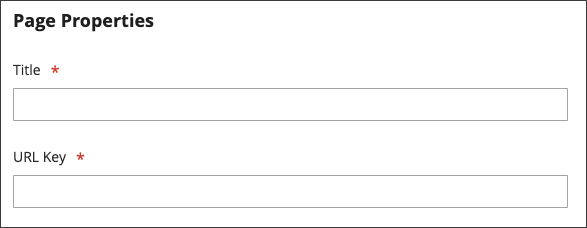

# Seitenhierarchie

{{ee-feature}}

Mit dem hierarchischen System für Speicherseiten können Sie Ihre Inhaltsseiten organisieren und Paginierung, Navigation und Menüs hinzufügen. Die Seite Datenschutzrichtlinie in den Beispieldaten ist ein Beispiel für eine Seite mit einem Menü auf der linken Seite. Wenn Sie regelmäßig eine große Menge von Inhalten veröffentlichen, können Sie Ihre Inhalte mithilfe einer Seitenhierarchie organisieren, um Personen das Auffinden von interessanten Artikeln zu erleichtern.

Das Seitenhierarchiesystem verwendet Knoten, um verwandte Inhaltselemente zu identifizieren und Inhaltsseiten in übergeordneten/untergeordneten Beziehungen zu organisieren. Ein übergeordneter Knoten ist wie ein Ordner, der untergeordnete Knoten und Seiten enthalten kann. Die relative Position jedes Knotens und jeder Seite in der Hierarchie wird als _tree_ -Struktur angezeigt. Ein Knoten kann andere Knoten und Inhaltsseiten enthalten und eine einzelne Inhaltsseite kann mit mehreren Knoten und anderen Inhaltsseiten in einer übergeordneten/untergeordneten oder benachbarten Beziehung verknüpft sein.

{width="600" zoomable="yes"}

## Konfigurieren der Seitenhierarchie

Die Konfigurationseinstellungen aktivieren das Seitenhierarchiesystem und die Metadaten und bestimmen das Standardmenülayout.

{width="600" zoomable="yes"}

1. Wechseln Sie in der Seitenleiste _Admin_ zu **[!UICONTROL Stores]** > _[!UICONTROL Settings]_>**[!UICONTROL Configuration]**.

1. Wählen Sie im linken Bereich unter _[!UICONTROL General]_die Option **[!UICONTROL Content Management]**.

1. Erweitern Sie  **[!UICONTROL CMS Page Hierarchy]** und nehmen Sie erforderliche Änderungen vor.

1. Klicken Sie nach Abschluss des Vorgangs auf **[!UICONTROL Save Config]**.

| Feld | Beschreibung |
|--- |--- |
| [!UICONTROL Enable Hierarchy Functionality] | Aktiviert die Verwendung der Seitenhierarchie für Ihre Inhaltsseiten. Optionen: `Yes` / `No` |
| [!UICONTROL Enable Hierarchy Metadata] | Wenn diese Option aktiviert ist, können Sie Metadaten mit Seiten in der Hierarchie verknüpfen. Optionen: `Yes` / `No` |
| [!UICONTROL Default Layout for Hierarchy Menu] | Legt den Standardmenüstil fest. Optionen: `Content` / `Left Column` / `Right Column` |

{style="table-layout:auto"}

## Hierarchieknoten hinzufügen

Das folgende Beispiel zeigt, wie ein Knoten mit einfacher Navigation zu verwandten Inhaltsseiten erstellt wird. Obwohl einem Knoten keine Inhaltsseite zugeordnet ist, verfügt er über einen URL-Schlüssel, der an anderer Stelle auf Ihrer Site referenziert werden kann.

Sie können beispielsweise einen Knoten mit dem Namen _Pressemitteilungen_ erstellen, der über die Navigation zu einzelnen Pressemitteilungen verfügt. Anschließend können Sie den Link auf Ihrer Seite _Über uns_ in den Knoten einfügen. Oder Sie erstellen einen Knoten für eine Sammlung von Back-Ausgaben Ihres Newsletters.

Um eine Verknüpfung zu einem Knoten herzustellen, verwenden Sie das Tool [Widget](widgets.md) , um einen CMS-Hierarchieknoten-Link zu erstellen und das Widget in einen Inhaltsbaustein oder eine Seite zu platzieren.

{width="600" zoomable="yes"}

### Schritt 1: Erstellen eines Knotens

1. Wechseln Sie in der Seitenleiste _Admin_ zu **[!UICONTROL Content]** > _[!UICONTROL Elements]_>**[!UICONTROL Hierarchy]**.

   {width="600" zoomable="yes"}

1. Klicken Sie über dem Raster auf **[!UICONTROL Add Node...]**.

1. Geben Sie unter _[!UICONTROL Page Properties]_einen **[!UICONTROL Title]**für den Knoten und einen geeigneten **[!UICONTROL URL Key]**ein.

   Der URL-Schlüssel stellt eine eindeutige Webadresse für den Knoten bereit. Hierbei muss es sich um Kleinbuchstaben handeln, wobei Trennzeichen anstelle von Leerzeichen verwendet werden.

   {width="500" zoomable="yes"}

1. Klicken Sie auf **[!UICONTROL Save]**.

   Der Knoten wird in der Baumstruktur links auf der Seite als Ordner angezeigt.

### Schritt 2: Hinzufügen von Seiten zum Knoten

1. Klicken Sie in der Hierarchiestruktur auf , um den Knoten auszuwählen.

1. Klicken Sie auf **[!UICONTROL Add Selected Pages(s) to Tree]**.

   Sie können nach oben scrollen, um zu sehen, dass jede ausgewählte Seite in der Struktur unter dem Knotenordner angezeigt wird.

### 3. Schritt: Struktur definieren

1. Ziehen Sie die Seiten bei Bedarf an die gewünschte Position, um sie im Menü anzuzeigen.

   {width="500" zoomable="yes"}

1. Klicken Sie oben in der Hierarchie auf den Knoten .

   Im Abschnitt _[!UICONTROL Page Properties]_werden jetzt Informationen zum Knoten angezeigt.

1. Führen Sie unter **[!UICONTROL Render Metadata in HTML Head]** folgende Schritte aus:

   {width="400" zoomable="yes"}

   - Um den Knoten als den oberen Rand der Hierarchie zu identifizieren, setzen Sie **[!UICONTROL First]** auf `Yes`.

   - Um ein Paginierungssteuerelement anzuzeigen, setzen Sie **[!UICONTROL Next/Previous]** auf `Yes`.

   - Um die Seiten in der Hierarchie als Buch zu organisieren, setzen Sie **[!UICONTROL Enable Chapter/Section]** auf `Yes`.

     Wenn Sie den Knoten nicht als Teil des Buches einbeziehen möchten, behalten Sie den Standardwert `No` bei.

   - Um den Knoten einem bestimmten Teil des Buches zuzuweisen, setzen Sie **[!UICONTROL Chapter/Section]** auf einen der folgenden Werte:

      - `No` - Definiert den Knoten nicht als Kapitel/Abschnitt.
      - `Chapter` - Weist den aktuellen Knoten als Kapitel zu.
      - `Section` - Weist den aktuellen Knoten als Abschnitt zu.
      - `Both` - Weist den aktuellen Knoten sowohl als Kapitel als auch als Abschnitt zu.

### Schritt 4: Hinzufügen von Paginierungskontrollen

1. Legen Sie unter _Paginierungsoptionen für verschachtelte Seiten_ **[!UICONTROL Enable Pagination]** auf `Yes` fest.

1. Geben Sie für &quot;**[!UICONTROL Frame]**&quot;die Anzahl der Seitenlinks ein, die Sie in das Paginierungssteuerelement aufnehmen möchten.

   Wenn die Hierarchie mehrere Seiten enthält, die in das Paginierungssteuerelement aufgenommen werden können.

1. Geben Sie für &quot;**[!UICONTROL Frame Skip]**&quot;die Anzahl der Seiten ein, die Sie für den nächsten Satz von Paginierungslinks voraus (oder zurück) überspringen möchten.

### Schritt 5: Menülayout auswählen

Wenn der Knoten im Menü angezeigt werden soll, gehen Sie wie folgt vor:

1. Legen Sie unter _Seitennavigationsmenüoptionen_ **[!UICONTROL Show in navigation menu]** auf `Yes` fest.

   Diese Einstellung bestimmt, ob ein Navigationsmenü für die Seitenhierarchie generiert wird.

   {width="300" zoomable="yes"}

1. Um die Position des Menüs im Verhältnis zum Inhalt anzugeben, legen Sie den Wert **[!UICONTROL Menu Layout]** fest:

   - `Content` - Das Menülayout befindet sich im Inhalt.
   - `Use Default` - Verwendet den in der [Konfiguration](../configuration-reference/general/content-management.md) angegebenen Menüstil.
   - `Left Column` - Das Menü wird links neben dem Inhalt angezeigt.
   - `Right Column` - Das Menü wird rechts neben dem Inhalt angezeigt.

1. Um festzulegen, wie viele Details im Menü enthalten sind, setzen Sie **[!UICONTROL Menu Detalization]** auf eine der folgenden Optionen:

   - `Only Children` - Umfasst nur Unterseiten im Menü.
   - `Neighbours and Children` - Umfasst Unterseiten und andere Seiten, die sich auf derselben Hierarchieebene befinden.

1. Um die Tiefe des Menüs zu bestimmen, geben Sie den Wert **[!UICONTROL Maximal Depth]** für die maximale Anzahl der einzuschließenden Ebenen ein.

1. Um das Menü zu formatieren, wählen Sie eine **[!UICONTROL List Type]**:

   - `Unordered` - Die Menüoptionen sind nicht nummeriert und können mit oder ohne Aufzählungszeichen formatiert werden. Optionen für ungeordneten Listentyp: Standard/Kreis/Datenträger/Quadrat
   - `Ordered` - Die Menüoptionen sind nummeriert und können in Groß- oder Kleinbuchstaben als numerische, alphabetische oder römische Zahlen formatiert werden.

1. Setzen Sie **[!UICONTROL List Style]** auf einen der folgenden Werte:

   - `Circle`
   - `Disc`
   - `Square`

1. Wenn der Knoten auch im Navigationsmenü sichtbar sein soll, scrollen Sie zu _Optionen des Hauptnavigationsmenüs_ und legen Sie **[!UICONTROL Show in Navigation menu]** auf `Yes` fest.

   {width="250" zoomable="yes"}

1. Klicken Sie auf **[!UICONTROL Save]**.
