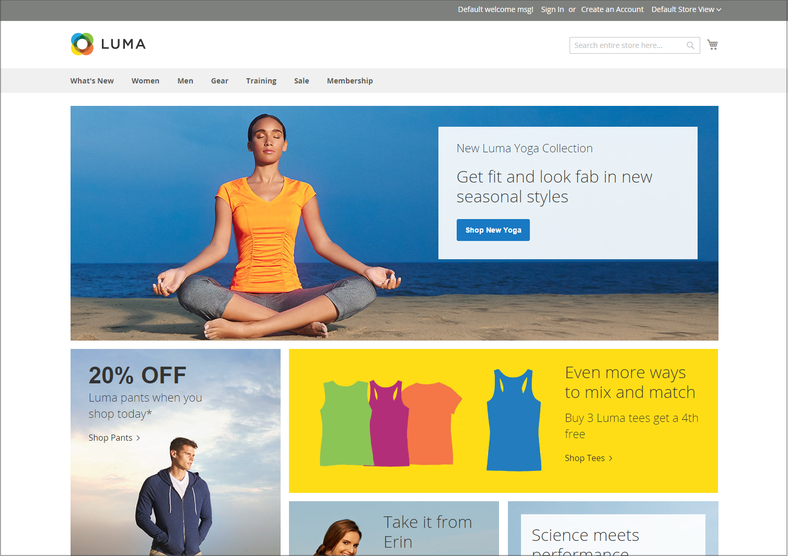

# Layoutbeispiele für Storefronts

Die Spaltenabmessungen werden durch das Stylesheet des Designs bestimmt. Einige Designs wenden eine feste Pixelbreite auf das Seiten-Layout an, während andere Prozentsätze verwenden, damit die Seite auf die Breite des Fensters oder Geräts reagiert.

Die meisten Desktop-Designs haben eine feste Breite für die Hauptspalte, und alle Aktivitäten finden in diesem geschlossenen Bereich statt. Je nach Bildschirmauflösung steht auf jeder Seite der Hauptspalte ein leerer Bereich zur Verfügung.

## Eine Spalte

Der Inhaltsbereich für ein einspaltiges Layout erstreckt sich über die gesamte Breite der Hauptspalte. Dieses Layout wird häufig für eine Startseite mit einem großen Banner oder Regler oder für Seiten verwendet, für die keine Navigation erforderlich ist, z. B. eine Anmeldeseite, eine Splash-Seite, ein Video oder eine ganzseitige Werbung.

{width="700" zoomable="yes"}

## Zwei Spalten mit linker Leiste

Der Inhaltsbereich dieses Layouts ist in zwei Spalten unterteilt. Die Spalte mit dem Hauptinhalt ist nach rechts verschoben, die Seitenleiste nach links.

{width="700" zoomable="yes"}

## Zwei Spalten mit rechter Leiste

Dieses Layout entspricht dem anderen zweispaltigen Layout. Dieses Mal ist die Seitenleiste nach rechts verschoben und die Spalte Hauptinhalt nach links.

{width="700" zoomable="yes"}

## Drei Spalten

Ein dreispaltiges Layout hat einen Hauptinhaltsbereich mit zwei Seitenspalten. Die linke Seitenleiste und die Spalte mit dem Hauptinhalt sind umschlossen und als Einheit nach links verschoben. Die andere Seitenleiste schwebt nach rechts.

{width="700" zoomable="yes"}
