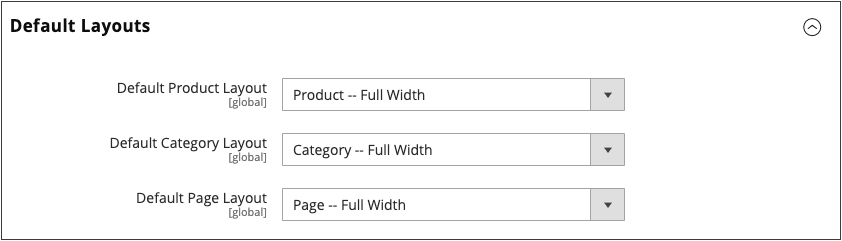

# Seiten-Layouts

Das Layout jeder Seite in Ihrem Store besteht aus verschiedenen Abschnitten oder Containern, die die Kopfzeilen-, Fußzeilen- und Inhaltsbereiche der Seite definieren. Je nach Layout kann jede Seite eine, zwei, drei Spalten oder mehr haben. Sie können sich das Layout als &quot;_&quot;_ Seite vorstellen und ein spezifisches Layout zuweisen, das als Standard für CMS-, Produkt- und Kategorieseiten verwendet wird.

Auf der Seite werden Inhaltsblöcke je nach Abschnitt des Seitenlayouts, in dem sie angezeigt werden sollen, so verschoben[ dass sie ](layout-updates.md) verfügbaren Platz ausfüllen. Beachten Sie, dass beim Ändern des Layouts von einem dreispaltigen zu einem zweispaltigen Layout der Inhalt des Hauptbereichs erweitert wird, um den verfügbaren Platz zu füllen. Beachten Sie außerdem, dass alle Blöcke, die mit der nicht verwendeten Seitenleiste verknüpft sind, zu verschwinden scheinen. Wenn Sie jedoch das dreispaltige Layout wiederherstellen, werden die Blöcke erneut angezeigt. Dieser fließende Ansatz oder _Liquid Layout_ ermöglicht es, das Seiten-Layout zu ändern, ohne den Inhalt überarbeiten zu müssen. Wenn Sie es gewohnt sind, mit einzelnen HTML-Seiten zu arbeiten, erfordert dieser modulare _Baustein_-Ansatz eine andere Denkweise.

{width="700" zoomable="yes"}

## Standard-Layouts konfigurieren

1. Navigieren Sie in _Admin_-Seitenleiste zu **[!UICONTROL Stores]** > _[!UICONTROL Settings]_>**[!UICONTROL Configuration]**.

1. Wählen Sie im linken Bedienfeld unter _[!UICONTROL General]_die Option **[!UICONTROL Web]**aus.

1. Erweitern Sie  den Abschnitt **[!UICONTROL Default Layouts]** .

   {width="600" zoomable="yes"}

1. Wählen Sie die **[!UICONTROL Default Product Layout]** aus, die Sie für Produktseiten verwenden möchten.

   Diese Einstellung bestimmt das Layout, das standardmäßig für Produktseiten verwendet wird.

   - `No layout updates` - Layout-Aktualisierungen sind für Produktseiten nicht verfügbar.
   - `Empty` - Verwendet ein leeres Layout für Produktseiten.
   - `1 column` - Verwendet ein einspaltiges Layout für Produktseiten.
   - `2 columns with left bar` - Verwendet ein zweispaltiges Layout mit der Seitenleiste links für Produktseiten.
   - `2 columns with right bar` - Verwendet ein zweispaltiges Layout mit der Seitenleiste auf der rechten Seite für Produktseiten.
   - `3 columns` - Verwendet ein dreispaltiges Layout mit Seitenleisten links und rechts für Produktseiten.

   Wenn [Page Builder](../page-builder/introduction.md) aktiviert ist, stehen zusätzliche Optionen für die volle Breite zur Verfügung. Anschließend können Sie die Inhaltstools von Page Builder verwenden, um das Layout für Ihre Produktseiten zu entwerfen.

   - `Page -- Full Width` - Verwendet das Layout _Seite -_ Breite) für Produktseiten.
   - `Category -- Full Width` - Verwendet das Layout _Kategorie -_ Breite) für Produktseiten.
   - `Product -- Full Width` - (Empfohlen) Verwendet das Layout _Produkt -_ Breite“ für Produktseiten.

1. Wählen Sie die **[!UICONTROL Default Category Layout]** aus, die Sie für Kategorieseiten verwenden möchten.

   Diese Einstellung bestimmt das Layout, das standardmäßig für Kategorieseiten verwendet wird.

   - `No layout updates` - Layout-Aktualisierungen sind für Kategorieseiten nicht verfügbar.
   - `Empty` - Verwendet ein leeres Layout für Kategorieseiten.
   - `1 column` - Verwendet ein einspaltiges Layout für Kategorieseiten.
   - `2 columns with left bar` - Verwendet ein zweispaltiges Layout mit der Seitenleiste auf der linken Seite für Kategorieseiten.
   - `2 columns with right bar` - Verwendet ein zweispaltiges Layout mit der Seitenleiste auf der rechten Seite für Kategorieseiten.
   - `3 columns` - Verwendet ein dreispaltiges Layout mit Seitenleisten links und rechts für Kategorieseiten.

   Wenn [Page Builder](../page-builder/introduction.md) aktiviert ist, stehen zusätzliche Optionen für die volle Breite zur Verfügung. Anschließend können Sie die Inhaltstools von Page Builder verwenden, um das Layout für Ihre Kategorieseiten zu entwerfen.

   - `Page -- Full Width` - Verwendet das Layout _Seite - Volle Breite_ für Kategorieseiten.
   - `Category -- Full Width` - (Empfohlen) Verwendet das Layout _Kategorie - Vollständige Breite_ für Kategorieseiten.
   - `Product -- Full Width` - Verwendet das Layout _Produkt -_ Breite) für Kategorieseiten.

1. Wählen Sie die **[!UICONTROL Default Page Layout]** aus, die Sie für CMS-Seiten verwenden möchten.

   Diese Einstellung legt das Layout fest, das standardmäßig für CMS-Seiten verwendet wird.

   - `No layout updates` - Für CMS-Seiten sind keine Layout-Aktualisierungen verfügbar.
   - `Empty` - Verwendet ein leeres Layout für CMS-Seiten.
   - `1 column` - Verwendet ein einspaltiges Layout für CMS-Seiten.
   - `2 columns with left bar` - Verwendet ein zweispaltiges Layout mit der Seitenleiste auf der linken Seite für CMS-Seiten.
   - `2 columns with right bar` - Verwendet ein zweispaltiges Layout mit der Seitenleiste auf der rechten Seite für CMS-Seiten.
   - `3 columns` - Verwendet ein dreispaltiges Layout mit Seitenleisten links und rechts für CMS-Seiten.

   Wenn [Page Builder](../page-builder/introduction.md) aktiviert ist, stehen zusätzliche Optionen für die volle Breite zur Verfügung. Anschließend können Sie die Inhaltstools von Page Builder verwenden, um das Layout für Ihre CMS-Seiten zu entwerfen.

   - `Page -- Full Width` - (Empfohlen) Verwendet das Layout _Seite - Volle Breite_ für CMS-Seiten.
   - `Category - Full Width` - Verwendet das Layout _Kategorie - Volle Breite_ für CMS-Seiten.
   - `Product - Full Width` - Verwendet das Layout _Produkt -_ Breite) für CMS-Seiten.

1. Klicken Sie abschließend auf **[!UICONTROL Save Config]**.

## Standard-Seitenlayouts

### Eine Spalte

{zoomable="yes"}

Das _[!UICONTROL 1 Column]_-Layout kann verwendet werden, um eine dramatische Startseite mit einem großen Bild oder Fokus zu erstellen. Es ist auch eine gute Wahl für eine Landingpage oder eine andere Seite, die eine Kombination aus Text, Bildern und Video aufweist.

### Zwei Spalten mit linker Leiste

{zoomable="yes"}

Das _[!UICONTROL 2 Columns with Left Bar]_-Layout wird häufig für Seiten mit Navigation auf der linken Seite verwendet, z. B. einen Katalog oder Suchergebnisseiten mit mehrschichtiger Navigation. Es ist auch eine hervorragende Wahl für Startseiten, die zusätzliche Navigation oder Blöcke unterstützender Inhalte auf der linken Seite benötigen.

### Zwei Spalten mit rechter Leiste

{zoomable="yes"}

Mit einem _[!UICONTROL 2 Columns with Right Bar]_Layout ist der Hauptinhaltsbereich groß genug für ein ansprechendes Bild oder Banner. Dieses Layout wird auch häufig für Produktseiten mit Blöcken unterstützender Inhalte auf der rechten Seite verwendet.

### Drei Spalten

{zoomable="yes"}

Das _[!UICONTROL 3 Column]_Layout verfügt über eine mittlere Spalte, die breit genug für den Haupttext der Seite ist, mit Platz auf jeder Seite für zusätzliche Navigation und Blöcke mit unterstützenden Inhalten.

### leer

{zoomable="yes"}

Mit dem _[!UICONTROL Empty]_-Layout können Sie benutzerdefinierte Seiten-Layouts definieren.
