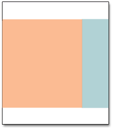

# Seitenlayouts

Das Layout jeder Seite in Ihrem Store besteht aus verschiedenen Abschnitten oder Containern, die die Kopf-, Fußzeilen- und Inhaltsbereiche der Seite definieren. Je nach Layout kann jede Seite über eine, zwei, drei Spalten oder mehr verfügen. Sie können sich das Layout als _Bodenplan_ und weisen Sie ein bestimmtes Layout zu, das als Standard für CMS-, Produkt- und Kategorieseiten verwendet werden soll.

Auf der Seite schwebt der Inhaltsbaustein, um den verfügbaren Platz gemäß dem Abschnitt der [Seitenlayout](layout-updates.md) wo sie angezeigt werden. Beachten Sie, dass sich der Inhalt des Hauptbereichs erweitert, wenn Sie das Layout von einem dreiseitigen in ein zweispaltiges Layout ändern. Beachten Sie außerdem, dass alle Blöcke, die mit der nicht verwendeten Seitenleiste verknüpft sind, scheinbar verschwinden. Wenn Sie jedoch das dreiseitige Layout wiederherstellen, werden die Blöcke wieder angezeigt. dieser flüssige Ansatz oder _flüssiges Layout_ ermöglicht es, das Seitenlayout zu ändern, ohne den Inhalt neu erstellen zu müssen. Wenn Sie es gewohnt sind, mit einzelnen HTML-Seiten zu arbeiten, ist dieser modulare, _Baustein_ Ansatz erfordert eine andere Denkweise.

{width="700" zoomable="yes"}

## Standardlayouts konfigurieren

1. Im _Admin_ Seitenleiste, navigieren Sie zu **[!UICONTROL Stores]** > _[!UICONTROL Settings]_>**[!UICONTROL Configuration]**.

1. Im linken Bereich unter _[!UICONTROL General]_auswählen **[!UICONTROL Web]**.

1. Erweitern  die **[!UICONTROL Default Layouts]** Abschnitt.

   {width="600" zoomable="yes"}

1. Wählen Sie die **[!UICONTROL Default Product Layout]** die Sie für Produktseiten verwenden möchten.

   Diese Einstellung legt das Layout fest, das standardmäßig für Produktseiten verwendet wird.

   - `No layout updates` - Layoutaktualisierungen sind für Produktseiten nicht verfügbar.
   - `Empty` - Verwendet ein leeres Layout für Produktseiten.
   - `1 column` - Verwendet ein einspaltiges Layout für Produktseiten.
   - `2 columns with left bar` - Verwendet ein zweispaltiges Layout mit der Seitenleiste auf der linken Seite für Produktseiten.
   - `2 columns with right bar` - Verwendet ein zweispaltiges Layout mit der Seitenleiste auf der rechten Seite für Produktseiten.
   - `3 columns` - Verwendet ein dreiseitiges Layout mit Seitenleisten auf der linken und rechten Seite für Produktseiten.

   Wann [Page Builder](../page-builder/introduction.md) aktiviert ist, sind zusätzliche Optionen für die volle Breite verfügbar. Anschließend können Sie mit den Inhaltstools des Seitenaufbaus das Layout für Ihre Produktseiten entwerfen.

   - `Page -- Full Width` - Verwendet die _Seite - Vollständige Breite_  Layout für Produktseiten.
   - `Category -- Full Width` - Verwendet die _Kategorie - Vollständige Breite_ Layout für Produktseiten.
   - `Product -- Full Width` - (Empfohlen) Verwendet die _Produkt - Vollständige Breite_ Layout für Produktseiten.

1. Wählen Sie die **[!UICONTROL Default Category Layout]** die Sie für Kategorieseiten verwenden möchten.

   Diese Einstellung bestimmt das Layout, das standardmäßig für Kategorieseiten verwendet wird.

   - `No layout updates` - Layoutaktualisierungen sind für Kategorieseiten nicht verfügbar.
   - `Empty` - Verwendet ein leeres Layout für Kategorieseiten.
   - `1 column` - Verwendet ein einspaltiges Layout für Kategorieseiten.
   - `2 columns with left bar` - Verwendet ein zweispaltiges Layout mit der Seitenleiste links für Kategorieseiten.
   - `2 columns with right bar` - Verwendet ein zweispaltiges Layout mit der Seitenleiste auf der rechten Seite für Kategorieseiten.
   - `3 columns` - Verwendet ein dreiseitiges Layout mit Seitenleisten auf der linken und rechten Seite für Kategorieseiten.

   Wann [Page Builder](../page-builder/introduction.md) aktiviert ist, sind zusätzliche Optionen für die volle Breite verfügbar. Anschließend können Sie mit den Inhaltstools des Seitenaufbaus das Layout für Ihre Kategorieseiten entwerfen.

   - `Page -- Full Width` - Verwendet die _Seite - Vollständige Breite_ Layout für Kategorieseiten.
   - `Category -- Full Width` - (Empfohlen) Verwendet die _Kategorie - Vollständige Breite_ Layout für Kategorieseiten.
   - `Product -- Full Width` - Verwendet die _Produkt - Vollständige Breite_ Layout für Kategorieseiten.

1. Wählen Sie die **[!UICONTROL Default Page Layout]** die Sie für CMS-Seiten verwenden möchten.

   Diese Einstellung bestimmt das Layout, das standardmäßig für CMS-Seiten verwendet wird.

   - `No layout updates` - Layoutaktualisierungen sind für CMS-Seiten nicht verfügbar.
   - `Empty` - Verwendet ein leeres Layout für CMS-Seiten.
   - `1 column` - Verwendet ein einspaltiges Layout für CMS-Seiten.
   - `2 columns with left bar` - Verwendet ein zweispaltiges Layout mit der Seitenleiste links für CMS-Seiten.
   - `2 columns with right bar` - Verwendet ein zweispaltiges Layout mit der Seitenleiste auf der rechten Seite für CMS-Seiten.
   - `3 columns` - Verwendet ein dreiseitiges Layout mit Seitenleisten auf der linken und rechten Seite für CMS-Seiten.

   Wann [Page Builder](../page-builder/introduction.md) aktiviert ist, sind zusätzliche Optionen für die volle Breite verfügbar. Anschließend können Sie mit den Inhaltstools des Seitenaufbaus das Layout für Ihre CMS-Seiten entwerfen.

   - `Page -- Full Width` - (Empfohlen) Verwendet die _Seite - Vollständige Breite_ Layout für CMS-Seiten.
   - `Category - Full Width` - Verwendet die _Kategorie - Vollständige Breite_ Layout für CMS-Seiten.
   - `Product - Full Width` - Verwendet die _Produkt - Vollständige Breite_ Layout für CMS-Seiten.

1. Wenn Sie fertig sind, klicken Sie auf **[!UICONTROL Save Config]**.

## Standardmäßige Seitenlayouts

### Eine Spalte

{zoomable=&quot;yes&quot;}

Die _[!UICONTROL 1 Column]_-Layout kann verwendet werden, um eine dramatische Startseite mit einem großen Bild oder Fokus zu erstellen. Sie eignet sich auch für Landingpages oder andere Seiten mit einer Kombination aus Text, Bildern und Videos.

### Zwei Spalten mit linker Leiste

{zoomable=&quot;yes&quot;}

Die _[!UICONTROL 2 Columns with Left Bar]_-Layout wird häufig für Seiten mit Navigation auf der linken Seite verwendet, z. B. für Kataloge oder Suchergebnisseiten mit mehrteiliger Navigation. Es ist auch eine hervorragende Wahl für Startseiten, die zusätzliche Navigation benötigen oder Bausteine unterstützender Inhalte auf der linken Seite.

### Zwei Spalten mit rechter Leiste

{zoomable=&quot;yes&quot;}

Mit _[!UICONTROL 2 Columns with Right Bar]_-Layout verwenden, ist der Hauptinhaltsbereich groß genug für ein auffälliges Bild oder Banner. Dieses Layout wird häufig auch für Produktseiten mit Bausteinen mit unterstützendem Inhalt auf der rechten Seite verwendet.

### Drei Spalten

{zoomable=&quot;yes&quot;}

Die _[!UICONTROL 3 Column]_Das Layout verfügt über eine mittlere Spalte, die für den Haupttext der Seite breit genug ist, wobei auf jeder Seite Platz für zusätzliche Navigation und unterstützende Inhalte vorhanden ist.

### Empty

{zoomable=&quot;yes&quot;}

Die _[!UICONTROL Empty]_-Layout können zur Definition benutzerdefinierter Seitenlayouts verwendet werden.
