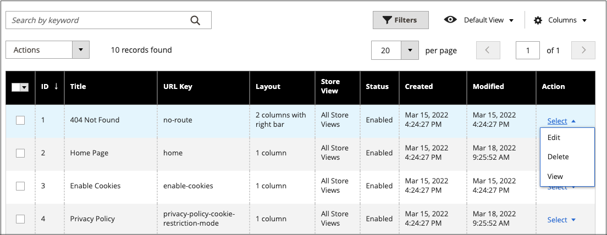
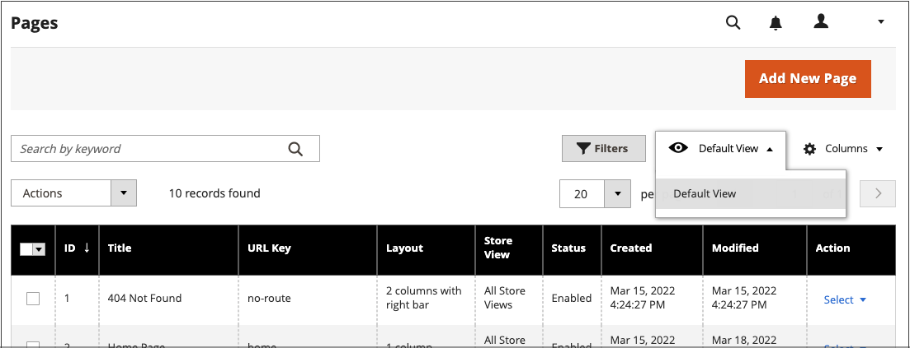

# Steuerelemente für den Seitenarbeitsbereich

Der Seitenarbeitsbereich enthält Tools, mit denen Sie die benötigten Seiten schnell finden können, sowie Befehle zur Durchführung von Routinewartungsaufgaben auf einzelnen oder mehreren Seiten. Sie können die Seiteneigenschaften auch schnell über das Raster aktualisieren.

{width="700" zoomable="yes"}

## Schnelles Aktualisieren der Seiteneigenschaften

1. Navigieren Sie in _Admin_-Seitenleiste zu **[!UICONTROL Content]** > _[!UICONTROL Elements]_>**[!UICONTROL Pages]**.
1. Klicken Sie auf eine beliebige Zeile im Raster.

   {width="600" zoomable="yes"}

   Um mehrere Datensätze auszuwählen, aktivieren Sie das Kontrollkästchen jeder Zeile, die Sie aktualisieren möchten.

1. Aktualisieren Sie eine der folgenden Eigenschaften:

   - **[!UICONTROL Title]**
   - **[!UICONTROL URL Key]**
   - **[!UICONTROL Status]**
   - **[!UICONTROL Layout]**

1. Klicken Sie abschließend auf **[!UICONTROL Save]**.

## Workspace-Steuerelemente

| Kontrolle | Beschreibung |
|--- |--- |
| [!UICONTROL Add New Page] | Fügt eine Seite hinzu. |
| [!UICONTROL Search] | Startet eine Katalogsuche anhand der aktuellen Filter. |
| [!UICONTROL Actions] | Listet alle Aktionen auf, die auf ausgewählte Elemente in der Liste angewendet werden können. Wenn Sie eine Aktion auf eine Seite oder auf mehrere Seiten anwenden möchten, aktivieren Sie das Kontrollkästchen in der ersten Spalte jedes Datensatzes, der der Aktion unterliegt. Optionen: `Delete` / `Disable` / `Enable` / `Edit` |
| [!UICONTROL Select] | Mit dem Steuerelement in der Kopfzeile der ersten Spalte können mehrere Datensätze als Ziel der Aktion ausgewählt werden. Aktivieren Sie das Kontrollkästchen in der ersten Spalte jedes Datensatzes, den Sie auswählen möchten. Optionen: `Select All` / `Deselect All` |
| [!UICONTROL Save Edits] | Wendet die aktuelle Aktion auf ausgewählte Datensätze an. |
| [!UICONTROL Edit] | Öffnet den Datensatz im Bearbeitungsmodus. Dasselbe können Sie erreichen, indem Sie auf eine beliebige Stelle in der Zeile klicken. |

{style="table-layout:auto"}

## Spalten

| Spalte | Beschreibung |
|--- |--- |
| [!UICONTROL Select] | Mit dem Kontrollkästchen in der ersten Spalte werden mehrere Datensätze ausgewählt. Optionen: `Select All` / `Deselect All` |
| [!UICONTROL ID] | Die ID ist eine fortlaufende Zahl, die jeder Seite zugewiesen wird. |
| [!UICONTROL Title] | Der Titel, der oben auf der Seite angezeigt wird. |
| [!UICONTROL URL Key] | Der URL-Schlüssel ähnelt einem Dateinamen und identifiziert die Seite in der URL. |
| [!UICONTROL Layout] | Legt fest, ob die Seite mit Seitenleisten rechts oder links vom Hauptinhaltsbereich angezeigt wird. Optionen: `1 column` / `2 columns with left bar` / `2 columns with right bar` / `3 columns` / `Empty` |
| [!UICONTROL Store View] | Wird verwendet, um die Seite mit einer bestimmten Store-Ansicht zu verknüpfen. |
| [!UICONTROL Status] | Gibt an, ob die Seite online oder offline ist. Optionen: `Enabled` / `Disabled` |
| [!UICONTROL Created] | Das Datum der Seitenerstellung. |
| [!UICONTROL Modified] | Das Datum der letzten Änderung der Seite. |
| [!UICONTROL Action] | Zu den Aktionen, die auf einen einzelnen Datensatz angewendet werden können, gehören: **[!UICONTROL Edit]**- Öffnet die Seite im Bearbeitungsmodus. **[!UICONTROL Delete]** - Löscht die Seite. **[!UICONTROL View]**- Zeigt die Seite im Vorschaumodus an. |

{style="table-layout:auto"}

## Andere Spalten

| Spalte | Beschreibung |
|--- |--- |
| [!UICONTROL Custom design from/to] | Gibt das Start- und Enddatum an, an dem das ausgewählte Design auf die Seite angewendet wird.  (nur Magento Open Source). |
| [!UICONTROL Custom Theme] | Wendet ein benutzerdefiniertes Design auf die Seite an |
| [!UICONTROL Custom Layout] | Bestimmt das benutzerdefinierte Layout der Seite |
| [!UICONTROL Meta Title] | Meta-Titel für die Seite |
| [!UICONTROL Meta Keywords] | Die Meta-Schlüsselwörter für die Seite |
| [!UICONTROL Meta Description] | Die Meta-Beschreibung für die Seite |

{style="table-layout:auto"}

## Seitensuche

Das Suchfeld oben links im _[!UICONTROL Pages]_&#x200B;Raster kann verwendet werden, um bestimmte Seiten nach Keyword zu finden. Für eine erweiterte Suche können Sie [ Suche ](../getting-started/admin-grid-controls.md) mehreren Parametern filtern.

### Nach Keyword suchen

1. Geben Sie einen Suchbegriff in das Seitensuchfeld ein.

1. Um die Ergebnisse anzuzeigen, klicken Sie auf das Symbol Suchen .

   Die Ergebnisse umfassen alle Seiten, die das Keyword enthalten.

### Filtern von Suchergebnissen

1. Klicken Sie ggf. auf **[!UICONTROL Clear All]** , um die vorherigen Suchkriterien zu löschen.

1. Um die Auswahl der Suchfilter anzuzeigen, klicken Sie auf das **[!UICONTROL Filters]** !([Trichtersymbol](../assets/icon-filter-search.png)) Registerkarte.

1. Schließen Sie so viele Filter wie nötig ab, um die Seiten zu beschreiben, die Sie finden möchten.

1. Klicken Sie auf **[!UICONTROL Apply Filters]** , um die Ergebnisse anzuzeigen.

### Suchfilter

| Filter | Beschreibung |
|--- |--- |
| [!UICONTROL ID] | Filtern Sie die Suche nach der Datensatz-ID der Seite. |
| [!UICONTROL Title] | Filtern Sie die Suche nach dem Seitentitel. |
| [!UICONTROL URL Key] | Filtern Sie die Suche nach dem URL-Schlüssel. |
| [!UICONTROL Created] | Filtern Sie die Suche nach dem Datum, an dem die Seite erstellt wurde. |
| [!UICONTROL Modified] | Filtern Sie die Suche nach dem Datum der letzten Änderung der Seite. |
| [!UICONTROL Store View] | Filtern Sie die Suche nach der Store-Ansicht. Optionen: `All available` / `Store Views` |
| [!UICONTROL Layout] | Filtern Sie die Suche nach dem Seiten-Layout. Optionen: `1 column` / `2 columns with left bar` / `2 columns with right bar` / `3 columns` / `Empty` |
| [!UICONTROL Status] | Filtern Sie die Suche nach dem Seitenstatus. Optionen: `Disabled` / `Published` |
| [!UICONTROL Custom design from / to] | Filtern Sie die Suche nach dem Start- und Enddatum, wenn das ausgewählte Design auf die Seite angewendet wird.  (nur Magento Open Source). |
| [!UICONTROL Asset] | Filtern der Suche nach Seitentitel-Assets |
| [!UICONTROL Custom Layout] | Filtern Sie die Suche nach einem benutzerdefinierten Layout. Optionen: `1 column` / `2 columns with left bar` / `2 columns with right bar` / `3 columns` / `Empty` / `Page -- Full Width` / `Category -- Full Width` / `Product -- Full Width` |
| [!UICONTROL Custom Theme] | Filtern Sie die Suche nach einem benutzerdefinierten Design. Standardoptionen: `Magento Blank` / `Magento Luma` |
| [!UICONTROL Meta Keywords] | Filtern Sie die Suche anhand der Meta-Keywords für die Seite. |
| [!UICONTROL Meta Title] | Filtern Sie die Suche nach dem Meta-Titel für die Seite. |
| [!UICONTROL Meta Description] | Filtern Sie die Suche nach der Meta-Beschreibung für die Seite. |

{style="table-layout:auto"}

### Suchwerkzeuge

| Tool | Beschreibung |
|--- |--- |
| [!UICONTROL Apply Filters] | Wendet alle Filter auf die Suchergebnisse an. |
| [!UICONTROL Cancel] | Bricht die aktuelle Suche ab. |
| [!UICONTROL Clear All] | Löscht alle Suchfilter. |

{style="table-layout:auto"}

## Seitenaktionen

Seiten können bearbeitet, deaktiviert, aktiviert und gelöscht werden. Um eine Aktion auf eine einzelne Seite anzuwenden, aktivieren Sie das Kontrollkästchen in der ersten Spalte. Um alle Seiten ein- oder auszuwählen, verwenden Sie das Auswahlsteuerelement oben in der Spalte.

{width="400" zoomable="yes"}

### Einzelklage

Verwenden Sie die Spalte _[!UICONTROL Action]_&#x200B;ganz rechts, um eine der folgenden Aktionen auf die einzelne Seite anzuwenden:

- [!UICONTROL Edit] - öffnet die Seite im Bearbeitungsmodus
- [!UICONTROL Delete] - löscht die Seite (Bestätigung erforderlich)
- [!UICONTROL View] - Öffnet eine Seite direkt in der Storefront

{width="600" zoomable="yes"}

### Massenaktionen

Wenden Sie mithilfe der _[!UICONTROL Action]_&#x200B;oben links eine der folgenden Aktionen auf mehrere ausgewählte Seiten gleichzeitig an:

- [!UICONTROL Delete] - löscht die Seiten (Bestätigung erforderlich)
- [!UICONTROL Disable] - Deaktiviert die Seiten in der Storefront
- [!UICONTROL Enable] - Aktiviert die Seiten in der Storefront
- [!UICONTROL Edit] - Öffnet Spalten im Raster im Bearbeitungsmodus (**[!UICONTROL Title]**, **[!UICONTROL URL Key]**, **[!UICONTROL Layout]** und **[!UICONTROL Status]**)

## Layout des Seitenrasters

Die Auswahl der Spalten und ihre Reihenfolge im Raster können nach Ihren Wünschen geändert werden. Um die neue Spaltenanordnung beizubehalten, können Sie sie als Ansicht speichern.

### Spaltenauswahl ändern

Klicken Sie in der oberen rechten Ecke auf das Steuerelement _Spalten_ () und führen Sie die folgenden Schritte aus:

- Aktivieren Sie das Kontrollkästchen einer beliebigen Spalte, die Sie dem Raster hinzufügen möchten.

- Deaktivieren Sie das Kontrollkästchen für alle Spalten, die Sie aus dem Raster entfernen möchten.

### Spalte verschieben

1. Klicken Sie auf die Spaltenüberschrift und halten Sie die Maustaste gedrückt.

1. Ziehen Sie die Spalte an die neue Position und lassen Sie sie los.

### Ansicht speichern

1. Klicken Sie auf _Steuerelement_ Ansicht) und dann auf **[!UICONTROL Save View As]**.

1. Geben Sie einen Namen für die Ansicht ein.

1. Um die Ansicht zu speichern, klicken Sie auf _Pfeil_ ().

   Der Name der Ansicht wird jetzt als aktuelle Ansicht angezeigt.

### Ändern der Ansicht

Klicken Sie auf _Ansicht_ () und führen Sie einen der folgenden Schritte aus:

- Wählen Sie die Ansicht aus, die Sie verwenden möchten.

- Ändern Sie den Namen einer Ansicht, indem Sie auf das Symbol Bearbeiten  klicken und den Namen aktualisieren.

  {width="600" zoomable="yes"}

## Geplante Änderungen

{{ee-feature}}

Seitenänderungen können planmäßig angewendet und mit anderen Inhaltsänderungen gruppiert werden. Sie können eine Kampagne auf der Grundlage geplanter Änderungen an einer Seite erstellen oder die Änderungen auf eine vorhandene Kampagne anwenden. Weitere Informationen finden Sie unter [Inhaltsbereitstellung](content-staging.md).

Beachten Sie beim Konfigurieren von Zeitplänen für Seitenänderungen und beim Bearbeiten von Kampagnen Folgendes:

- Alle geplanten Aktualisierungen werden nacheinander angewendet, d. h., jede Entität kann immer nur eine geplante Aktualisierung haben. Jede geplante Aktualisierung wird auf alle Store-Ansichten innerhalb ihres Zeitrahmens angewendet. Daher kann eine Entität nicht gleichzeitig verschiedene geplante Aktualisierungen für verschiedene Store-Ansichten haben. Alle Entitätsattributwerte in allen Store-Ansichten, die nicht von der aktuellen geplanten Aktualisierung betroffen sind, werden aus den Standardwerten übernommen, nicht aus der vorherigen geplanten Aktualisierung.

- Wenn eine Kampagne mit mehr als einer Seite verknüpft ist, kann die Kampagne nur über das [Staging-Dashboard“ bearbeitet ](content-staging-dashboard.md).

- Wenn eine aktive Kampagne anfänglich ohne Enddatum erstellt wird, kann die Kampagne nicht später bearbeitet werden, um ein Enddatum einzuschließen. In diesem Fall müssen Sie eine doppelte Kampagne erstellen und das erforderliche Enddatum eingeben.

- Das Start- und Enddatum einer Kampagne müssen mithilfe der Admin-Zeitzone **_Standard_** definiert werden, die aus der lokalen Zeitzone jeder Website konvertiert wird. Angenommen, Sie haben mehrere Websites in verschiedenen Zeitzonen, möchten aber eine Kampagne basierend auf einer US-Zeitzone starten. In diesem Fall müssen Sie für jede lokale Zeitzone eine separate Aktualisierung planen und **[!UICONTROL Start Date]** und **[!UICONTROL End Date]** in festlegen, die von jeder lokalen Website-Zeitzone in die standardmäßige Admin-Zeitzone konvertiert werden.

- Sie können Änderungen für Produktaktualisierungen planen und in der Vorschau anzeigen. Weitere Informationen finden Sie unter [Planung einer Aktualisierung](content-staging-scheduled-update.md).

>[!NOTE]
>
>Die Registerkarte [!UICONTROL Custom Design Update] wurde in  Adobe Commerce entfernt und kann nicht direkt auf der Seite geändert werden. Für diese Aktivierungen muss ein geplantes Update erstellt werden.

{width="600" zoomable="yes"}

