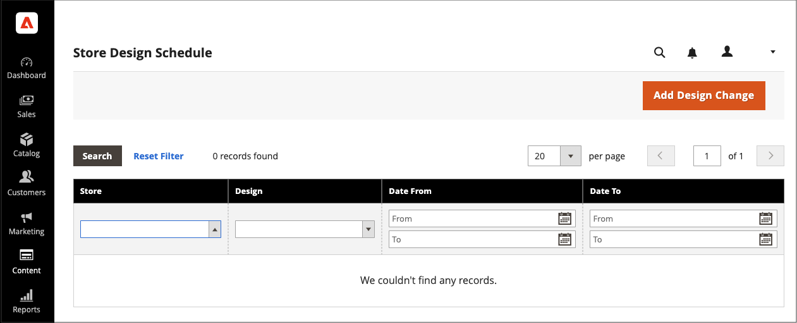

# Planen von Designänderungen

Planen Sie die Design-Änderungen im Voraus, damit sie entsprechend Ihren Geschäftszyklen und Ereignissen wirksam werden. Sie können geplante Design-Änderungen für saisonale Änderungen, Promotions oder einfach nur zum Hinzufügen von Varianten verwenden.

{width="700" zoomable="yes"}

## Geplante Design-Änderung hinzufügen

1. Navigieren Sie in _Admin_-Seitenleiste zu **[!UICONTROL Content]** > _[!UICONTROL Design]_>**[!UICONTROL Schedule]**.

1. Klicken Sie auf **[!UICONTROL Add Design Change]**.

   {width="600" zoomable="yes"}

1. Legen Sie **[!UICONTROL Store]** auf die Store-Ansicht fest, in der Sie die Änderungen anwenden möchten.

1. Legen Sie **[!UICONTROL Custom Design]** auf das zu verwendende Design oder die Variante eines Designs fest.

1. Klicken Sie für **[!UICONTROL Date From]** und **[!UICONTROL Date To]** auf das Symbol _Kalender_ (), um die Start- und Endwerte für den Zeitraum auszuwählen, in dem die Änderung wirksam wird.

1. Klicken Sie abschließend auf **[!UICONTROL Save]**.

## Geplante Designänderung bearbeiten

1. Navigieren Sie in _Admin_-Seitenleiste zu **[!UICONTROL Content]** > _[!UICONTROL Design]_>**[!UICONTROL Schedule]**.

1. Wählen Sie das Element aus, das Sie bearbeiten möchten.

1. Nehmen Sie die erforderlichen Änderungen vor.

1. Klicken Sie abschließend auf **[!UICONTROL Save]**.

## Geplante Designänderung löschen

1. Navigieren Sie in _Admin_-Seitenleiste zu **[!UICONTROL Content]** > _[!UICONTROL Design]_>**[!UICONTROL Schedule]**.

1. Wählen Sie das Element aus, das Sie löschen möchten.

1. Klicken Sie oben auf der Seite in der Schaltflächenleiste auf **[!UICONTROL Delete]**.

1. Um die Aktion zu bestätigen, klicken Sie auf **[!UICONTROL OK]**.
