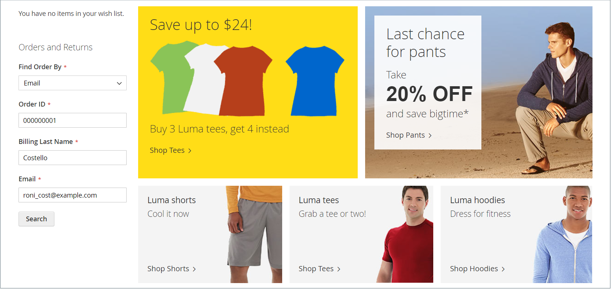

# Widget „Bestellungen und Rückgaben“

Das Widget _Bestellungen und Rücksendungen_ bietet Gästen die Möglichkeit, den Status ihrer Bestellungen zu überprüfen, Rechnungen zu drucken und Sendungen zu verfolgen. Wenn das Widget zur Storefront hinzugefügt wird, ist es nur für Gäste und für Kunden sichtbar, die nicht bei ihren Konten angemeldet sind. Sie können Bestellungen finden, indem Sie die Bestell-ID, den Nachnamen der Rechnungsstellung und entweder die E-Mail-Adresse oder die Postleitzahl angeben.

{width="600" zoomable="yes"}

## Das Widget „Bestellungen und Rückgaben“ in der Storefront

1. Der Kunde kann die Option **[!UICONTROL Find Order By]** verwenden, um einen der folgenden Parameter für die Suche der Bestellung auszuwählen:

   - E-Mail-Adresse
   - Postleitzahl

1. Der Kunde gibt den **[!UICONTROL Order ID]** und die **[!UICONTROL Billing Last Name]** ein.

1. Gibt entweder die **[!UICONTROL Email Address]** oder die **[!UICONTROL ZIP Code]** ein, die mit der Bestellung verknüpft sind.

1. Klicks **[!UICONTROL Search]**, um die Bestellung abzurufen.

   {width="700" zoomable="yes"}

## Einrichten des Widgets „Bestellungen und Rückgaben“

1. Navigieren Sie in _Admin_-Seitenleiste zu **[!UICONTROL Content]** > _[!UICONTROL Elements]_>**[!UICONTROL Widgets]**.

1. Klicken Sie oben rechts auf **[!UICONTROL Add Widget]**.

1. Gehen Sie im Abschnitt _[!UICONTROL Settings]_wie folgt vor:

   - Legen Sie **[!UICONTROL Type]** auf `Orders and Returns` fest.

   - Wählen Sie die **[!UICONTROL Design Theme]** aus, die vom Store verwendet wird.

1. Klicken Sie auf **[!UICONTROL Continue]**.

1. Gehen Sie im Abschnitt _[!UICONTROL Storefront Properties]_wie folgt vor:

   - Geben Sie **[!UICONTROL Widget Title]** einen beschreibenden Titel für das Widget ein.

     Dieser Titel ist nur von der Administratorin bzw. dem Administrator sichtbar.

   - Wählen Sie **[!UICONTROL Assign to Store Views]** die Store-Ansichten aus, in denen das Widget sichtbar ist.

     Sie können eine bestimmte Shop-Ansicht oder `All Store Views` auswählen. Halten Sie zum Auswählen mehrerer Ansichten die Strg-Taste (PC) bzw. die Befehlstaste (Mac) gedrückt und klicken Sie auf die einzelnen Optionen.

   - (Optional) Geben Sie **[!UICONTROL Sort Order]** eine Zahl ein, um die Reihenfolge zu bestimmen, in der dieses Element zusammen mit anderen im selben Teil der Seite angezeigt wird. (`0` = First, `1` = Second, `3` = Third usw.)

1. Klicken Sie im Abschnitt _[!UICONTROL Layout Updates]_auf **[!UICONTROL Add Layout Update]**und führen Sie folgende Schritte aus:

   - Legen Sie **[!UICONTROL Display On]** auf den Seitentyp fest, auf dem das Widget angezeigt werden soll.

   - Um zu bestimmen, wo das Widget auf der Seite angezeigt wird, füllen Sie die restlichen Informationen zur Layout-Aktualisierung aus.

1. Klicken Sie abschließend auf **[!UICONTROL Save]**.

1. Wenn Sie aufgefordert werden, den Cache zu aktualisieren, klicken Sie auf den Link in der Nachricht oben auf der Seite und folgen Sie den Anweisungen.
