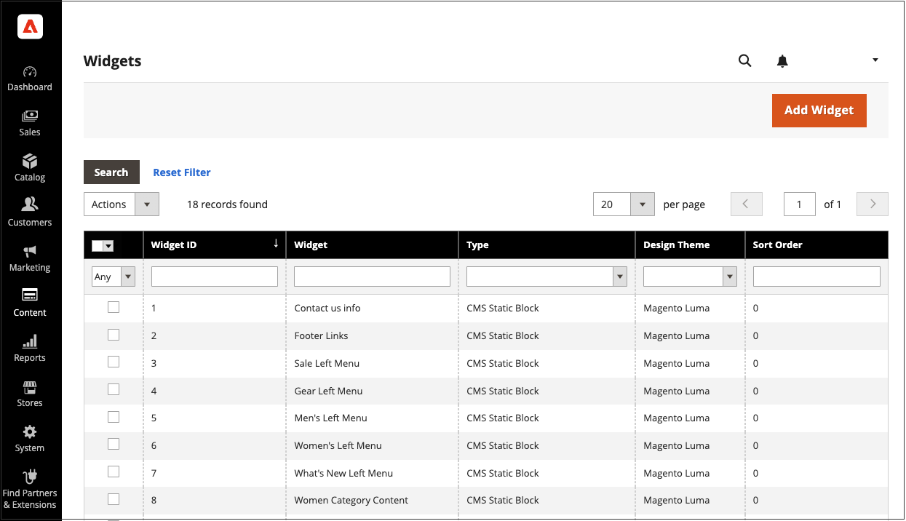

# Widgets

Ein Widget ist ein Code-Fragment, mit dem eine breite Palette von Inhalten angezeigt und an bestimmten Blockreferenzen in Ihrem Store platziert werden kann. Viele Widgets zeigen dynamische Echtzeitdaten an und bieten Ihren Kunden Möglichkeiten zur Interaktion mit Ihrem Geschäft. Das Widget-Tool erleichtert das Platzieren eines Widgets innerhalb vorhandener Inhalte, z. B. Blöcke mit Bildern und Text, und interaktive Elemente an den meisten Stellen in Ihrem Store.

Sie können Widgets verwenden, um Landingpages für Marketing-Kampagnen zu erstellen und an bestimmten Stellen im gesamten Store Werbeinhalte anzuzeigen. Widgets können auch verwendet werden, um interaktive Elemente und Aktionsblöcke für externe Überprüfungssysteme, Videochats, Abstimmungs- und Abonnementformulare hinzuzufügen oder Navigationselemente für Tag-Clouds und Bild-Regler bereitzustellen.

{{$include /help/_includes/directives-caution.md}}

{width="700" zoomable="yes"}

## Widget-Typen

Beim [Erstellen eines Widgets](widget-create.md) müssen Sie den Typ festlegen. Dieser Typ bestimmt, wie das Widget funktioniert.

| Typ | Beschreibung |
|--- |--- |
| [!UICONTROL CMS Hierarchy Node Link] | Verwenden Sie diese Option, um einen Link zu einem bestimmten Knoten in der Seitenhierarchie anzuzeigen, der in andere Inhalte integriert werden kann. |
| [!UICONTROL CMS Page Link] | Verwenden Sie diese Option, um benutzerdefinierten Text und einen Titel anzugeben, der auf eine bestimmte CMS-Seite verweist. Wenn der Link vollständig ist, kann er auf Inhaltsseiten und -blöcken verwendet werden. |
| [!UICONTROL CMS Static Block] | Verwenden Sie diese Option, um einen Inhaltsblock an einer bestimmten Position auf einer Seite anzuzeigen. |
| [!UICONTROL Catalog Category Link] | Verwenden Sie diese Option, um entweder einen Inline- oder einen Block-Stil-Link zu einer ausgewählten Katalogkategorie anzuzeigen. Wenn der Link vollständig ist, kann er auf Inhaltsseiten und -blöcken verwendet werden. |
| [!UICONTROL Catalog Events Carousel] | Verwenden Sie diese Option, um eine Liste bevorstehender Katalogereignisse anzuzeigen. |
| [!UICONTROL Catalog New Products List] | Verwenden Sie diese Option, um einen Block von Produkten anzuzeigen, die während der im Produktdatensatz angegebenen Zeit als neu gekennzeichnet wurden. |
| [!UICONTROL Catalog Product Link] | Verwenden Sie diese Option, um entweder einen Inline- oder einen Block-Stil-Link zu einem ausgewählten Katalogprodukt anzuzeigen. Wenn der Link vollständig ist, kann er auf Inhaltsseiten und -blöcken verwendet werden. |
| [!UICONTROL Catalog Products List] | Verwenden Sie diese Option, um eine Liste der Produkte aus dem Katalog anzuzeigen. |
| [!UICONTROL Dynamic Blocks Rotator] | Verwenden Sie diese Option, um einen einzelnen dynamischen Block oder eine Reihe dynamischer Blöcke in einer Reihe, zufälligen Reihenfolge oder gemischt anzuzeigen. Der dynamische Block kann durch eine Preisregel ausgelöst und auf einer bestimmten Seite und Position platziert oder so konfiguriert werden, dass er auf allen Seiten angezeigt wird. |
| [!UICONTROL Gift Registry Search] | Verwenden Sie diese Option, um Käufern die Möglichkeit zu geben, nach öffentlichen Geschenkregistern anhand des Namens oder der Registrierungs-ID zu suchen. |
| [!UICONTROL Order by SKU] | Bestellung nach SKU kann im Shop angezeigt werden, um es allen Käufern zu erleichtern, oder nur bestimmten Kundengruppen zur Verfügung gestellt werden. Käufer können entweder die SKU- und Mengeninformationen direkt in den Block „Bestellung nach SKU“ eingeben oder eine CSV-Datei von ihrem Kundenkonto hochladen. |
| [!UICONTROL Orders and Returns] | Verwenden Sie diese Option, um Gästen die Möglichkeit zu geben, den Status ihrer Bestellungen zu überprüfen und Anfragen zur Rücksendung von Waren einzureichen. Das Widget wird nur für Gäste und Kunden angezeigt, die nicht bei ihren Konten angemeldet sind. |
| [!UICONTROL Recently Compared Products] | Zeigt den Block der kürzlich verglichenen Produkte an. Sie können die Anzahl der eingeschlossenen Produkte angeben und sie als Liste oder Produktraster formatieren. |
| [!UICONTROL Recently Viewed Products] | Verwenden Sie diese Option, um den Block der zuletzt angezeigten Produkte anzuzeigen. Sie können die Anzahl der eingeschlossenen Produkte angeben und sie als Liste oder Produktraster formatieren. Das Widget zeigt möglicherweise keine Preisaktualisierungen in Echtzeit an. Der Käufer muss auf ein Produkt klicken, um die aktuellen Preise auf seiner Produktseite anzuzeigen. |
| [!UICONTROL Wish List Search] | Verwenden Sie diese Option, um einem Kunden die Möglichkeit zu geben, anhand des Namens oder der E-Mail-Adresse des Besitzers der Wunschliste nach öffentlich verfügbaren Wunschlisten zu suchen. Store-Kunden können Wunschlisten finden, die zu anderen Kunden gehören, sie anzeigen und Produkte von ihnen bestellen oder die Produkte zu ihren eigenen Wunschlisten hinzufügen. |

{style="table-layout:auto"}

<!-- Last updated from includes: 2022-08-30 15:36:09 -->
