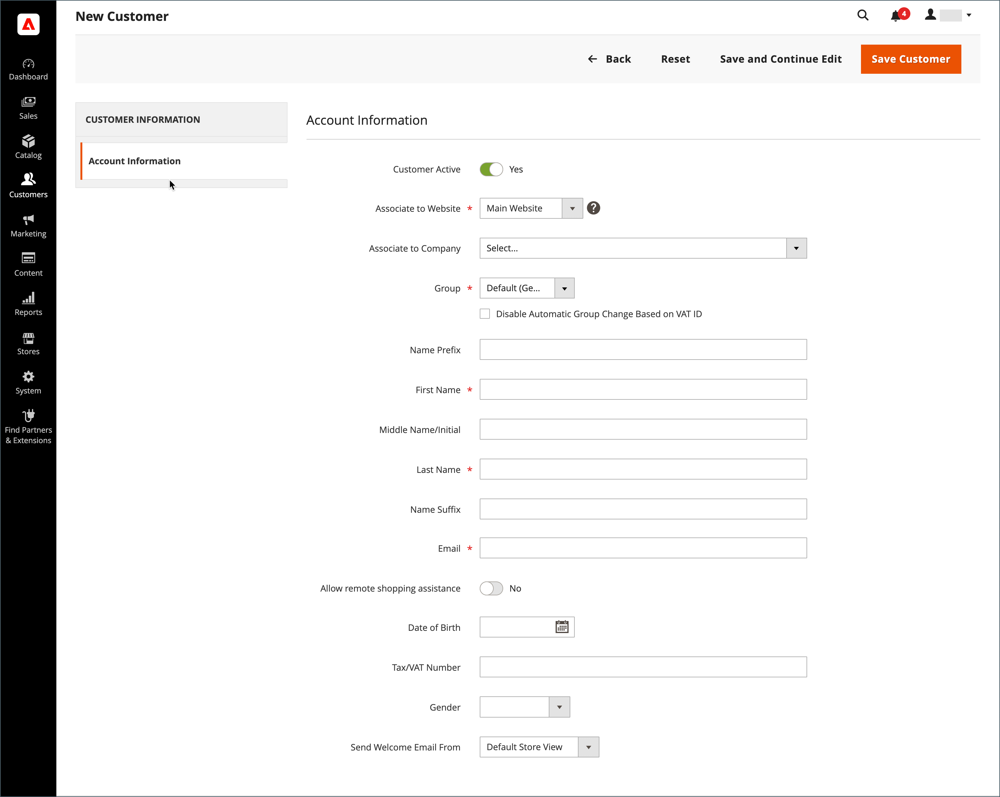

# Erstellen eines individuellen Kundenkontos

Besucher Ihres Geschäfts können ein Konto eröffnen, um ihre Käufe und Aktivitäten zu verwalten. Kunden erstellen in der Regel ihre eigenen Konten in Ihrem Geschäft. Sie können jedoch auch Kundenkonten direkt über die Admin erstellen, was für die telefonische Unterstützung von Kunden nützlich ist.

Die folgenden Anweisungen stellen die standardmäßige Kundenkontenkonfiguration dar. Informationen zum Ändern der Auswahl und des Verhaltens einiger Felder im Formular finden Sie unter [Konfigurieren von Kundenkonten](../customers/customer-account-scope.md).

Als Store-Administrator können Sie auch die [Neue Kontooptionen](../customers/account-options-new.md) um eine Bestätigungs-E-Mail an neue registrierte Kunden zu senden, mit der sichergestellt werden kann, dass registrierte Konten gültig sind.

>[!NOTE]
>
>Ab Version 2.4.7 müssen Kundinnen und Kunden unabhängig vom Browser ihre E-Mail-Adresse und ihr Passwort erneut eingeben, um sich nach der E-Mail-Bestätigung bei ihrem Konto anzumelden.

## Konto aus der Storefront erstellen

Ein Kunde erstellt ein Konto in der Storefront.

1. Klicken Sie in der Storefront **[!UICONTROL Create an Account]** in der oberen rechten Ecke der Kopfzeile.

   {width="700" zoomable="yes"}

1. Unter **[!UICONTROL Personal Information]**, gibt ihren ein **[!UICONTROL First Name]** und **[!UICONTROL Last Name]**.

   {width="600" zoomable="yes"}

1. Wenn der Kunde seinen Namen und seine E-Mail-Adresse zur Liste der Newsletter-Abonnenten hinzufügen möchte, wählt er die **[!UICONTROL Sign Up for Newsletter]** Kontrollkästchen.

   >[!INFO]
   >
   > Diese Option wird auch dann angezeigt, wenn der Store keinen Newsletter veröffentlicht.

1. Wenn Support-Mitarbeiter im Geschäft [Sehen, was sie sehen](../customers/login-as-customer.md) und bietet Remote-Unterstützung, wählt der Kunde die **[!UICONTROL Allow remote shopping assistance]** Kontrollkästchen.

1. Unter **[!UICONTROL Sign-in Information]**, gibt ihren ein **[!UICONTROL Email]** Adresse.

   >[!INFO]
   >
   > Diese E-Mail-Adresse wird Teil der Anmeldedaten und kann keinem anderen Kundenkonto zugeordnet werden.

   {width="600" zoomable="yes"}

1. Gibt ein **[!UICONTROL Password]** Dazu gehören drei der folgenden Arten von Informationen:

   - Kleinbuchstaben
   - Großbuchstaben
   - Zahlen
   - Sonderzeichen

   Nach dem Drücken **[!UICONTROL Enter]** festgelegt ist, wird die Stärke des Kennworts ausgewertet und unter dem Feld angezeigt. Wenn das Kennwort wie folgt lautet _schwach_, versuchen Sie eine andere, bis sie als ausgewertet wird _kräftig_.

   {width="600" zoomable="yes"}

1. Anschließend gibt der Kunde sie erneut ein, um **[!UICONTROL Confirm Password]**.

1. Klicken Sie bei Bedarf auf . **[!UICONTROL Show Password]** , um das eingegebene Kennwort anzuzeigen.

1. Klicken Sie abschließend auf . **Konto erstellen**.

Der Kunde kann dann seine E-Mail-Adresse und sein Passwort verwenden, um [Anmelden](../customers/customer-sign-in.md) in ihr Konto eintragen und die Adressangaben ausfüllen.

## Erstellen eines Kontos über den Administrator

Als Händler können Sie über den Administrator ein Kundenkonto erstellen.

1. Auf der _Admin_ Seitenleiste, zu gehen **[!UICONTROL Customers]** > **[!UICONTROL All Customers]**.

1. Klick **[!UICONTROL Add New Customer]**.

### Schritt 1: Vervollständigen Sie die Kontoinformationen

{width="700" zoomable="yes"}

1. In der **[!UICONTROL Account Information]** Gehen Sie wie folgt vor:

   - Für eine Installation an mehreren Standorten müssen Sie Folgendes festlegen **[!UICONTROL Associate to Website]** auf der Website, auf die sich das Kundenkonto bezieht.
   - Weisen Sie den Kunden ggf. einer anderen Person zu **[!UICONTROL Customer Group]**.
   - Wenn Sie [Validierung der MwSt.-Kennung](../stores-purchase/vat.md) und möchten **[!UICONTROL Disable Automatic Group Change Based on VAT ID]**, aktivieren Sie das Kontrollkästchen.

1. Füllen Sie die erforderlichen Felder aus:

   - **[!UICONTROL First Name]**
   - **[!UICONTROL Last Name]**
   - **[!UICONTROL Email]**

1. Füllen Sie die optionalen Felder nach Bedarf aus:

   - **[!UICONTROL Name Prefix]**
   - **[!UICONTROL Middle Name/Initial]**
   - **[!UICONTROL Name Suffix]**
   - **[!UICONTROL Date of Birth]**
   - **[!UICONTROL Tax/VAT Number]**
   - **[!UICONTROL Gender]**

   >[!WARNING]
   >
   >Halten Sie sich gemäß den aktuellen Best Practices für Sicherheit und Datenschutz über alle potenziellen Rechts- und Sicherheitsrisiken im Klaren, die mit der Speicherung des vollständigen Geburtsdatums der Kunden (Monat, Tag, Jahr) mit anderen persönlichen Kennungen verbunden sind. Es wird empfohlen, die Speicherung der vollständigen Geburtsdaten von Kundinnen und Kunden zu begrenzen und vorzuschlagen, als Alternative das Kundenjahr zu verwenden.

1. set **[!UICONTROL Send Welcome Email From]** zur Store-Ansicht, von der aus der _Willkommen_ E-Mail muss gesendet werden.

   >[!INFO]
   >
   > Wenn der Store Ansichten für verschiedene [Languages](../stores-purchase/store-localize.md)festgelegt ist, bestimmt diese Einstellung die Sprache der Begrüßungs-E-Mail.

1. Klick **[!UICONTROL Save and Continue Edit]** Oben auf der Seite.

   >[!INFO]
   >
   >Nachdem das Kundenkonto gespeichert wurde, wird der vollständige Satz von Optionen im linken Bedienfeld und im Menü oben auf der Seite angezeigt. Die _[!UICONTROL Customer View]_zeigt eine Zusammenfassung des Kontos an.

   {width="600" zoomable="yes"}

### Schritt 2: Adressinformationen ausfüllen

1. Wählen Sie im linken Bedienfeld **[!UICONTROL Addresses]** und klicken Sie auf **[!UICONTROL Add New Addresses]**.

1. Wenn dieselbe Adresse sowohl für die Rechnungsstellung als auch für den Versand verwendet wird, schalten Sie beide Optionen um.

   - **[!UICONTROL Default Billing Address]**
   - **[!UICONTROL Default Shipping Address]**

   {width="600" zoomable="yes"}

1. Scrollen Sie nach unten und füllen Sie die erforderlichen Adressfelder in der zweiten Spalte aus.

   - **[!UICONTROL Street Address]**
   - **[!UICONTROL City]**
   - **[!UICONTROL Country]**
   - **[!UICONTROL State/Province]**
   - **[!UICONTROL ZIP/Postal Code]**

1. Geben Sie die **[!UICONTROL Phone Number]** für diese Adresse.

1. Geben Sie gegebenenfalls Folgendes ein **[!UICONTROL VAT Number]** Dem Kunden zugeordnet.

1. Wenn nur diese Adresse für das Konto benötigt wird, klicken Sie auf **[!UICONTROL Save]**.

   Klicken Sie andernfalls auf **[!UICONTROL Save and Continue Edit]** und wiederholen Sie die vorherigen Schritte, um weitere Adressen hinzuzufügen.

   Die neue Adresse wird in der [!UICONTROL Addresses] Seite mit der ausgewählten _[!UICONTROL Default Billing]_und_[!UICONTROL Default Shipping]_ Adressen oberhalb der vollständigen Liste.

   {width="600" zoomable="yes"}

### Schritt 3: Zurücksetzen des Kennworts

Kundenkonten, die über den Administrator erstellt wurden, wurden zunächst keine Passwörter zugewiesen.

1. Suchen Sie das neue Kundenkonto im Raster.

1. Klick **[!UICONTROL Edit]** in der _[!UICONTROL Action]_Spalte.

1. Klicken Sie oben auf der Seite in der Menüleiste auf **[!UICONTROL Reset Password]**.

1. Eine Benachrichtigung mit Anweisungen zum Festlegen des Kennworts wird an den Kontoinhaber gesendet.

## Schaltflächenleiste

Zusätzliche Schaltflächen werden verfügbar, wenn das Profil zum ersten Mal gespeichert wird. Weitere Informationen finden Sie unter [Kundenprofil aktualisieren](../customers/update-account.md).

| Schaltfläche | Beschreibung |
|--- |--- |
| **[!UICONTROL Back]** | Kehrt zurück zum _[!UICONTROL Customers]_Seite ohne Speichern der Änderungen. |
| **[!UICONTROL Delete Customer]** | Löscht den aktuellen Kunden. Abgeschlossene Bestellungen, die mit dem Kunden verknüpft sind, werden nicht entfernt. |
| **[!UICONTROL Reset]** | Setzt alle nicht gespeicherten Änderungen im Kundenformular auf ihre vorherigen Werte zurück. |
| **[!UICONTROL Create Order]** | Erstellt eine Bestellung für den Kunden. |
| **[!UICONTROL Reset Password]** | Sendet eine [Passwort zurücksetzen](../customers/password-reset.md) Link zum Kunden per E-Mail. |
| **[!UICONTROL Force Sign-in]** | Widerruft die OAuth-Zugriffstoken, die mit dem Kundenkonto verknüpft sind. Diese Funktion kann nur mit Kundenkonten verwendet werden, denen OAuth-Token als Teil einer Web-API zugewiesen wurden [Integration](../systems/integrations.md). Weitere Informationen finden Sie unter [OAuth-basierte Authentifizierung](https://developer.adobe.com/commerce/webapi/get-started/authentication/gs-authentication-oauth/) in der Entwicklerdokumentation. |
| **[!UICONTROL Manage Shopping Cart]** | Ermöglicht dem Administrator, den Warenkorb für den Kunden zu verwalten. |
| **[!UICONTROL Save and Continue Edit]** | Speichert Änderungen und lässt das Kundenprofil geöffnet. |
| **[!UICONTROL Save Customer]** | Speichert Änderungen und schließt das Kundenprofil. |

{style="table-layout:auto"}

## Feldbeschreibungen

### [!UICONTROL Account Information]

| Feld | Beschreibung |
|--- |--- |
| **[!UICONTROL Associate to Website]** | Identifiziert die mit dem Kundenkonto verknüpfte Website. |
| **[!UICONTROL Group]** | Identifiziert die [Kundengruppe](../customers/customer-groups.md) wobei der Kunde Mitglied ist. Aktivieren Sie ggf. das Kontrollkästchen, um die automatische Gruppenänderung auf Grundlage der MwSt. zu deaktivieren. |
| **[!UICONTROL Name Prefix]** | Falls verwendet, das Präfix, das dem Namen des Kunden zugeordnet ist (z. B. Herr, Frau oder Dr.). Die Präfixwerte werden bestimmt durch [Konfiguration](../configuration-reference/customers/customer-configuration.md). Je nach Konfiguration kann das Eingabesteuerelement ein Textfeld oder eine Liste von Optionen sein. |
| **[!UICONTROL First Name]** | Der Vorname des Kunden. |
| **[!UICONTROL Middle Name / Initial]** | Der zweite Vorname oder Initial des Kunden. Dieses Feld ist nur enthalten, wenn im Feld [Konfiguration](../configuration-reference/customers/customer-configuration.md) Thema. |
| **[!UICONTROL Last Name]** | Der Nachname des Kunden. |
| **[!UICONTROL Name Suffix]** | Falls verwendet, das Suffix, das dem Namen des Kunden zugeordnet ist (z. B. Jr., Sr. oder III). Die Suffix-Werte werden bestimmt durch [Konfiguration](../configuration-reference/customers/customer-configuration.md). Je nach Konfiguration kann das Eingabesteuerelement ein Textfeld oder eine Dropdown-Liste von Optionen sein. |
| **[!UICONTROL Email]** | Die E-Mail-Adresse des Kunden. |
| **[!UICONTROL Date of Birth]** | Das Geburtsdatum des Kunden. Das Geburtsdatum ist enthalten, wenn es in der [Konfiguration](../configuration-reference/customers/customer-configuration.md) Thema.   Halten Sie sich gemäß den aktuellen Best Practices für Sicherheit und Datenschutz über alle potenziellen Rechts- und Sicherheitsrisiken im Klaren, die mit der Speicherung des vollständigen Geburtsdatums der Kunden (Monat, Tag, Jahr) mit anderen persönlichen Kennungen verbunden sind. Es wird empfohlen, die Speicherung der vollständigen Geburtsdaten von Kundinnen und Kunden zu begrenzen und als Alternative die Verwendung des Geburtsjahres von Kundinnen und Kunden vorzuschlagen. |
| **[!UICONTROL Tax / VAT Number]** | Die Steuer- oder Umsatzsteuernummer des Kunden, falls zutreffend. |
| **[!UICONTROL Gender]** | Identifiziert das Geschlecht des Kunden. Das Geschlecht ist enthalten, wenn es in der [Konfiguration](../configuration-reference/customers/customer-configuration.md). Optionen: `Male` / `Female` / `Not Specified` |
| **[!UICONTROL Send Welcome Email From]** | Wenn Sie mehrere Store-Ansichten haben, identifiziert diese Einstellung die Store-Ansicht, von der die Begrüßungsnachricht gesendet wird. Wenn Store-Ansichten für verschiedene Sprachen verwendet werden, bestimmt diese Einstellung die Sprache der Begrüßungs-E-Mail. |

### [!UICONTROL Addresses]

| Feld | Beschreibung |
|--- |--- |
| **[!UICONTROL New Addresses]** | Identifiziert den Typ der neuen Adresse. Optionen: `Default Billing Address` / `Default Shipping Address` |
| **[!UICONTROL Add New Addresses]** | Zeigt einen weiteren Abschnitt Neue Adresse an, um den Typ der einzugebenden Adresse zu identifizieren. |
| **[!UICONTROL Company]** | Der Firmenname, falls für diese Adresse zutreffend. |
| **[!UICONTROL Street Address]** | Die Straße des Kunden. Eine zweite Zeile der Straßenadresse ist verfügbar, wenn sie im [Konfiguration](../configuration-reference/customers/customer-configuration.md) Thema. |
| **[!UICONTROL City]** | Die Stadt, in der sich die Kundenadresse befindet. |
| **[!UICONTROL Country]** | Das Land, in dem sich die Kundenadresse befindet. |
| **[!UICONTROL State/Province]** | Das Bundesland, in dem sich die Kundenadresse befindet. |
| **[!UICONTROL Zip/Postal Code]** | Die Postleitzahl, an der sich die Kundenadresse befindet. |
| **[!UICONTROL Phone Number]** | Die Telefonnummer des Kunden, die mit der Adresse verknüpft ist. |
| **[!UICONTROL VAT Number]** | Falls zutreffend, die Umsatzsteuernummer, die für den Kunden unter dieser Adresse gilt. |
