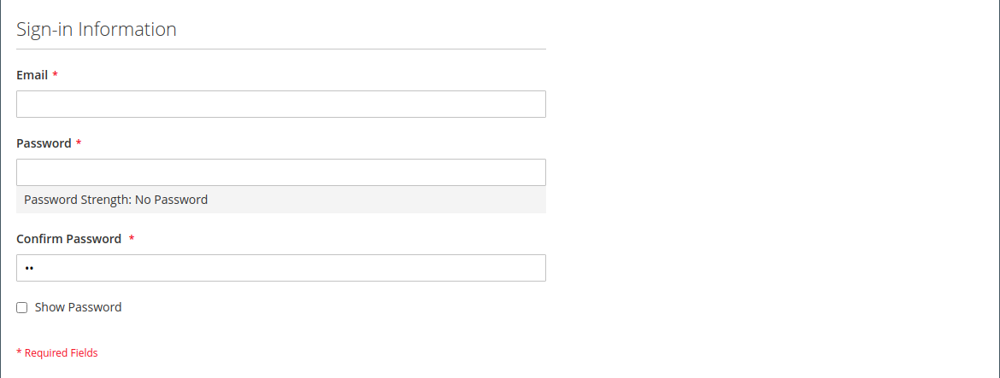

# Erstellen eines individuellen Kundenkontos

Besucher Ihres Geschäfts können ein Konto eröffnen, um ihre Käufe und Aktivitäten zu verwalten. Kunden erstellen in der Regel ihre eigenen Konten in Ihrem Geschäft. Sie können jedoch auch Kundenkonten direkt von der Administratorin bzw. dem Administrator erstellen. Dies ist nützlich, um Kunden telefonisch zu helfen.

Die folgenden Anweisungen stellen die standardmäßige Kundenkontenkonfiguration dar. Informationen zum Ändern der Auswahl und des Verhaltens einiger Felder im Formular finden Sie unter [ von Kundenkonten](../customers/customer-account-scope.md).

Als Store-Administrator können Sie auch die [Optionen für neue Konten](../customers/account-options-new.md) festlegen, um eine Bestätigungs-E-Mail an neue registrierte Kunden zu senden, wodurch sichergestellt wird, dass registrierte Konten gültig sind.

>[!NOTE]
>
>Ab Version 2.4.7 müssen Kundinnen und Kunden unabhängig vom Browser ihre E-Mail-Adresse und ihr Passwort erneut eingeben, um sich nach der E-Mail-Bestätigung bei ihrem Konto anzumelden.

## Konto aus der Storefront erstellen

Ein Store-Kunde erstellt ein Konto in der Storefront.

1. Klicken Sie in der Storefront oben rechts in der Kopfzeile auf **[!UICONTROL Create an Account]** .

   {width="700" zoomable="yes"}

1. Unter **[!UICONTROL Personal Information]** geben Sie deren **[!UICONTROL First Name]** und **[!UICONTROL Last Name]** ein.

   {width="600" zoomable="yes"}

1. Wenn der Kunde seinen Namen und seine E-Mail-Adresse zur Liste der Newsletter-Abonnenten hinzufügen möchte, aktiviert der Kunde das Kontrollkästchen **[!UICONTROL Sign Up for Newsletter]** .

   >[!INFO]
   >
   > Diese Option wird auch dann angezeigt, wenn der Store keinen Newsletter veröffentlicht.

1. Wenn die Support-Mitarbeiter im Geschäft [sehen, was sie sehen](../customers/login-as-customer.md) und Remote-Unterstützung bieten sollen, aktiviert der Kunde das Kontrollkästchen **[!UICONTROL Allow remote shopping assistance]** .

1. Geben Sie unter **[!UICONTROL Sign-in Information]** deren **[!UICONTROL Email]** ein.

   >[!INFO]
   >
   > Diese E-Mail-Adresse wird Teil der Anmeldedaten und kann keinem anderen Kundenkonto zugeordnet werden.

   {width="600" zoomable="yes"}

1. Gibt einen **[!UICONTROL Password]** ein, der drei der folgenden Arten von Informationen enthält:

   - Kleinbuchstaben
   - Großbuchstaben
   - Zahlen
   - Sonderzeichen

   Nach dem Drücken von **[!UICONTROL Enter]** wird die Stärke des Kennworts ausgewertet und unter dem Feld angezeigt. Wenn das Kennwort als „schwach _eingestuft wird,_ Sie ein anderes, bis es als &quot;_&quot;_.

   {width="600" zoomable="yes"}

1. Anschließend gibt der Kunde sie erneut in **[!UICONTROL Confirm Password]** ein.

1. Klicken Sie bei Bedarf auf **[!UICONTROL Show Password]** , um das eingegebene Kennwort anzuzeigen.

1. Klicken Sie abschließend auf **Konto erstellen**.

Der Kunde kann dann seine E-Mail-Adresse und sein Passwort verwenden[ um sich bei ](../customers/customer-sign-in.md) Konto anzumelden und die Adressinformationen auszufüllen.

## Erstellen eines Kontos über den Administrator

Als Händler können Sie über den Administrator ein Kundenkonto erstellen.

1. Navigieren Sie in der _Admin_-Seitenleiste zu **[!UICONTROL Customers]** > **[!UICONTROL All Customers]**.

1. Klicken Sie auf **[!UICONTROL Add New Customer]**.

### Schritt 1: Kontoinformationen ausfüllen

{width="700" zoomable="yes"}

1. Gehen Sie im Abschnitt **[!UICONTROL Account Information]** wie folgt vor:

   - Für eine Multisite-Installation **[!UICONTROL Associate to Website]** Sie auf die Website, für die das Kundenkonto gilt.
   - Weisen Sie den Kunden ggf. einem anderen **[!UICONTROL Customer Group]** zu.
   - Wenn Sie die [MwSt.-ID-](../stores-purchase/vat.md) verwenden und **[!UICONTROL Disable Automatic Group Change Based on VAT ID]** möchten, aktivieren Sie das Kontrollkästchen.

1. Füllen Sie die erforderlichen Felder aus:

   - **[!UICONTROL First Name]**
   - **[!UICONTROL Last Name]**
   - **[!UICONTROL Email]**

1. Füllen Sie die optionalen Felder nach Bedarf aus:

   - **[!UICONTROL Name Prefix]**
   - **[!UICONTROL Middle Name/Initial]**
   - **[!UICONTROL Name Suffix]**
   - **[!UICONTROL Date of Birth]**
   - **[!UICONTROL Tax/VAT Number]**
   - **[!UICONTROL Gender]**

   >[!WARNING]
   >
   >Gemäß den aktuellen Best Practices für Sicherheit und Datenschutz sollten Sie sich über potenzielle rechtliche und Sicherheitsrisiken im Zusammenhang mit der Speicherung des vollständigen Geburtsdatums der Kunden (Monat, Tag, Jahr) mit anderen persönlichen Kennungen im Klaren sein. Es wird empfohlen, die Speicherung der vollständigen Geburtsdaten von Kundinnen und Kunden zu begrenzen und vorzuschlagen, alternativ das Kundenjahr zu verwenden.

1. Legen Sie **[!UICONTROL Send Welcome Email From]** auf die Store-Ansicht fest, von der _Begrüßungs_-E-Mail gesendet werden soll.

   >[!INFO]
   >
   > Wenn der Store Ansichten für verschiedene [Sprachen](../stores-purchase/store-localize.md) hat, bestimmt diese Einstellung die Sprache der Begrüßungs-E-Mail.

1. Klicken Sie oben auf der Seite auf **[!UICONTROL Save and Continue Edit]** .

   >[!INFO]
   >
   >Nachdem das Kundenkonto gespeichert wurde, wird der vollständige Satz von Optionen im linken Bereich und im Menü oben auf der Seite angezeigt. Auf der Registerkarte _[!UICONTROL Customer View]_wird eine Zusammenfassung des Kontos angezeigt.

   {width="600" zoomable="yes"}

### Schritt 2: Adressinformationen ausfüllen

1. Wählen Sie im linken Bedienfeld **[!UICONTROL Addresses]** und klicken Sie auf **[!UICONTROL Add New Addresses]**.

1. Wenn dieselbe Adresse sowohl für die Rechnungsstellung als auch für den Versand verwendet wird, schalten Sie beide Optionen um.

   - **[!UICONTROL Default Billing Address]**
   - **[!UICONTROL Default Shipping Address]**

   {width="600" zoomable="yes"}

1. Scrollen Sie nach unten und füllen Sie die erforderlichen Adressfelder in der zweiten Spalte aus.

   - **[!UICONTROL Street Address]**
   - **[!UICONTROL City]**
   - **[!UICONTROL Country]**
   - **[!UICONTROL State/Province]**
   - **[!UICONTROL ZIP/Postal Code]**

1. Geben Sie die **[!UICONTROL Phone Number]** für diese Adresse ein.

1. Geben Sie gegebenenfalls die mit dem Kunden verknüpfte **[!UICONTROL VAT Number]** ein.

1. Wenn nur diese Adresse für das Konto benötigt wird, klicken Sie auf **[!UICONTROL Save]**.

   Klicken Sie andernfalls auf **[!UICONTROL Save and Continue Edit]** und wiederholen Sie die vorherigen Schritte, um weitere Adressen hinzuzufügen.

   Die neue Adresse wird auf der Seite [!UICONTROL Addresses] mit den ausgewählten _[!UICONTROL Default Billing]_und_[!UICONTROL Default Shipping]_ Adressen über der vollständigen Liste angezeigt.

   {width="600" zoomable="yes"}

### Schritt 3: Kennwort zurücksetzen

Kundenkonten, die über den Administrator erstellt wurden, wurden zunächst keine Passwörter zugewiesen.

1. Suchen Sie das neue Kundenkonto im Raster.

1. Klicken Sie in der Spalte _[!UICONTROL Action]_auf **[!UICONTROL Edit]**.

1. Klicken Sie oben auf der Seite in der Menüleiste auf **[!UICONTROL Reset Password]**.

1. Eine Benachrichtigung mit Anweisungen zum Festlegen des Kennworts wird an den Kontoinhaber gesendet.

## Schaltflächenleiste

Zusätzliche Schaltflächen werden verfügbar, wenn das Profil zum ersten Mal gespeichert wird. Weitere Informationen finden Sie unter [Kundenprofil aktualisieren](../customers/update-account.md).

| Schaltfläche | Beschreibung |
|--- |--- |
| **[!UICONTROL Back]** | Kehrt zur _[!UICONTROL Customers]_zurück, ohne die Änderungen zu speichern. |
| **[!UICONTROL Delete Customer]** | Löscht den aktuellen Kunden. Abgeschlossene Bestellungen, die mit dem Kunden verknüpft sind, werden nicht entfernt. |
| **[!UICONTROL Reset]** | Setzt alle nicht gespeicherten Änderungen im Kundenformular auf ihre vorherigen Werte zurück. |
| **[!UICONTROL Create Order]** | Erstellt eine Bestellung für den Kunden. |
| **[!UICONTROL Reset Password]** | Sendet einen Link [Kennwort zurücksetzen](../customers/password-reset.md) per E-Mail an den Kunden. |
| **[!UICONTROL Force Sign-in]** | Widerruft die OAuth-Zugriffstoken, die mit dem Kundenkonto verknüpft sind. Diese Funktion kann nur mit Kundenkonten verwendet werden, denen OAuth-Token als Teil einer Web-API zugewiesen wurden [Integration](../systems/integrations.md). Weitere Informationen finden Sie unter [OAuth-basierte Authentifizierung](https://developer.adobe.com/commerce/webapi/get-started/authentication/gs-authentication-oauth/) in der Entwicklerdokumentation. |
| **[!UICONTROL Manage Shopping Cart]** | Ermöglicht dem Administrator, den Warenkorb für den Kunden zu verwalten. |
| **[!UICONTROL Save and Continue Edit]** | Speichert Änderungen und hält das Kundenprofil offen. |
| **[!UICONTROL Save Customer]** | Speichert Änderungen und schließt das Kundenprofil. |

{style="table-layout:auto"}

## Feldbeschreibungen

### [!UICONTROL Account Information]

| Feld | Beschreibung |
|--- |--- |
| **[!UICONTROL Associate to Website]** | Identifiziert die mit dem Kundenkonto verknüpfte Website. |
| **[!UICONTROL Group]** | Gibt die [Kundengruppe“ an](../customers/customer-groups.md) bei der der Kunde Mitglied ist. Aktivieren Sie bei Bedarf das Kontrollkästchen, um die automatische Gruppenänderung auf Grundlage der MwSt. zu deaktivieren. |
| **[!UICONTROL Name Prefix]** | Falls verwendet, das Präfix, das dem Namen des Kunden zugeordnet ist (z. B. Herr, Frau oder Dr.). Die Präfixwerte werden durch die [Konfiguration“ ](../configuration-reference/customers/customer-configuration.md). Je nach Konfiguration kann das Eingabesteuerelement ein Textfeld oder eine Liste von Optionen sein. |
| **[!UICONTROL First Name]** | Der Vorname des Kunden. |
| **[!UICONTROL Middle Name / Initial]** | Der zweite Vorname oder Initial des Kunden. Dieses Feld ist nur enthalten, wenn es im Thema [Konfiguration](../configuration-reference/customers/customer-configuration.md) angegeben ist. |
| **[!UICONTROL Last Name]** | Der Nachname des Kunden. |
| **[!UICONTROL Name Suffix]** | Falls verwendet, das Suffix, das dem Namen des Kunden zugeordnet ist (z. B. Jr., Sr. oder III). Die Suffix-Werte werden durch die [Konfiguration“ ](../configuration-reference/customers/customer-configuration.md). Je nach Konfiguration kann das Eingabesteuerelement ein Textfeld oder eine Dropdown-Liste von Optionen sein. |
| **[!UICONTROL Email]** | Die E-Mail-Adresse des Kunden. |
| **[!UICONTROL Date of Birth]** | Das Geburtsdatum des Kunden. Das Geburtsdatum ist enthalten, wenn es im Thema [Konfiguration](../configuration-reference/customers/customer-configuration.md) angegeben ist.   Halten Sie sich im Einklang mit den aktuellen Best Practices für Sicherheit und Datenschutz über mögliche rechtliche und Sicherheitsrisiken im Zusammenhang mit der Speicherung des vollständigen Geburtsdatums der Kundinnen und Kunden (Monat, Tag, Jahr) mit anderen persönlichen Kennungen im Klaren. Es wird empfohlen, die Speicherung der vollständigen Geburtsdaten von Kundinnen und Kunden zu begrenzen und alternativ ein Kundenjahr zu verwenden. |
| **[!UICONTROL Tax / VAT Number]** | Die Steuer- oder Umsatzsteuer-Nummer des Kunden, falls zutreffend. |
| **[!UICONTROL Gender]** | Identifiziert das Geschlecht des Kunden. Das Geschlecht ist enthalten, wenn es in der [Konfiguration](../configuration-reference/customers/customer-configuration.md) angegeben ist. Optionen: `Male` / `Female` / `Not Specified` |
| **[!UICONTROL Send Welcome Email From]** | Wenn Sie mehrere Store-Ansichten haben, identifiziert diese Einstellung die Store-Ansicht, von der die Begrüßungsnachricht gesendet wird. Wenn Store-Ansichten für verschiedene Sprachen verwendet werden, bestimmt diese Einstellung die Sprache der Begrüßungs-E-Mail. |

### [!UICONTROL Addresses]

| Feld | Beschreibung |
|--- |--- |
| **[!UICONTROL New Addresses]** | Identifiziert den Typ der neuen Adresse. Optionen: `Default Billing Address` / `Default Shipping Address` |
| **[!UICONTROL Add New Addresses]** | Zeigt einen weiteren Abschnitt Neue Adresse an, um den Typ der einzugebenden Adresse zu identifizieren. |
| **[!UICONTROL Company]** | Der Firmenname, falls für diese Adresse zutreffend. |
| **[!UICONTROL Street Address]** | Die Straße des Kunden. Eine zweite Zeile der Straßenadresse ist verfügbar, wenn im Thema [Konfiguration](../configuration-reference/customers/customer-configuration.md) angegeben. |
| **[!UICONTROL City]** | Die Stadt, in der sich die Kundenadresse befindet. |
| **[!UICONTROL Country]** | Das Land, in dem sich die Kundenadresse befindet. |
| **[!UICONTROL State/Province]** | Das Bundesland, in dem sich die Kundenadresse befindet. |
| **[!UICONTROL Zip/Postal Code]** | Die Postleitzahl, an der sich die Kundenadresse befindet. |
| **[!UICONTROL Phone Number]** | Die Telefonnummer des Kunden, die mit der Adresse verknüpft ist. |
| **[!UICONTROL VAT Number]** | Falls zutreffend, die Umsatzsteuernummer, die für den Kunden unter dieser Adresse gilt. |
