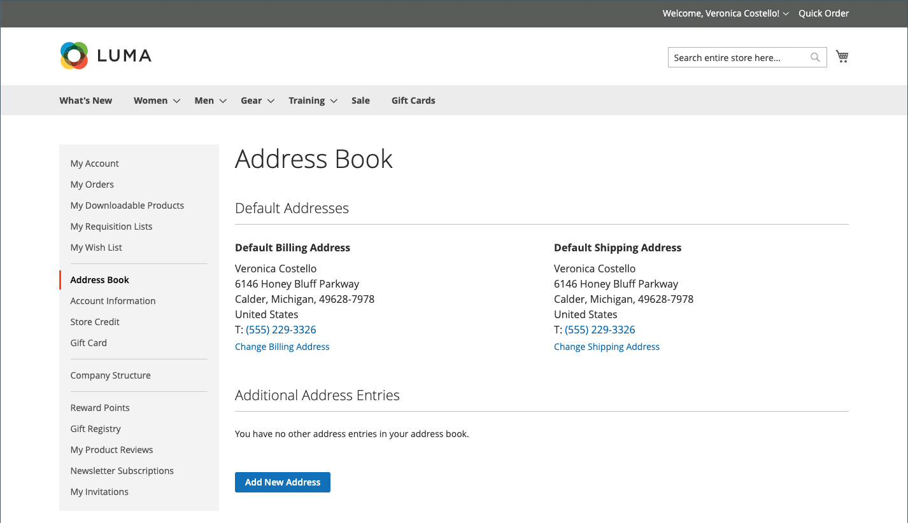
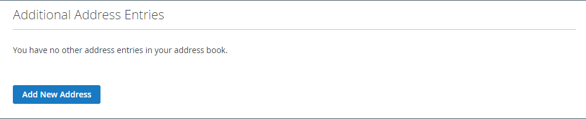

# Das Kundenadressbuch

Kunden, die ihre Adressbücher aktuell halten, können den Checkout-Prozess beschleunigen. Das Adressbuch enthält die standardmäßigen Abrechnungs- und Versandadressen des Kunden sowie alle weiteren Adressen, die er häufig verwendet. Zusätzliche Adresseinträge sind einfach über das Raster zu erreichen und zu pflegen. Jedes Kundenadressbuch kann über 3.000 Adressbucheinträge verwalten, ohne die Leistung zu beeinträchtigen.

{width="700" zoomable="yes"}

## Adresse hinzufügen

1. Im linken Navigationsbereich seines Kundenkontos wählt der Kunde **[!UICONTROL Address Book]** aus.

1. Klicken Sie auf der Seite _[!UICONTROL Address Book]_unter_ Zusätzliche Adresseinträge _auf **[!UICONTROL Add New Address]**.

   {width="600" zoomable="yes"}

1. Definiert das neue Adresselement.

1. Ergänzt die Kontakt- und Adressinformationen.

   >[!INFO]
   >
   >Standardmäßig werden der Vor- und Nachname des Kunden zunächst im Formular angezeigt.

1. Aktiviert die folgenden Kontrollkästchen, um anzugeben, wie die Adresse verwendet werden soll.

   Aktiviert beide Kontrollkästchen, wenn dieselbe Adresse für die Rechnungsstellung und den Versand verwendet wird.

   * [!UICONTROL Use as my default billing address]
   * [!UICONTROL Use as my default shipping address]

1. Wenn Sie fertig sind, klicken Sie **[!UICONTROL Save Address]**.

   >[!INFO]
   >
   >Die neue Adresse wird unter [!UICONTROL Additional Address Entries] aufgeführt.

   {width="700" zoomable="yes"}

## Bearbeiten einer Adresse

1. Im linken Navigationsbereich seines Kundenkontos wählt der Kunde **[!UICONTROL Address Book]** aus.

1. Sucht den Eintrag der zu bearbeitenden Adresse.

1. Klicks **[!UICONTROL Edit]**.

1. Nehmen Sie die erforderlichen Änderungen vor.

   >[!INFO]
   >
   >Der Kunde kann diese Adresse als Standard-**[!UICONTROL Shipping or Billing]**-Adresse festlegen, indem er die _Als Standard-Rechnungsadresse verwenden_ aktiviert.

1. Wenn die Änderungen abgeschlossen sind, klicken Sie auf **[!UICONTROL Save Address]**.

## Standardadresse ändern

1. Im linken Navigationsbereich seines Kundenkontos wählt der Kunde **[!UICONTROL Address Book]** aus.

1. Wählt eine der Bearbeitungsmethoden:

   * Klicks **[!UICONTROL Change Billing/Shipping Address]** im Abschnitt _[!UICONTROL Default Addresses]_.

   * Klicks **[!UICONTROL Edit]** im _[!UICONTROL Additional Address Entries]_.

1. Nehmen Sie die erforderlichen Änderungen vor und klicken Sie auf **[!UICONTROL Save Address]**.

## Löschen einer Adresse

1. Im linken Navigationsbereich seines Kundenkontos wählt der Kunde **[!UICONTROL Address Book]** aus.

1. Sucht den zu löschenden Adresseintrag.

1. Klicks **[!UICONTROL Delete]** im _[!UICONTROL Additional Address Entries]_.

1. Um die Aktion zu bestätigen, klicken Sie auf **[!UICONTROL OK]**.

   >[!IMPORTANT]
   >
   >Die Standard-Rechnungs- und Versandadressen können nicht gelöscht werden.
