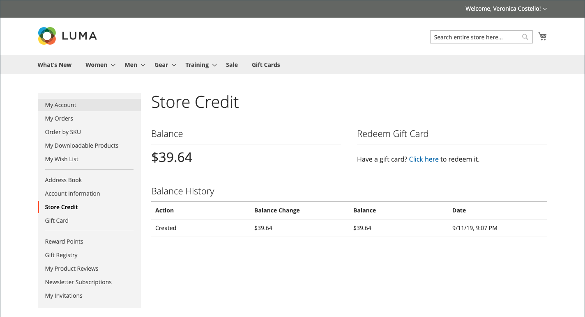
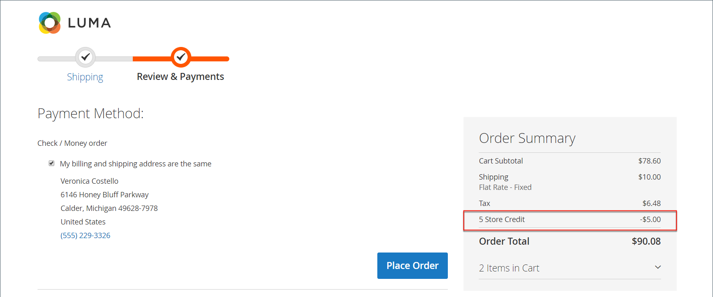

# Guthaben im Dashboard des Kundenkontos speichern

{{ee-feature}}

Auf der Seite _[!UICONTROL Store Credit]_&#x200B;des Dashboards für Kundenkonten werden Beträge aus Rücksendungen und Rückerstattungen aufgelistet, die auf zukünftige Käufe angewendet werden können. Kunden können den Wert auch von einer Geschenkkarte einlösen.

{width="700" zoomable="yes"}

## Warenkorb-Guthaben während des Checkouts anwenden

1. Der Kunde bestimmt den Betrag des verfügbaren Speicherguthabens.

   Während des Schritts _Überprüfen und_&quot; wird der verfügbare Betrag unter &quot;**[!UICONTROL Store Credit]**&quot; angezeigt.

1. Um den Betrag auf die Bestellung anzuwenden, klickt der Kunde auf **[!UICONTROL Use Store Credit]**.

   {width="600" zoomable="yes"}

1. Die Bestellsumme wird neu berechnet, und der Betrag der angewendeten Speichergutschrift wird in der Bestellzusammenfassung angezeigt.

   {width="600" zoomable="yes"}

1. Wenn Sie bereit sind, klicken Sie auf **[!UICONTROL Place Order]**.

## Speicherkreditkonto und -verlauf anzeigen

Es gibt zwei Methoden zum Anzeigen von Kreditsalden und Historie:

Methode 1: **Vom Kundenkonto-Dashboard**

1. In der Storefront meldet sich der Kunde beim Konto an.

1. Wählt **[!UICONTROL Store Credit]** im linken Bedienfeld aus.

Methode 2: **Von der Seite _Überprüfung und Zahlungen_**

1. Der Kunde fügt dem Warenkorb ein Produkt hinzu.

1. Wechselt zur Kasse.

1. Übergibt den **[!UICONTROL Shipping]** Schritt.

1. Wenn ein Warenkorb verfügbar ist, klickt der Kunde auf **Warenkorb verwenden**.

1. Wenn der Kunde sich von der Verwendung des Gutscheins für den Store ändert, klickt auf **[!UICONTROL Remove]** im _[!UICONTROL Order Summary]_&#x200B;Abschnitt.
