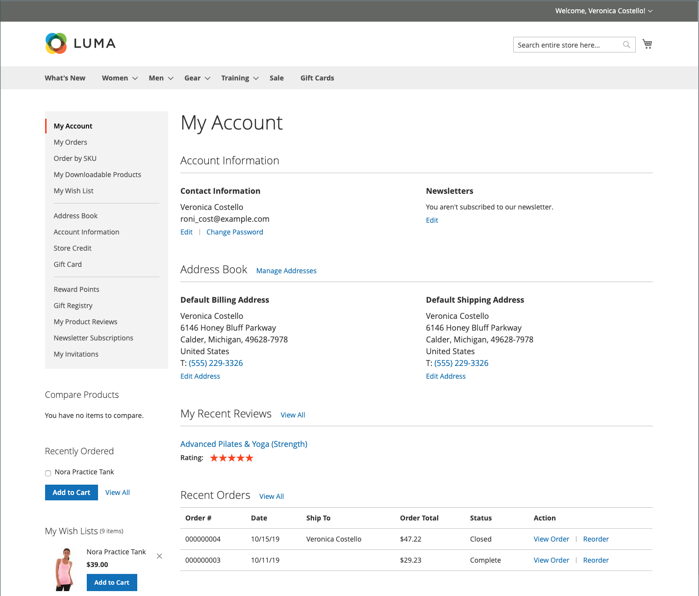
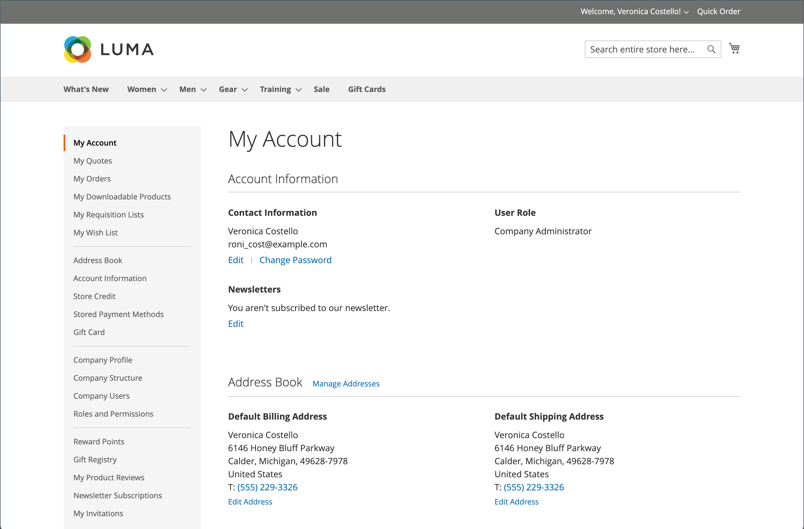

# Kundenkonto-Dashboard

Kunden können ihre eigenen Informationen und Aktivitäten über ihr Konto-Dashboard verwalten und überwachen. Kunden können Bestellungen nachbestellen, Versandadressen und Zahlungsmethoden, Produktbewertungen, Newsletter-Abonnements und mehr verwalten.

{width="700" zoomable="yes"}

>[!NOTE]
>
> Mit der Installation und Aktivierung von Adobe Commerce B2B kann das Kauferlebnis mit unternehmensspezifischen Funktionen personalisiert werden. Für Kunden, die einem Unternehmen zugeordnet sind, kann das gesamte Spektrum der Dashboard-Optionen für B2B-Konten (Bestellungen, Anforderungslisten und ausgehandelte Angebote) aktiviert werden. Weitere Informationen zu den B2B-Funktionen finden Sie im [Adobe Commerce B2B-Benutzerhandbuch](../b2b/introduction.md).

{width="700" zoomable="yes"}

## Seitennavigation im Konto-Dashboard

Die folgende Tabelle enthält Informationen zu allen Abschnitten, die im linken Navigationsbereich des Dashboards für Kundenkonten verfügbar sind.

| Abschnitt | Beschreibung |
|------------------------------------------------------------------------------------------------------------------------------------------------------|----------------------------------------------------------------------------------------------------------------------------------------------------------------------------------------------------------------------------------------------------------------------------------------------------------------------------------------------------------------|
| [**[!UICONTROL My Account]**](../customers/account-dashboard-my-account.md) | Zeigt zusammenfassende Informationen für Ihr Konto an, einschließlich Kontaktinformationen, Standardadressen aus Ihrem Adressbuch und letzter Bestellungen. |
| [**[!UICONTROL My Orders]**](../stores-purchase/orders-storefront.md#view-recently-ordered-products) | Zeigt eine Liste aller Kundenbestellungen mit jeweils einem Link an. Wenn diese Option in der Konfiguration aktiviert ist, kann jede Bestellung durch einfaches Klicken auf den Link „Neu anordnen“ neu angeordnet werden. |
| [**[!UICONTROL My Downloadable Products]**](../catalog/product-create-downloadable.md#storefront-experience) | Listet alle herunterladbaren Produkte auf, die der Kunde gekauft hat, mit einem Link zu jedem. |
| [**[!UICONTROL My Wish List]**](../stores-purchase/wishlist-storefront.md) | Verwalten Sie Ihre Wunschlisten und platzieren Sie Bestellungen aus Wunschlistenelementen. |
| [**[!UICONTROL Address Book]**](../customers/account-dashboard-address-book.md) | Das Kundenadressbuch enthält die standardmäßige Rechnungs- und Lieferadresse sowie zusätzliche Adresseinträge. |
| [**[!UICONTROL Account Information]**](../customers/account-dashboard-account-information.md) | Kunden können ihre Kontoinformationen aktualisieren und ihr Passwort nach Bedarf ändern. Der Store-Administrator kann auch die Kundenkonten aktualisieren und auf die Informationen zugreifen, um Unterstützung beim Einkaufen anzubieten. |
| [**[!UICONTROL Billing Agreements]**](../stores-purchase/paypal-billing-agreements.md#storefront-experience) | Zeigt eine Liste aller Abrechnungsvereinbarungen mit dem Kunden an. |
| [**[!UICONTROL My Product Reviews]**](../merchandising-promotions/product-reviews.md#product-reviews-on-the-storefront) | Zeigt eine Liste aller vom Kunden eingereichten Produktbewertungen mit je einem Link zu ihnen an. |
| [**[!UICONTROL Newsletter Subscriptions]**](../merchandising-promotions/newsletters.md) | Listet alle verfügbaren Newsletter mit einem Häkchen neben den Elementen auf, die der Kunde abonniert hat. |
|  [**[!UICONTROL Order by SKU]**](../stores-purchase/order-by-sku.md#order-by-sku-from-a-customer-account) | Ermöglicht das Hinzufügen einzelner Artikel zum Warenkorb per SKU oder das Importieren einer Liste von Produkten, die aus einer CSV-Datei bestellt werden sollen. |
|  [**[!UICONTROL Store Credit]**](../customers/account-dashboard-store-credit.md) | Zeigt den aktuellen Betrag der Gutschrift aus Rücksendungen, Rückerstattungen und eingelösten Geschenkkarten an, die auf Käufe angewendet werden können. |
| [**[!UICONTROL Stored Payment Methods]**](../stores-purchase/stored-payment-methods.md) | Listet alle Zahlungsmethoden mit sicheren Tresoren auf, die vom Kunden zum Speichern von Kreditkarteninformationen verwendet werden. |
|  [**[!UICONTROL Gift Card]**](../catalog/product-gift-card-create.md) | Ermöglicht es Kunden, das aktuelle Guthaben auf verfügbaren Geschenkkarten zu überprüfen und Geschenkkarten für das Ladenguthaben einzulösen. |
|  [**[!UICONTROL Reward Points]**](../merchandising-promotions/rewards-loyalty.md) | Listet alle Prämienpunkte auf, die der Kunde erworben hat und die auf Käufe angewendet werden können. |
|  [**[!UICONTROL Gift Registry]**](../merchandising-promotions/gift-registries.md) | Wird verwendet, um Geschenkregistrierungen aufzulisten und zu pflegen und neue hinzuzufügen. |
|  [**[!UICONTROL My Invitations]**](../merchandising-promotions/invitations.md) | Listet alle Einladungen auf, die der Kunde für geplante Ereignisse erstellt und gesendet hat. |
|  [**[!UICONTROL My Purchase Orders]**](../b2b/account-dashboard-my-purchase-orders.md) | (Nur Firmen) Listet alle vom Kunden eingereichten oder kontrollierten Bestellungen mit einem Link zu detaillierten Informationen auf. |
|  [**[!UICONTROL My Quotes]**](../b2b/account-dashboard-my-quotes.md) | (Nur Firmen) Listet alle Angebote des Kunden mit einem Link zu detaillierten Informationen auf. |
|  [**[!UICONTROL My Requisition Lists]**](../b2b/account-dashboard-requisition-lists-manage.md) | (Nur Firmen) Alle vom Kunden erstellten Anforderungslisten werden verwaltet. |
|  [**[!UICONTROL Company Profile]**](../b2b/account-company-manage.md#update-a-company-profile) | (Nur Firmen) Ein spezieller Unternehmensadministrator kann Unternehmensinformationen verwalten, einschließlich Firmenname und -adresse, Kontaktinformationen für Unternehmensadministratoren und Zahlungsinformationen. |
|  [**[!UICONTROL Company Credit]**](../b2b/credit-company.md#storefront-credit-information) | (Nur Firmen) Zeigt den aktuellen ausstehenden Saldo, die verfügbare Gutschrift und das Kreditlimit an, das dem Konto zugeordnet ist, gefolgt von einer Liste ausstehender Rechnungen. Der Abschnitt „Firmengutschrift“ wird nur dann im Dashboard angezeigt, wenn [Zahlung auf Konto](../b2b/enable-basic-features.md#configure-payment-on-account) in der Konfiguration aktiviert ist. |
|  [**[!UICONTROL Company Structure]**](../b2b/account-company-structure.md) | (Nur Firmen) Wird vom Unternehmensadministrator verwendet, um die Geschäftsstruktur des Unternehmens zu definieren. |
|  [**[!UICONTROL Company Users]**](../b2b/account-company-users.md) | (Nur Firmen) Wird vom Firmenadministrator zum Erstellen von Benutzerkonten für Unternehmenskäufer verwendet. |
|  [**[!UICONTROL Roles and Permissions]**](../b2b/account-company-roles-permissions.md) | (Nur Unternehmen) Wird vom Unternehmensadministrator verwendet, um Rollen für Unternehmensbenutzer mit verschiedenen Berechtigungsebenen zu definieren. |
|  [**[!UICONTROL Approval Rules]**](../b2b/account-dashboard-approval-rules.md) | (Nur Firmen) Wird zum Definieren von Genehmigungsregeln für Bestellungen verwendet. |

{style="table-layout:auto"}
