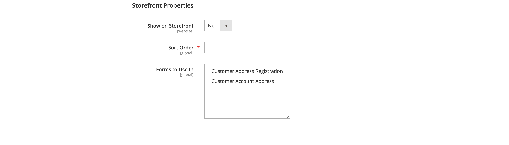

# Attribute der Kundenadressen

{{ee-feature}}

Der Attributsatz Kundenadresse bestimmt die Eigenschaften von Straßenadressen, die vom Konto des Kunden oder während des [Checkout](../stores-purchase/checkout-process.md) in das [Adressbuch](account-dashboard-address-book.md) eingegeben werden.

Benutzerdefinierte Adressattribute können eingerichtet werden, um zusätzliche Informationen bereitzustellen, wie eine optionale E-Mail-Adresse, ein Skype-Konto, eine alternative Telefonnummer, ein Gebäude oder ein Bezirk. Das benutzerdefinierte Attribut kann dann in die [Adressvorlage](address-templates.md) eingefügt werden, die zum Erstellen von Verkaufsdokumenten verwendet wird. Der Prozess zum Erstellen eines benutzerdefinierten Adressattributs entspricht fast dem Erstellen eines [Kundenattributs](attribute-properties.md).

Kundenadressattribute werden in den folgenden Formularen verwendet:

- [Registrierung der Kundenadresse](account-create.md)
- [Kundenkontoadresse](account-dashboard-address-book.md)

{width="700" zoomable="yes"}

## Schritt 1: Ausfüllen der Attributeigenschaften

1. Wechseln Sie in der Seitenleiste _Admin_ zu **[!UICONTROL Stores]** > _[!UICONTROL Attributes]_>**[!UICONTROL Customer Address]**.

1. Klicken Sie in der oberen rechten Ecke auf **[!UICONTROL Add New Attribute]**.

   {width="600" zoomable="yes"}

1. Gehen Sie im Abschnitt **[!UICONTROL Attribute Properties]** wie folgt vor:

   - Geben Sie einen **[!UICONTROL Default Label]** -Wert ein, der das Attribut während der Dateneingabe angibt.

   - Geben Sie einen **[!UICONTROL Attribute Code]** -Wert ein, der das Attribut im System angibt.

     Der Attributcode muss mit einem Buchstaben beginnen und kann eine beliebige Kombination aus Kleinbuchstaben (a-z) und Zahlen (0-9) enthalten. Der Code muss weniger als 30 Zeichen lang sein und darf keine Sonderzeichen oder Leerzeichen enthalten. Das Unterstrichzeichen (_) kann zur Angabe eines Leerzeichens verwendet werden.

     >[!TIP]
     >
     >**_Tastaturbefehl:_** Um nur die erforderlichen Felder auszufüllen, scrollen Sie nach unten zu [!UICONTROL Storefront Properties], geben Sie den Wert [!UICONTROL Sort Order] ein und speichern Sie.

1. Um den Typ des Eingabeditors zu bestimmen, der für die Dateneingabe verwendet wird, setzen Sie **[!UICONTROL Input Type]** auf einen der folgenden Werte:

   - `Text Field` - Ein einzeiliges Textfeld.
   - `Text Area` - Ein mehrzeiliger Textbereich.
   - `Multiple Line` - Erstellt mehrere Textzeilen für das Attribut, ähnlich wie bei einer mehrzeiligen Straßenadresse. Die Anzahl der einzelnen Dateneintragszeilen kann zwischen 2 und 20 liegen. Verwenden Sie den Wert `Default Value` , um den Anfangswert des Felds anzugeben.
   - `Date` - Zeigt ein Datumsfeld mit einem Popup-Kalender an. Zusätzliche Eigenschaften: Verwenden Sie `Default Value` , um den Anfangswert des Felds anzugeben.  Verwenden Sie `Minimal Value`, um das früheste Datum anzugeben, das eingegeben werden kann.  Verwenden Sie &quot;`Maximum Value`&quot;, um das Datum anzugeben, das zuletzt eingegeben werden kann.
   - `Dropdown` - Eine Dropdownliste, in der nur ein Wert ausgewählt werden kann.
   - `Multiple Select` - Eine Dropdownliste, in der mehrere Werte ausgewählt werden können.
   - `Yes/No` - Ein Feld, das nur eine Auswahl von `Yes` - oder `No` -Werten bietet.
   - `File (attachment)` - Ein Feld, in das eine Datei hochgeladen und dem Kundenattribut als Anlage zugeordnet werden kann.
   - `Image File` - Ein Feld, mit dem ein Bild in die Galerie hochgeladen und mit dem Kundenattribut verknüpft werden kann.

1. Wenn der Kunde einen Wert in das Feld eingeben muss, setzen Sie **[!UICONTROL Values Required]** auf `Yes`.

1. Um dem Feld einen Anfangswert zuzuweisen, geben Sie einen **[!UICONTROL Default Value]** ein.

1. Um die Genauigkeit der im Feld eingegebenen Daten vor dem Speichern des Datensatzes zu überprüfen, setzen Sie **[!UICONTROL Input Validation]** auf den Datentyp, der im Feld zulässig sein soll. Die verfügbaren Werte hängen von dem angegebenen _[!UICONTROL Input Type]_ab.

   - `None` - Das Feld hat während der Dateneingabe keine Eingabevalidierung.
   - `Alphanumeric` - Akzeptiert während der Dateneingabe eine beliebige Kombination aus Zahlen (0-9) und alphabetischen Zeichen (a-z, A-Z). Informationen zum Einschließen von Sonderzeichen finden Sie unter [!UICONTROL Escape HTML Entities] im nächsten Schritt.
   - `Alphanumeric with Space` - Akzeptiert eine beliebige Kombination aus Zahlen (0-9), alphabetischen Zeichen (a-z, A-Z) und Leerzeichen während der Dateneingabe.
   - `Numeric Only` - Akzeptiert während der Dateneingabe nur Zahlen (0-9).
   - `Alpha Only` - Akzeptiert während der Dateneingabe nur alphabetische Zeichen (a-z, A-Z).
   - `URL` - Akzeptiert nur eine URL während der Dateneingabe.
   - `Email` - Akzeptiert nur eine E-Mail-Adresse während der Dateneingabe.
   - `Length Only` - Validiert die Eingabe anhand der Länge der in das Feld eingegebenen Daten.

1. Um einen Vorverarbeitungsfilter auf Werte anzuwenden, die in ein Textfeld, einen Textbereich oder einen mehrzeiligen Eingabetyp eingegeben wurden, legen Sie **[!UICONTROL Input/Output Filter]** auf einen der folgenden Werte fest:

   - `None` - Wendet keinen Filter auf den in das Feld eingegebenen Text an.
   - `Strip HTML Tags` - Entfernt HTML-Tags aus dem Text. Dieser Filter kann beim Bereinigen von Daten helfen, die aus einer anderen Quelle, die HTML-Tags enthält, in ein Feld eingefügt werden.
   - `Escape  HTML Entities` - Konvertiert die im Text gefundenen Sonderzeichen in eine gültige HTML-Escape-Sequenz, z. B. `&;`. Escape-Sequenzen sind zwischen einem kaufmännischen Und und einem Semikolon umschlossen und werden häufig für typografische Anführungszeichen, Copyright- und Markenzeichensymbole verwendet. Escape-Sequenzen werden auch verwendet, um Zeichen wie die Symbole &quot;kleiner als&quot;(`<`) und &quot;größer als&quot;(`>`) sowie das kaufmännische Und-Zeichen zu identifizieren, die auch im Code verwendet werden. Dieser Filter kann dazu beitragen, Sonderzeichen zu bereinigen, die manchmal aus Textverarbeitungen in Datenbankfelder eingefügt werden.

1. Füllen Sie die Kundenraster- und Segmenteigenschaften aus:

   - Um die Spalte in das Kundenraster einbeziehen zu können, setzen Sie **[!UICONTROL Add to Column Options]** auf `Yes`.

   - Um das Kundenraster nach diesem Attribut zu filtern, setzen Sie **[!UICONTROL Use in Filter Options]** auf `Yes`.

   - Um das Kundenraster nach Textattribut mit unterschiedlichen Filterübereinstimmungsbedingungen zu filtern, setzen Sie **[!UICONTROL Grid Filter Condition Type]** auf `Partial Match`, `Prefix Match` oder `Full Match`. Das Feld _Suche nach Keyword_ für das Raster ist davon nicht betroffen.

   - Um das Kundenraster anhand dieses Attributs zu durchsuchen, setzen Sie **[!UICONTROL Use in Search Options]** auf `Yes`.

   - Um dieses Attribut [Kundensegmenten](customer-segments.md) zur Verfügung zu stellen, setzen Sie **[!UICONTROL Use in Customer Segment]** auf `Yes`.

## Schritt 2: Ausfüllen der Storefront-Eigenschaften

1. Scrollen Sie nach unten zum Abschnitt &quot;**[!UICONTROL Storefront Properties]**&quot;.

   {width="600" zoomable="yes"}

1. Um das Attribut für Kunden sichtbar zu machen, setzen Sie **[!UICONTROL Show on Storefront]** auf `Yes`.

1. Geben Sie eine Zahl in das Feld **[!UICONTROL Sort Order]** ein, die die Reihenfolge des Erscheinungsbilds bestimmt, wenn sie mit anderen Attributen aufgeführt wird.

1. Setzen Sie **[!UICONTROL Forms to Use]** auf jedes Formular, das das Attribut enthalten soll.

   Um beide Optionen auszuwählen, halten Sie beim Klicken auf die einzelnen Formulare die Strg-Taste (PC) oder die Befehlstaste (Mac) gedrückt.

   - [Registrierung von Kundenadressen](account-create.md)
   - [Kundenkontoadresse](account-dashboard-address-book.md)

## Schritt 3: Titel ausfüllen und speichern

1. Wählen Sie im Bedienfeld auf der linken Seite **[!UICONTROL Manage Labels/Options]** aus.

1. Geben Sie unter &quot;**[!UICONTROL Manage Titles]**&quot;eine Beschriftung ein, um das Attribut für jede [Store-Ansicht](../getting-started/websites-stores-views.md) zu identifizieren.

1. Klicken Sie nach Abschluss des Vorgangs auf **[!UICONTROL Save Attribute]**.

   {width="600" zoomable="yes"}

## Feldbeschreibungen

### [!UICONTROL Attribute Properties]

| Feld | Beschreibung |
|--- |--- |
| [!UICONTROL Default Label] | Die Standardbeschriftung, mit der das Attribut in der Admin- und Storefront identifiziert wird. |
| [!UICONTROL Attribute Code] | Ein eindeutiger Code, der das Attribut im System identifiziert. Der Code kann bis zu 21 Zeichen lang sein und darf keine Leerzeichen oder Sonderzeichen enthalten. Anstelle eines Leerzeichens kann das Unterstrichsymbol verwendet werden. |
| [!UICONTROL Input Type] | Bestimmt das [Eingabedialog](../catalog/attributes-input-types.md), das für die Dateneingabe verwendet wird. Optionen:  **`Text Field`**- Ein einzeiliges Textfeld. **`Text Area`** - Ein mehrzeiliger Textbereich.  **`Multiple Line`**- Erstellt mehrere Textzeilen für das Attribut, ähnlich wie bei einer mehrzeiligen Straßenadresse. Die Anzahl der einzelnen Dateneintragszeilen kann zwischen 2 und 20 liegen. **`Date`** - Zeigt ein Datumsfeld mit einem Popup-Kalender an. **`Dropdown`**- Eine Dropdownliste, in der nur ein Wert ausgewählt werden kann. **`Multiple Select`** - Eine Dropdownliste, in der mehrere Werte ausgewählt werden können.  **`Yes/No`**- Ein Feld, das nur eine Auswahl von `Yes` - oder `No` -Werten bietet. **`File (attachment)`** - Ein Feld, in das eine Datei hochgeladen und dem Kundenattribut als Anlage zugeordnet werden kann.  **`Image File`**- Ein Feld, mit dem ein Bild in die Galerie hochgeladen und mit dem Kundenattribut verknüpft werden kann. |
| [!UICONTROL Values Required] | Bestimmt, ob ein Wert in das Feld eingegeben werden muss. Optionen: `Yes` / `No` |
| [!UICONTROL Default Value] | Gibt den Anfangswert des Attributs an. |
| [!UICONTROL Input Validation] | Die Auswahl der Optionen wird vom Eingabetyp bestimmt. Optionen:  **`None`**- Das Feld hat während der Dateneingabe keine Eingabevalidierung. **`Alphanumeric`** - Akzeptiert während der Dateneingabe eine beliebige Kombination aus Zahlen (0-9) und alphabetischen Zeichen (a-z, A-Z).  **`Alphanumeric with Space`**- Ermöglicht es, dass Leerzeichen in der Straßenadresse den maximalen Längenanforderungen des Frachtführers entsprechen. Beim Checkout kann der Kunde eine beliebige Kombination aus Zahlen (0-9), Buchstaben (a-z, A-Z) und Leerzeichen in die Straßenadresse des Empfängers und Absenders eingeben. Alle zusätzlichen Leerzeichen werden beim Speichern der Adresse abgeschnitten. **`Numeric Only`** - Akzeptiert während der Dateneingabe nur Zahlen (0-9).  **`Alpha Only`**- Akzeptiert während der Dateneingabe nur alphabetische Zeichen (a-z, A-Z). ** URL **- Akzeptiert nur eine URL während der Dateneingabe. **`Email`** - Akzeptiert nur eine E-Mail-Adresse während der Dateneingabe.  **`Length Only`**- Validiert die Eingabe anhand der Länge der in das Feld eingegebenen Daten. |
| [!UICONTROL Input/Output Filter] | Wendet einen Vorverarbeitungsfilter auf Werte an, die in ein Textfeld, einen Textbereich oder einen mehrzeiligen Eingabetyp eingegeben wurden, bevor der Datensatz gespeichert wird. Optionen:  **`None`**- Wendet keinen Filter auf den in das Feld eingegebenen Text an. **`Strip HTML Tags`** - Entfernt HTML-Tags aus dem Text. Dieser Filter kann beim Bereinigen von Daten helfen, die aus einer anderen Quelle, die HTML-Tags enthält, in ein Feld eingefügt werden.  **`Escape HTML Entities`**- Konvertiert die im Text gefundenen Sonderzeichen in eine gültige HTML-Escape-Sequenz, z. B. `amp;`. Escape-Sequenzen sind zwischen einem kaufmännischen Und und einem Semikolon eingeschlossen und werden häufig für typografische Anführungszeichen, Copyright-Symbole und Markenzeichensymbole verwendet. Escape-Sequenzen werden auch verwendet, um Zeichen wie die Symbole &quot;kleiner als&quot;(`<`) und &quot;größer als&quot;(`>`) sowie das kaufmännische Und-Zeichen zu identifizieren, die auch im Code verwendet werden. Dieser Filter kann dazu beitragen, Sonderzeichen zu bereinigen, die manchmal aus Textverarbeitungen in Datenbankfelder eingefügt werden. |
| [!UICONTROL Add to Column Options] | Gibt an, ob das Attribut als Spalte im Raster [Kunden](./customers-all.md) enthalten ist. Optionen: `Yes` / `No` |
| Verwenden in Filteroptionen | Gibt an, ob das Attribut als Filter für Suchvorgänge aus dem Raster verwendet werden kann. Optionen: `Yes` / `No` |
| [!UICONTROL Grid Filter Condition Type] | Gibt Filterübereinstimmungsbedingungen für Attribute in Suchvorgängen aus dem Raster an. Das Feld _[!UICONTROL Search by keyword]_für das Raster hat keine Auswirkungen. Optionen: `Partial Match` / `Prefix Match` / `Full Match` |
| [!UICONTROL Use in Search Options] | Gibt an, ob der Attributwert bei Suchvorgängen als Keyword verwendet werden kann. Optionen: `Yes` / `No` |
| [!UICONTROL Use in Customer Segment] | Bestimmt, ob das Attribut in den Bedingungen für [Kundensegment](./customer-segments.md) enthalten ist. Optionen: `Yes` / `No` |

### [!UICONTROL Storefront Properties]

| Feld | Beschreibung |
|--- |--- |
| [!UICONTROL Show on Storefront] | Bestimmt, ob das Attribut als Feld in den Kundeninformationen in der Storefront angezeigt wird. Optionen: `Yes` / `No` |
| [!UICONTROL Sort Order] | Gibt die Sortierreihenfolge dieses Attributs in Bezug auf andere Kundenattribute an. Die Sortierreihenfolge bestimmt die Reihenfolge, in der Felder während der Dateneingabe bei Verwendung der Tastaturnavigation den Fokus erhalten. |
| [!UICONTROL Forms to Use in] | Bestimmt die Seiten mit Dateneingabeformularen, auf denen das Attribut angezeigt wird. Optionen:  [`Customer Address Registration`](account-create.md)  [`Customer Account Address`](account-dashboard-address-book.md) |
