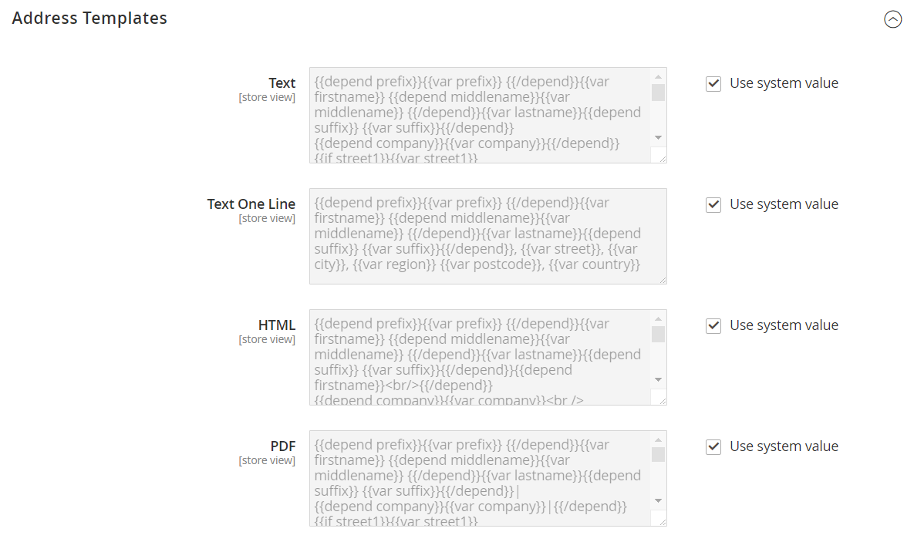

# Vorlagen für Kundenadressen

{{ee-feature}}

Sie können die Vorlage ändern, die das Format der Rechnungs- und Lieferadressen des Kunden steuert, die auf gedruckten Rechnungen, Sendungen und Rückerstattungen sowie im Adressbuch des Kundenkontos angezeigt werden. Wenn Sie zusätzliche Informationen einbeziehen möchten, können Sie [benutzerdefinierte Attribute](attribute-properties.md) erstellen, die mit dem Kundenkonto und der [Adresse](address-attributes.md) verknüpft sind, und sie in die Vorlage integrieren.

## Beispiel 1: Kurzformat

Für [!UICONTROL Text One Line] Adressvorlage:

```text
{{depend prefix}}{{var prefix}} {{/depend}}{{var firstname}} {{depend middlename}}{{var middlename}} {{/depend}}{{var lastname}}{{depend suffix}} {{var suffix}}{{/depend}}, {{var street}}, {{var city}}, {{var region}} {{var postcode}}, {{var country}}
```

## Beispiel 2: Langformat

Für [!UICONTROL Text], [!UICONTROL HTML] und [!UICONTROL PDF] Adressvorlagen:

```text
{{depend prefix}}{{var prefix}} {{/depend}}{{var firstname}} {{depend middlename}}{{var middlename}} {{/depend}}{{var lastname}}{{depend suffix}} {{var suffix}}{{/depend}}{{depend company}}{{var company}}{{/depend}}{{if street1}}{{var street1}}{{/if}}{{depend street2}}{{var street2}}{{/depend}}{{depend street3}}{{var street3}}{{/depend}}{{depend street4}}{{var street4}}{{/depend}}{{if city}}{{var city}},  {{/if}}{{if region}}{{var region}}, {{/if}}{{if postcode}}{{var postcode}}{{/if}}{{var country}}{{depend telephone}}T: {{var telephone}}{{/depend}}{{depend fax}}F: {{var fax}}{{/depend}}{{depend vat_id}}VAT: {{var vat_id}}{{/depend}}
```

{width="600" zoomable="yes"}

## Reihenfolge der Adressfelder ändern

1. Navigieren Sie in _Admin_-Seitenleiste zu **[!UICONTROL Stores]** > _[!UICONTROL Settings]_>**[!UICONTROL Configuration]**.

1. Erweitern Sie im linken Seitenbereich **[!UICONTROL Customers]** und wählen Sie **[!UICONTROL Customer Configuration]** aus.

1. Klicken Sie, um den Abschnitt **[!UICONTROL Address Templates]** zu erweitern.

   Im Abschnitt finden Sie separate Formatierungsanweisungen für die folgenden Elemente:

   - [!UICONTROL Text]
   - [!UICONTROL Text One Line]
   - [!UICONTROL HTML]
   - [!UICONTROL PDF]

1. Bearbeiten Sie die einzelnen Vorlagen nach Bedarf, indem Sie die Beispiele als Referenz verwenden.

1. Klicken Sie abschließend auf **[!UICONTROL Save Config]**.
