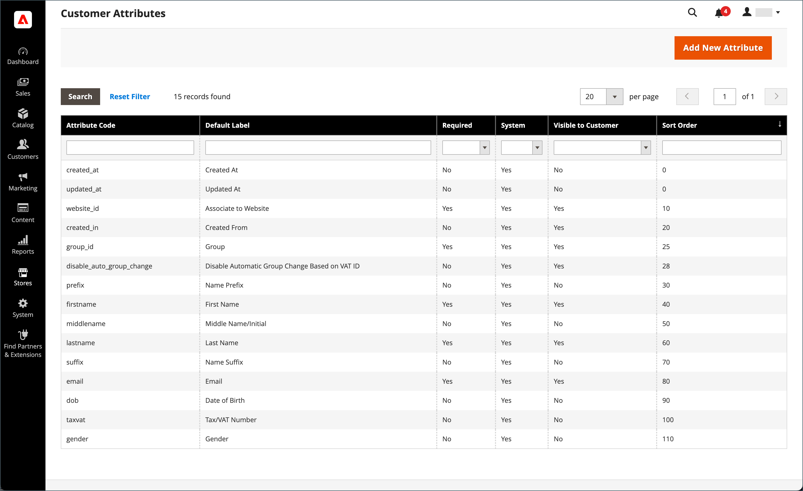

# Kundenattributeigenschaften

{{ee-feature}}

Kundenattribute liefern die Informationen, die zur Unterstützung der Auftrags-, Erfüllungs- und Kundenverwaltungsprozesse erforderlich sind. Da Ihr Unternehmen einzigartig ist, benötigen Sie möglicherweise neben den vom System bereitgestellten Standardelementen auch Felder. Sie können den Abschnitten Kontoinformationen, Adressbuch und Rechnungsinformationen des Kundenkontos benutzerdefinierte Attribute hinzufügen. Kunde [Adressattribute](address-attributes.md) kann auch in der _Rechnungsinformationen_ bei der Kasse, oder wenn sich Gäste für ein Konto anmelden.

{width="700" zoomable="yes"}

## Schritt 1: Ausfüllen der Attributeigenschaften

1. Im _Admin_ Seitenleiste, navigieren Sie zu **[!UICONTROL Stores]** > _[!UICONTROL Attributes]_>**[!UICONTROL Customer]**.

1. Klicken Sie oben rechts auf **[!UICONTROL Add New Attribute]**.

   {width="600" zoomable="yes"}

1. Im **[!UICONTROL Attribute Properties]** führen Sie folgende Schritte aus:

   - Geben Sie einen **[!UICONTROL Default Label]** , das das Attribut während der Dateneingabe angibt.

   - Geben Sie eine **[!UICONTROL Attribute Code]** , das das Attribut im System angibt.

   Der Attributcode muss mit einem Buchstaben beginnen und kann eine beliebige Kombination aus Kleinbuchstaben (a-z) und Zahlen (0-9) enthalten. Der Code muss weniger als 30 Zeichen lang sein und darf keine Sonderzeichen oder Leerzeichen enthalten. Das Unterstrich (`_`) verwendet werden, um ein Leerzeichen anzugeben.

   >[!TIP]
   >
   >**Tastaturbefehl:** Um nur die erforderlichen Felder auszufüllen, scrollen Sie nach unten zu _[!UICONTROL Storefront Properties]_, geben Sie die_[!UICONTROL Sort Order]_ und speichern Sie.

1. Füllen Sie die Dateneintragseigenschaften aus:

   - Um den Typ des Eingabeditors zu bestimmen, der für die Dateneingabe verwendet wird, legen Sie **[!UICONTROL Input Type]** auf einen der folgenden Werte zu:

     | Typ | Beschreibung |
     |----|-----------|
     | `Text Field` | Ein einzeiliges Textfeld. |
     | `Text Area` | Ein mehrzeiliges Eingabefeld für die Eingabe von Textabsätzen, z. B. eine Produktbeschreibung. Sie können den WYSIWYG-Editor verwenden, um den Text mit HTML-Tags zu formatieren, oder die Tags direkt in den Text eingeben. |
     | `Multiple Line` | Erstellt mehrere Textzeilen für das Attribut, ähnlich einer mehrzeiligen Straßenadresse. Die Anzahl der einzelnen Dateneintragszeilen kann zwischen zwei und 20 liegen. Verwenden Sie die `Default Value` , um den Anfangswert des Felds anzugeben. |
     | `Date` | Zeigt einen Datumswert im bevorzugten Datumsformat und in der bevorzugten Zeitzone an. Datumswerte können aus einer Liste oder einem Kalender ausgewählt werden (  ).   **_Hinweis:_**Abhängig von Ihrer Systemkonfiguration_Admin _Benutzer können Datumsangaben direkt in ein Feld eingeben oder ein Datum aus dem Kalender oder der Liste auswählen. Informationen zum Festlegen von Datums- und Uhrzeitwerten finden Sie unter [Datums- und Uhrzeitoptionen](../catalog/attributes-input-types.md#date-and-time-options). |
     | `Yes/No` | Zeigt eine Dropdownliste mit vordefinierten Optionen von `Yes` und `No`. |
     | `Dropdown` | Zeigt eine Dropdown-Liste mit Werten an, die nur eine Auswahl zulassen. Der Dropdown-Eingabetyp ist eine Schlüsselkomponente von [konfigurierbare Produkte](../catalog/product-create-configurable.md). |
     | `Multiple Select` | Eine Dropdown-Liste, in der mehrere Werte ausgewählt werden können. |
     | `File (attachment)` | Ein Feld, in das eine Datei hochgeladen und dem Kundenattribut als Anlage zugeordnet werden kann. |
     | `Image File` | Ein Feld, in das ein Bild in die Galerie hochgeladen und dem Kundenattribut zugeordnet werden kann. |

   - Wenn der Kunde einen Wert in das Feld eingeben muss, legen Sie **[!UICONTROL Values Required]** nach `Yes`.

   - Um dem Feld einen Anfangswert zuzuweisen, geben Sie einen **[!UICONTROL Default Value]**.

   - Um die Genauigkeit der in das Feld eingegebenen Daten vor dem Speichern des Datensatzes zu überprüfen, legen Sie **[!UICONTROL Input Validation]** zum Datentyp hinzu, der im Feld zulässig sein soll. Die verfügbaren Werte hängen von der [!UICONTROL Input Type] angegeben.

     | Wert | Beschreibung |
     |-----|-----------|
     | `None` | Das Feld hat während der Dateneingabe keine Eingabevalidierung. |
     | `Alphanumeric` | Akzeptiert eine beliebige Kombination von Zahlen (0-9) und alphabetischen Zeichen (a-z, A-Z) während der Dateneingabe. Informationen zum Einschließen von Sonderzeichen finden Sie unter _Escape HTML Entitäten_. |
     | `Alphanumeric with Space` | Akzeptiert eine beliebige Kombination von Zahlen (0-9), alphabetischen Zeichen (a-z, A-Z) und Leerzeichen während der Dateneingabe. |
     | `Numeric Only` | Akzeptiert nur Zahlen (0-9) während der Dateneingabe. |
     | `Alpha Only` | Akzeptiert während der Dateneingabe nur alphabetische Zeichen (a-z, A-Z). |
     | `URL` | Akzeptiert nur eine URL während der Dateneingabe. |
     | `Email` | Akzeptiert nur eine E-Mail-Adresse während der Dateneingabe. |
     | `Length Only` | Validiert die Eingabe anhand der Länge der in das Feld eingegebenen Daten. |

   - Um die Größe der Eingabetypen für Textfelder und Textbereiche zu begrenzen, geben Sie die **[!UICONTROL Minimum Text Length]** und **[!UICONTROL Maximum Text Length]**.

   - Um einen Vorverarbeitungsfilter auf Werte anzuwenden, die in ein Textfeld, einen Textbereich oder einen mehrzeiligen Eingabetyp eingegeben werden, legen Sie **[!UICONTROL Input/Output Filter]** auf einen der folgenden Werte zu:

     | Wert | Beschreibung |
     |-----|-----------|
     | `None` | Es wird kein Filter auf den in das Feld eingegebenen Text angewendet. |
     | `Strip HTML Tags` | Entfernt HTML-Tags aus dem Text. Dieser Filter kann beim Bereinigen von Daten helfen, die aus einer anderen Quelle, die HTML-Tags enthält, in ein Feld eingefügt werden. |
     | `Escape  HTML Entities` | Konvertiert Sonderzeichen im Text in eine gültige HTML-Escape-Sequenz, z. B. `&;`. Escape-Sequenzen sind zwischen einem kaufmännischen Und und einem Semikolon umschlossen und werden häufig für typografische Anführungszeichen, Copyright- und Markenzeichensymbole verwendet. Escape-Sequenzen werden auch verwendet, um Zeichen wie das Kleiner als (`<`) und größer als (`>`) und das kaufmännische Und-Zeichen, die auch im Code verwendet werden. Dieser Filter kann dazu beitragen, Sonderzeichen zu bereinigen, die manchmal aus Textverarbeitungen in Datenbankfelder eingefügt werden. |

1. Füllen Sie die Kundenraster- und Segmenteigenschaften aus:

   - Um die Spalte in das Kundenraster einbeziehen zu können, legen Sie **[!UICONTROL Add to Column Options]** nach `Yes`.

   - Um das Kundenraster nach diesem Attribut zu filtern, legen Sie **[!UICONTROL Use in Filter Options]** nach `Yes`.

   - Um das Kundenraster nach Textattribut mit unterschiedlichen Filterübereinstimmungsbedingungen zu filtern, legen Sie **[!UICONTROL Grid Filter Condition Type]** nach `Partial Match`, `Prefix Match`oder `Full Match`. Sie wirkt sich nicht auf die _Suche nach Keyword_  -Feld für das Raster.

   - Um das Kundenraster nach diesem Attribut zu durchsuchen, legen Sie **[!UICONTROL Use in Search Options]** nach `Yes`.

   - So stellen Sie dieses Attribut zur Verfügung [Kundensegmente](customer-segments.md), set **[!UICONTROL Use in Customer Segment]** nach `Yes`.

## Schritt 2: Ausfüllen der Storefront-Eigenschaften

1. Scrollen Sie nach unten zum **[!UICONTROL Storefront Properties]** Abschnitt.

   {width="600" zoomable="yes"}

1. Um das Attribut für Kunden sichtbar zu machen, legen Sie **[!UICONTROL Show on Storefront]** nach `Yes`.

1. Geben Sie im Feld **[!UICONTROL Sort Order]** -Feld, das die Reihenfolge des Erscheinungsbilds bestimmt, wenn es mit anderen Attributen aufgeführt wird.

1. Satz **[!UICONTROL Forms to Use]** zu jedem Formular hinzu, das das Attribut enthalten soll. Um mehrere Optionen auszuwählen, halten Sie die Strg-Taste gedrückt und klicken Sie auf jedes Formular.

   - [&quot;Kundenregistrierung&quot;](customer-sign-in.md)
   - [&quot;Bearbeiten von Kundenkonten&quot;](account-create.md)
   - [&quot;Admin Checkout&quot;](../stores-purchase/checkout-process.md)

## Schritt 3: Titel ausfüllen und speichern

1. Wählen Sie im linken Bereich die Option **[!UICONTROL Manage Labels/Options]**.

1. under **[!UICONTROL Manage Titles]**, geben Sie einen Titel ein, um das Attribut für jede [Store-Ansicht](../getting-started/websites-stores-views.md).

1. Wenn Sie fertig sind, klicken Sie auf **[!UICONTROL Save Attribute]**.

   {width="600" zoomable="yes"}

## Feldbeschreibungen

### [!UICONTROL Attribute Properties]

| Feld | Beschreibung |
|--- |--- |
| [!UICONTROL Default Label] | Die Standardbeschriftung, mit der das Attribut in der Admin- und Storefront identifiziert wird. |
| [!UICONTROL Attribute Code] | Ein eindeutiger Code, der das Attribut im System identifiziert. Der Code kann bis zu 60 Zeichen lang sein und darf keine Leerzeichen oder Sonderzeichen enthalten. Anstelle eines Leerzeichens kann das Unterstrichsymbol verwendet werden. |
| [!UICONTROL Input Type] | Bestimmt das Eingabefeld, das für die Dateneingabe verwendet wird. Optionen:  **`Text Field`**- Ein einzeiliges Textfeld. **`Text Area`** - Ein mehrzeiliger Textbereich.  **`Multiple Line`**- Erstellt mehrere Textzeilen für das Attribut, ähnlich einer mehrzeiligen Straßenadresse. Die Anzahl der einzelnen Dateneintragszeilen kann zwischen 2 und 20 liegen. **`Date`** - Zeigt ein Datumsfeld mit einem Popup-Kalender an. **`Dropdown`**- Eine Dropdownliste, in der nur ein auszuwählender Wert zulässig ist. **`Multiple Select`** - Eine Dropdown-Liste, in der mehrere Werte ausgewählt werden können.  **`Yes/No`**- Ein Feld, das nur eine Auswahl an `Yes` oder `No` -Werte. **`File (attachment)`** - Ein Feld, in das eine Datei hochgeladen und dem Kundenattribut als Anhang zugeordnet werden kann.  **`Image File`**- Ein Feld, in das ein Bild in die Galerie hochgeladen und dem Kundenattribut zugeordnet werden kann. |
| [!UICONTROL Values Required] | Bestimmt, ob ein Wert in das Feld eingegeben werden muss. Optionen: `Yes` / `No` |
| [!UICONTROL Default Value] | Gibt den Anfangswert des Attributs an. |
| [!UICONTROL Input Validation] | Die Auswahl der Optionen wird vom Eingabetyp bestimmt. Optionen:  **`None`**- Das Feld hat während der Dateneingabe keine Eingabevalidierung. **`Alphanumeric`** - Akzeptiert eine beliebige Kombination von Zahlen (0-9) und Buchstaben (a-z, A-Z) während der Dateneingabe.  **`Alphanumeric with Space`**- Ermöglicht es, dass die Räume in der Straßenadresse den maximalen Längenanforderungen des Beförderers entsprechen. Beim Checkout kann der Kunde eine beliebige Kombination aus Zahlen (0-9), Buchstaben (a-z, A-Z) und Leerzeichen in die Straßenadresse des Empfängers und Absenders eingeben. Alle zusätzlichen Leerzeichen werden beim Speichern der Adresse abgeschnitten. **`Numeric Only`** - Akzeptiert nur Zahlen (0-9) während der Dateneingabe.  **`Alpha Only`**- Akzeptiert während der Dateneingabe nur Buchstaben (a-z, A-Z). **`URL`** - Akzeptiert nur eine URL während der Dateneingabe.  **`Email`**- Akzeptiert nur eine E-Mail-Adresse während der Dateneingabe. **`Length Only`** - Validiert die Eingabe anhand der Länge der in das Feld eingegebenen Daten. |
| [!UICONTROL Input/Output Filter] | Wendet einen Vorverarbeitungsfilter auf Werte an, die in ein Textfeld, einen Textbereich oder einen mehrzeiligen Eingabetyp eingegeben wurden, bevor der Datensatz gespeichert wird. Optionen:  **`None`**- Wendet keinen Filter auf den in das Feld eingegebenen Text an. **`Strip HTML Tags`** - Entfernt HTML-Tags aus dem Text. Dieser Filter kann beim Bereinigen von Daten helfen, die aus einer anderen Quelle, die HTML-Tags enthält, in ein Feld eingefügt werden.  **`Escape HTML Entities`**- Konvertiert die im Text gefundenen Sonderzeichen in eine gültige HTML-Escape-Sequenz, z. B. `amp;`. Escape-Sequenzen sind zwischen einem kaufmännischen Und und einem Semikolon eingeschlossen und werden häufig für typografische Anführungszeichen, Copyright-Symbole und Markenzeichensymbole verwendet. Escape-Sequenzen werden auch verwendet, um Zeichen wie das Kleiner als (`<`) und größer als (`>`) und das kaufmännische Und-Zeichen, die auch im Code verwendet werden. Dieser Filter kann dazu beitragen, Sonderzeichen zu bereinigen, die manchmal aus Textverarbeitungen in Datenbankfelder eingefügt werden. |
| [!UICONTROL Add to Column Options] | Gibt an, ob das Attribut als Spalte im [Kunden](customers-all.md) Gitter. Optionen: `Yes` / `No` |
| [!UICONTROL Use in Filter Options] | Gibt an, ob das Attribut als Filter für Suchvorgänge aus dem Raster verwendet werden kann. Optionen: `Yes` / `No` |
| [!UICONTROL Grid Filter Condition Type] | Gibt die Bedingungen für die Filterung von Attributen für Suchvorgänge aus dem Raster an. Sie wirkt sich nicht auf die _Suche nach Keyword_ -Feld für das Raster. Optionen: `Partial Match` / `Prefix Match` / `Full Match` |
| [!UICONTROL Use in Search Options] | Gibt an, ob der Attributwert bei Suchvorgängen als Keyword verwendet werden kann. Optionen: `Yes` / `No` |
| [!UICONTROL Use in Customer Segment] | Bestimmt, ob das Attribut in [Kundensegment](customer-segments.md) Bedingungen. Optionen: `Yes` / `No` |

### [!UICONTROL Storefront Properties]

| Feld | Beschreibung |
|--- |--- |
| [!UICONTROL Show on Storefront] | Bestimmt, ob das Attribut als Feld in den Kundeninformationen in der Storefront angezeigt wird. Optionen: `Yes` / `No` |
| [!UICONTROL Sort Order] | Gibt die Sortierreihenfolge dieses Attributs in Bezug auf andere Kundenattribute an. Die Sortierreihenfolge bestimmt die Reihenfolge, in der Felder während der Dateneingabe bei Verwendung der Tastaturnavigation den Fokus erhalten. |
| [!UICONTROL Forms to Use in] | Bestimmt die Seiten mit Dateneingabeformularen, auf denen das Attribut angezeigt wird. Optionen:  [`Customer Registration`](account-dashboard-account-information.md)  [`Customer Account Edit`](account-create.md)  [`Admin Checkout`](../stores-purchase/checkout-process.md) |

## Standardmäßige Kundenattribute

| Attributcode | Beschreibung |
| --------------- | ------------------ |
| `created_at` | Das Datum der Erstellung des Kundenkontos. |
| `updated_at` | Das Datum der letzten Aktualisierung des Kundenkontos. |
| `website_id` | Die Website-ID der Site, auf der das Kundenkonto erstellt wurde. |
| `store_id` | Die Store-ID der Site, auf der das Kundenkonto erstellt wurde. |
| `created_in` | Die Store-Ansicht, in der das Konto erstellt wurde. |
| `group_id` | Die ID der Kundengruppe, der der Kunde zugewiesen ist. |
| `disable_auto_group_change` | Bestimmt, ob Kundengruppen dynamisch zugewiesen werden können während [MwSt-ID-Validierung](../stores-purchase/vat.md#configure-vat-id-validation). |
| `prefix` | Jedes Präfix, das mit dem Kundennamen verwendet wird (z. B. Herr, Frau oder Dr.). |
| `firstname` | Der Vorname des Kunden. |
| `middlename` | Der Vorname oder die mittlere Anfangsphase des Kunden. |
| `lastname` | Der Nachname des Kunden. |
| `suffix` | Jedes Suffix, das mit dem Kundennamen verwendet wird. (z. B. Jr., Sr. oder Esquire) |
| `email` | Die E-Mail-Adresse des Kunden. |
| `dob` | Das Geburtsdatum des Kunden.    **_Wichtig:_**Beachten Sie im Einklang mit den aktuellen Best Practices für Sicherheit und Datenschutz alle potenziellen rechtlichen und sicherheitstechnischen Risiken, die mit der Speicherung des vollständigen Geburtsdatums (Monat, Tag, Jahr) der Kunden mit anderen persönlichen Identifikatoren verbunden sind. Es wird empfohlen, die Speicherung der vollständigen Geburtsdaten der Kunden zu begrenzen und stattdessen das Geburtsjahr des Kunden zu verwenden. |
| `taxvat` | Die dem Kunden zugewiesene Mehrwertsteuernummer (MwSt). Die Standardbeschriftung dieses Attributs lautet `VAT Number`. Das Feld MwSt.-Nummer ist immer in allen Versand- und Rechnungskunden-Adressen vorhanden, wenn sie vom Administrator angezeigt werden, es ist jedoch kein erforderliches Feld. |
| `gender` | Das Kundengeschlecht. |

## Demo für Kundenattribute

Eine Demonstration der Erstellung von Kundenattributen finden Sie in diesem Video:

>[!VIDEO](https://video.tv.adobe.com/v/343661?quality=12)
