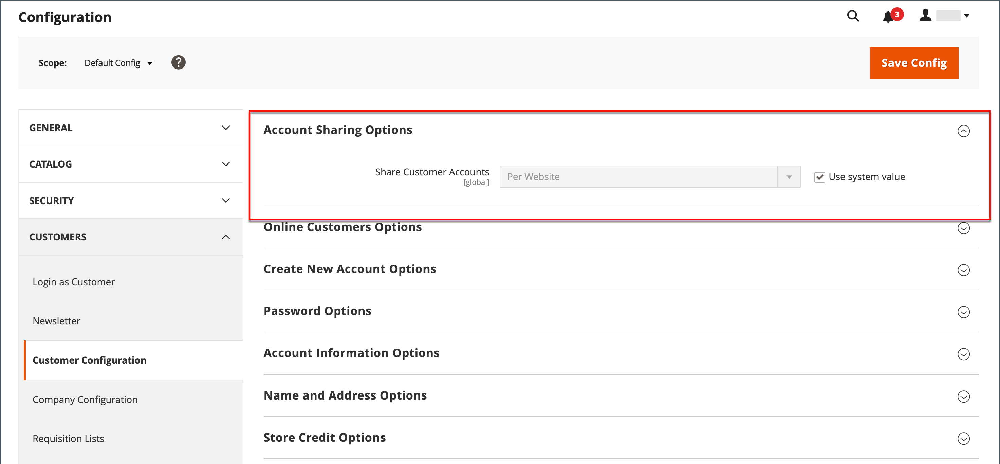

# Kundenkontobereich

Der Header jeder Seite in Ihrem Store erweitert eine Einladung für Käufer, sich _ein Konto bei Ihrem Store anzumelden_ zu registrieren. Kunden, die ein Konto eröffnen, profitieren von einer Reihe von Vorteilen, darunter:

* **Kundenkonto erstellen** - Besucher können ein Kundenkonto erstellen, damit sie die Storefront als registrierter Kunde verwenden können.
* **Erstellen eines Unternehmenskontos** Je nach Konfiguration kann ein Besucher Ihres Geschäfts ein Unternehmenskonto erstellen. Weitere Informationen finden Sie unter [Adobe Commerce B2B](../b2b/introduction.md).
* **Schnellerer Checkout** - Registrierte Kunden durchlaufen den Checkout schneller, da ein Großteil der Informationen bereits in ihren Konten vorhanden ist.
* **Self-Service** - Registrierte Kunden können ihre Informationen aktualisieren, den Status von Bestellungen überprüfen und sogar von ihren Konten neu bestellen.

Kunden können auf ihr Konto zugreifen, indem sie auf den **[!UICONTROL My Account]** Link in der Kopfzeile des Stores klicken. Über ihr -Konto können Kundinnen und Kunden Informationen anzeigen und ändern, einschließlich vergangener und aktueller Adressen, Abrechnungs- und Versandvoreinstellungen, Newsletter-Abonnements, Wunschlisten und mehr.

{width="600" zoomable="yes"}

## Festlegen des Umfangs von Kundenkonten

Der Umfang von Kundenkonten kann auf die Website beschränkt sein, auf der das Konto erstellt wurde, oder für alle Websites und Stores in der Store-Hierarchie freigegeben werden.

>[!NOTE]
>
>Wenn die Website aus der Kundengruppe ausgeschlossen ist, darf sich der Kunde nicht bei der Website anmelden, wenn der Umfang der Kundenkonten auf die Website beschränkt oder für alle Websites freigegeben ist. Weitere Informationen [ Ausschließen von Websites aus Gruppen finden ](customer-groups.md#create-a-customer-group) unter „Erstellen einer Kundengruppe“.

1. Navigieren Sie in _Admin_-Seitenleiste zu **[!UICONTROL Stores]** > [!UICONTROL _[!UICONTROL Settings]_] > **[!UICONTROL Configuration]**.

1. Erweitern Sie im linken Bereich **[!UICONTROL Customers]** und wählen Sie **[!UICONTROL Customer Configuration]**.

1. Erweitern Sie den Abschnitt **[!UICONTROL Account Sharing Options]** .

   {width="600" zoomable="yes"}

1. Legen Sie **[!UICONTROL Share Customer Accounts]** auf eine der folgenden Einstellungen fest:

   | Option | Beschreibung |
   | --- | --- |
   | `Global` | Gibt Kundenkontoinformationen für jede Website frei und speichert sie in der Installation. |
   | `Per Website` | Beschränkt Kundenkontoinformationen auf die Website, auf der das Konto erstellt wurde. |

   {style="table-layout:auto"}

   >[!INFO]
   >
   > Deaktivieren Sie bei Bedarf das Kontrollkästchen **[!UICONTROL User system value]** , um die Änderung vorzunehmen.

1. Klicken Sie abschließend auf **[!UICONTROL Save Config]**.

   >[!NOTE]
   >
   >Wenn `Global` ausgewählt ist, werden die Kundeninformationen in **Mein Konto** (Adressen und Kontoinformationen wie Kontaktdaten) freigegeben.
