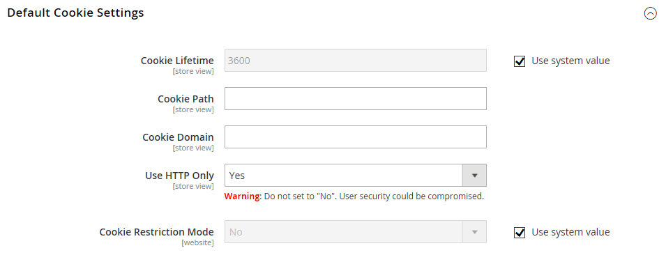

# Lebensdauer der Kundensitzung

Die Lebensdauer einer Kunden-Shopping-Sitzung wird durch mehrere Faktoren bestimmt, darunter die Länge der Server-Sitzung, die Verwendung eines [persistenten Warenkorbs](../stores-purchase/cart-persistent.md) und die Lebensdauer der im Browser gespeicherten Informationen. Obwohl diese sich auf dasselbe Kundenerlebnis beziehen, handelt es sich um separate Prozesse mit unterschiedlichen Ablaufereignissen und Lebensdauern.

| Prozess | Beschreibung |
| --- | --- |
| Sitzung | Auf dem Server gespeicherte Informationen, z. B. der Inhalt des Warenkorbs. Wenn die Serversitzung abläuft, bevor das Cookie abläuft, verlieren Kunden möglicherweise den Inhalt des Warenkorbs und verringern das Sicherheitsrisiko. |
| Sitzungs-Cookie | Informationen, die im Browser als eine Anzahl oder Zeichenfolge gespeichert werden. Wenn das Sitzungs-Cookie vor der Serversitzung abläuft, wird der Kunde abgemeldet. Das Sitzungs-Cookie wird gelöscht, sobald der Kunde das Browser-Fenster schließt. Standardmäßig ist die Cookie-Lebensdauer auf 3.600 Sekunden oder eine Stunde festgelegt. Wenn in diesem Zeitraum keine Tastaturaktivität vorhanden ist, wird die aktuelle Sitzung beendet, und die Kunden müssen sich wieder bei ihren Konten anmelden, um den Einkauf fortsetzen zu können. |

{style="table-layout:auto"}

Wenn [Warenkorb](../stores-purchase/cart-persistent.md) aktiviert ist, werden die Inhalte des Warenkorbs gespeichert, wenn sich Kunden das nächste Mal bei ihren Konten anmelden. Bei der Verwendung eines persistenten Warenkorbs wird empfohlen, die Lebensdauer der Serversitzung und des Sitzungs-Cookies auf einen langen Zeitraum festzulegen.

Auf dem Server wird die Länge der Sitzung durch die `php.ini` Datei und mehrere Variablen gesteuert. Derzeit verfügt Adobe Commerce über keine Admin-Konfigurationseinstellung, die die Länge der Serversitzung steuert.

## Konfigurieren der Cookie-Lebensdauer

1. Navigieren Sie in _Admin_-Seitenleiste zu [!UICONTROL **Stores**] > _[!UICONTROL Settings]_>[!UICONTROL **Configuration**].

1. Wenn Sie mehrere Stores haben, stellen Sie die **[!UICONTROL Store View]** in der oberen rechten Ecke auf den Store ein, für den die Konfiguration gilt.

1. Wählen Sie im linken Bedienfeld unter **[!UICONTROL General]** die Option **[!UICONTROL Web]** aus.

1. Erweitern Sie den Abschnitt **[!UICONTROL Default Cookie Settings]** .

   {width="600" zoomable="yes"}

1. Um den Standardwert zu ändern, deaktivieren Sie das Kontrollkästchen **[!UICONTROL Use system value]** und geben Sie den neuen Wert in Sekunden ein.

1. Klicken Sie abschließend auf **[!UICONTROL Save Config]**.

## Konfigurieren der _Angaben speichern_ Funktion

Um die Anmeldung zu vereinfachen, ermöglicht die **[!UICONTROL Remember Me]** den Inhabern von Benutzerkonten, die Eingabe ihrer Anmeldeinformationen bei jedem Betreten der Storefront zu vermeiden. Aus Sicherheitsgründen ist die Persistenzfunktion standardmäßig deaktiviert.

1. Navigieren Sie in _Admin_-Seitenleiste zu **[!UICONTROL Stores]** > _[!UICONTROL Settings]_>**[!UICONTROL Configuration]**.

1. Erweitern Sie im linken Bereich **[!UICONTROL Customers]** und wählen Sie **[!UICONTROL Persistent Shopping Cart]**.

1. Erweitern Sie den Abschnitt **[!UICONTROL General Options]** .

1. Legen Sie **[!UICONTROL Enable Persistence]** auf `Yes` fest. (Deaktivieren Sie das Kontrollkästchen **[!UICONTROL Use system value]** , um die Änderung der Standardeinstellung zu ermöglichen.)

1. Wählen Sie **[!UICONTROL Enable "Remember Me"]** je nach Ihren Anforderungen `Yes` oder `No` aus.

1. Klicken Sie abschließend auf **[!UICONTROL Save Config]**.
