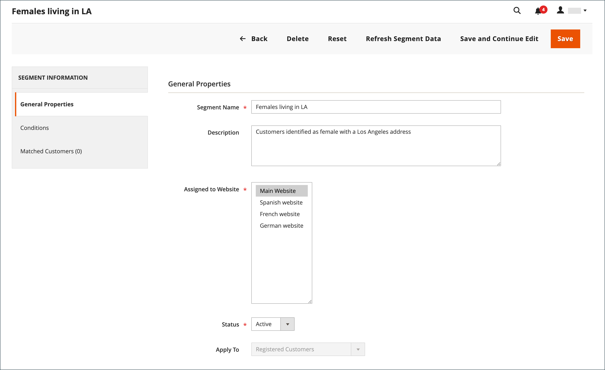

# Kundensegmente erstellen und löschen

{{ee-feature}}

Das Erstellen eines Kundensegments ähnelt dem Erstellen einer [Warenkorbpreisregel](../merchandising-promotions/price-rules-cart.md), allerdings umfassen die Optionen [kundensegmentspezifische Attribute](../customers/customer-segments.md).

{width="700" zoomable="yes"}

_**[!UICONTROL Customer Segments]grid **_

| Spalte | Beschreibung |
|--- |--- |
| **[!UICONTROL ID]** | Die eindeutige ID des Kundensegments. |
| **[!UICONTROL Segment]** | Der Name des Kundensegments. |
| **[!UICONTROL Status]** | Gibt an, ob das Kundensegment _[!UICONTROL Active]_oder_[!UICONTROL Inactive]_ ist. |
| **[!UICONTROL Website]** | Gibt die Website an, zu der das Kundensegment gehört. |

{style="table-layout:auto"}

## Voraussetzung: Kundensegmente aktivieren

1. Wechseln Sie in der Seitenleiste _Admin_ zu **[!UICONTROL Stores]** > _[!UICONTROL Settings]_>**[!UICONTROL Configuration]**.

1. Erweitern Sie im linken Bereich den Wert **[!UICONTROL Customers]** und wählen Sie **[!UICONTROL Customer Configuration]** aus.

1. Erweitern Sie den Abschnitt **[!UICONTROL Customer Segments]** .

1. Stellen Sie sicher, dass **[!UICONTROL Enable Customer Segment Functionality]** auf `Yes` gesetzt ist.

   {width="600" zoomable="yes"}

1. (Optional) Um die Echtzeit-Validierung für Kundensegmente zu deaktivieren, setzen Sie **[!UICONTROL Real-time Check if Customer is Matched by Segment]** auf `No`.

   Wenn Sie die Echtzeit-Validierung deaktivieren, werden Kundensegmente durch eine einzige kombinierte Bedingungs-SQL-Abfrage validiert. Die Deaktivierung dieser Funktion verbessert die Leistung der Segmentvalidierung, wenn das System viele Kundensegmente enthält. Die Validierung funktioniert jedoch nicht mit einer geteilten Datenbank oder wenn keine registrierten Kunden vorhanden sind.

1. Klicken Sie nach Abschluss des Vorgangs auf **[!UICONTROL Save Config]**.

## Segment erstellen

Die folgenden Schritte verwenden ein Beispiel zum Erstellen eines Kundensegments, das weibliche Kunden in Los Angeles anspricht.

### Schritt 1: Hinzufügen eines Kundensegments

1. Wechseln Sie in der Seitenleiste _Admin_ zu **[!UICONTROL Customers]** > **[!UICONTROL Segments]**.

1. Klicken Sie in der oberen rechten Ecke auf **[!UICONTROL Add Segment]**.

1. Geben Sie einen **[!UICONTROL Segment Name]** -Wert ein, der das Kundensegment beim Arbeiten in der Admin-Konsole identifiziert.

1. Geben Sie einen kurzen **[!UICONTROL Description]** -Wert ein, der den Zweck des Segments erklärt.

1. Setzen Sie **[!UICONTROL Assigned to Website]** auf die Website, auf der das Kundensegment verwendet werden kann.

1. Setzen Sie den **[!UICONTROL Status]** auf _Aktiv_ oder _Inaktiv_.

1. Um die Kundentypen zu identifizieren, die Sie für die Anwendung des Segments verwenden möchten, setzen Sie **[!UICONTROL Apply to]** auf einen der folgenden Werte:

   - `Visitors and Registered Customers` - Umfasst alle Käufer, unabhängig davon, ob sie bei einem Konto angemeldet sind.
   - `Registered Customers` - Umfasst nur Käufer, die bei einem Konto angemeldet sind.
   - `Visitors` - Umfasst nur Käufer, die nicht bei einem Konto angemeldet sind.

   >[!TIP]
   >
   >Wenn Sie ein Segment erstellen, das auf in einem Kundenkonto gespeicherten Kundenattributen basiert, empfiehlt es sich, das Segment nur auf registrierte Kunden anzuwenden.

   >[!NOTE]
   >
   > Wenn ein Segment für `Visitors and Registered Customers` gilt, zeigt die [!UICONTROL Matched Customers] nur `Registered Customers` an. Dies ist auch dann der Fall, wenn Besucher auf Grundlage von Bedingungen, die für sie gelten, als Ziel ausgewählt werden können. Für nur `Visitors` Segmente wird keine Registerkarte `Matched Customers` angezeigt.

1. Klicken Sie auf **[!UICONTROL Save and Continue Edit]**.

   Nach dem Speichern des Segments &quot;_[!UICONTROL General Properties]_&quot; werden im linken Bereich zusätzliche Optionen verfügbar.

   {width="600" zoomable="yes"}

**_[!UICONTROL General Properties]_**

| Feld | Beschreibung |
|--- |---|
| **[!UICONTROL Segment Name]** | Ein Name, der das Segment für die interne Referenz angibt. |
| **[!UICONTROL Description]** | Eine kurze Beschreibung, die den Zweck des Segments für interne Referenzzwecke erläutert. |
| **[!UICONTROL Assigned to Website]** | Die einzelne Website, auf der das Segment verwendet werden kann. |
| **[!UICONTROL Status]** | Aktiviert und deaktiviert das Segment. Alle damit verbundenen Preisregeln und Banner werden deaktiviert, wenn das Segment deaktiviert ist. Optionen: `Active` / `Inactive` |
| **[!UICONTROL Apply to]** | Definiert die Kundentypen, auf die das Segment angewendet wird. Die Auswahl beeinflusst die für die Erstellung des Segments verfügbaren Bedingungen. Die Einstellung kann nach dem Speichern des Segments nicht mehr geändert werden. |

{style="table-layout:auto"}

### Schritt 2: Bedingungen definieren

>[!NOTE]
>
> Für Besucher gelten nur die folgenden Bedingungen: Bedingungen für den Warenkorb (Gesamtwert des Warenkorbs, Zeileneinträge des Warenkorbs und Menge der Warenkorbprodukte), Produktregeln (Produkte im Warenkorb und Produktverlauf) sowie Kombinationen dieser Elemente. Wenn ein Segment sowohl für Besucher als auch registrierte Kunden gelten soll, werden die Besucher nur anhand der aufgelisteten Bedingungen verfolgt.

1. Klicken Sie im linken Bereich auf **[!UICONTROL Conditions]**.

   Die Standardbedingung beginnt auf der Seite mit &quot;_[!UICONTROL If ALL of these conditions are TRUE:]_&quot;.

   {width="600" zoomable="yes"}

1. Erstellen Sie eine Bedingung für weibliche Kunden:

   - Klicken Sie auf das Symbol **[!UICONTROL Add]** , um die Liste der Bedingungen anzuzeigen, und wählen Sie `Gender` aus.

   - Behalten Sie die standardmäßige Bedingungssteueroption **ist** bei.

   - Klicken Sie auf **..** und wählen Sie `female` aus.

   {width="600" zoomable="yes"}

1. Erstellen Sie eine weitere Bedingung, die auf die Einwohner von Los Angeles abzielt:

   - Klicken Sie in der nächsten Zeile auf das Symbol **[!UICONTROL Add]** und wählen Sie `Customer Address` aus.

     Diese Aktion erstellt eine übergeordnete Bedingung, in der Sie ein oder mehrere Adressfelder definieren können, die abgeglichen werden sollen.

   - Klicken Sie auf das Symbol &quot;**[!UICONTROL Add]**&quot;, um die Liste der Adressfelder anzuzeigen, und wählen Sie &quot;`City`&quot;.

   - Klicken Sie auf **is** , um die Optionen zur Bedingungssteuerung anzuzeigen und `contains` auszuwählen.

   - Klicken Sie auf **..** und geben Sie `Los Angeles` ein.

   - Klicken Sie in der nächsten Zeile auf das Symbol **[!UICONTROL Add]** und wählen Sie `State/Province` aus.

   - Behalten Sie die standardmäßige Bedingungssteueroption **ist** bei.

   - Klicken Sie auf **..** und wählen Sie `United States > California` aus.

   {width="600" zoomable="yes"}

1. Klicken Sie auf **[!UICONTROL Save and Continue Edit]**.

### Schritt 3: Überprüfen der Liste der übereinstimmenden Kunden

1. Klicken Sie im linken Bereich auf **[!UICONTROL Matched Customers]** , um alle Kunden anzuzeigen, die die Bedingung erfüllen.

   {width="600" zoomable="yes"}

1. Wenn die Kundenliste Ihr Ziel erfüllt, klicken Sie auf **[!UICONTROL Save]** , um das Kundensegment abzuschließen.

1. Das Kundensegment kann jetzt für Targeting-Promotions, Inhalte und Mailings verwendet werden.

_**[!UICONTROL Matched Customers]grid **_

| Spalte | Beschreibung |
|--- |--- |
| **[!UICONTROL ID]** | Die Kunden-ID eines registrierten Kunden. |
| **[!UICONTROL Name]** | Der Name eines registrierten Kunden. |
| **[!UICONTROL Email]** | Die E-Mail-Adresse eines registrierten Kunden. |
| **[!UICONTROL Group]** | Die Kundengruppe, der der Kunde zugewiesen ist. |
| **[!UICONTROL Phone]** | Die Telefonnummer des Kunden. |
| **[!UICONTROL ZIP]** | Postleitzahl des Kunden. |
| **[!UICONTROL Country]** | Das Land, in dem sich der Kunde befindet. |
| **[!UICONTROL State / Province]** | Das Bundesland oder die Provinz, in dem sich der Kunde befindet. |
| **[!UICONTROL Customer Since]** | Datum und Uhrzeit der Erstellung des Kundenkontos. |

{style="table-layout:auto"}

## Entfernen eines Kundensegments

1. Wechseln Sie in der Seitenleiste _Admin_ zu **[!UICONTROL Customers]** > **[!UICONTROL Segments]**.

1. Suchen Sie das zu löschende Segment und wählen Sie es aus.

1. Klicken Sie in der Menüleiste auf die Schaltfläche **[!UICONTROL Delete]** .

1. Um die Aktion zu bestätigen, klicken Sie auf **[!UICONTROL OK]**.

## Schaltflächenleiste

| Schaltfläche | Beschreibung |
|--- |--- |
| **[!UICONTROL Back]** | Kehrt zur Seite _[!UICONTROL Customer Segments]_zurück, ohne die Änderungen zu speichern. |
| **[!UICONTROL Delete]** | Löscht das aktuelle Kundensegment. Kunden oder abgeschlossene Bestellungen, die mit dem Kunden im Segment verknüpft sind, werden nicht entfernt. |
| **[!UICONTROL Reset]** | Setzt nicht gespeicherte Änderungen im Kundensegmentformular auf ihre vorherigen Werte zurück. |
| **[!UICONTROL Refresh Segment Data]** | Aktualisiert die Segmentdaten auf die zuletzt gespeicherten Werte. Relevant, wenn Segmentdaten nicht verfügbar oder veraltet sind. |
| **[!UICONTROL Save and Continue Edit]** | Speichert Änderungen und hält das Kundensegment geöffnet. |
| **[!UICONTROL Save]** | Speichert Änderungen und schließt das Kundensegment. |

{style="table-layout:auto"}

## Demo zu Kundensegmenten

In diesem Video erfahren Sie, wie Sie Kundensegmente erstellen:

>[!VIDEO](https://video.tv.adobe.com/v/343659/?quality=12&learn=on)
