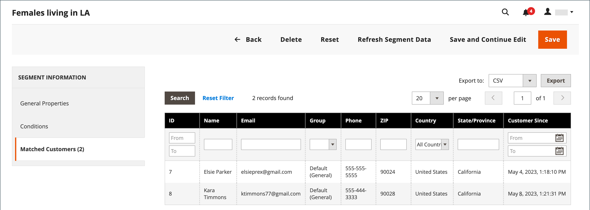

# Erstellen und Löschen von Kundensegmenten

{{ee-feature}}

Das Erstellen eines Kundensegments ähnelt dem Erstellen [Warenkorb-Preisregel](../merchandising-promotions/price-rules-cart.md) mit dem Unterschied, dass die Optionen [Kundensegmentspezifische Attribute) ](../customers/customer-segments.md).

{width="700" zoomable="yes"}

_**[!UICONTROL Customer Segments]Raster **_

| Spalte | Beschreibung |
|--- |--- |
| **[!UICONTROL ID]** | Die eindeutige ID des Kundensegments. |
| **[!UICONTROL Segment]** | Der Name des Kundensegments. |
| **[!UICONTROL Status]** | Gibt an, ob das Kundensegment _[!UICONTROL Active]_oder_[!UICONTROL Inactive]_ ist. |
| **[!UICONTROL Website]** | Gibt die Website an, zu der das Kundensegment gehört. |

{style="table-layout:auto"}

## Voraussetzung: Kundensegmente aktivieren

1. Navigieren Sie in _Admin_-Seitenleiste zu **[!UICONTROL Stores]** > _[!UICONTROL Settings]_>**[!UICONTROL Configuration]**.

1. Erweitern Sie im linken Bereich **[!UICONTROL Customers]** und wählen Sie **[!UICONTROL Customer Configuration]**.

1. Erweitern Sie den Abschnitt **[!UICONTROL Customer Segments]** .

1. Stellen Sie sicher, dass **[!UICONTROL Enable Customer Segment Functionality]** auf `Yes` gesetzt ist.

   {width="600" zoomable="yes"}

1. (Optional) Um die Echtzeit-Validierung für Kundensegmente zu deaktivieren, setzen Sie **[!UICONTROL Real-time Check if Customer is Matched by Segment]** auf `No`.

   Wenn Sie die Echtzeit-Validierung deaktivieren, werden Kundensegmente durch eine einzige kombinierte SQL-Abfrage mit Bedingungen validiert. Durch Deaktivieren dieser Funktion wird die Leistung der Segmentvalidierung verbessert, wenn im System viele Kundensegmente vorhanden sind. Die Validierung funktioniert jedoch nicht mit einer geteilten Datenbank oder wenn keine registrierten Kunden vorhanden sind.

1. Klicken Sie abschließend auf **[!UICONTROL Save Config]**.

## Erstellen eines Segments

Die folgenden Schritte verwenden ein Beispiel für die Erstellung eines Kundensegments, das sich an weibliche Kunden in Los Angeles richtet.

### Schritt 1: Kundensegment hinzufügen

1. Navigieren Sie in der _Admin_-Seitenleiste zu **[!UICONTROL Customers]** > **[!UICONTROL Segments]**.

1. Klicken Sie oben rechts auf **[!UICONTROL Add Segment]**.

1. Geben Sie einen **[!UICONTROL Segment Name]** ein, der das Kundensegment identifiziert, wenn Sie in der Admin-Verwaltung arbeiten.

1. Geben Sie eine kurze **[!UICONTROL Description]** ein, in der der Zweck des Segments erläutert wird.

1. **[!UICONTROL Assigned to Website]** Sie auf die Website, auf der das Kundensegment verwendet werden kann.

1. Legen Sie die **[!UICONTROL Status]** auf _Aktiv_ oder _Inaktiv_ fest.

1. Um die Kundentypen zu identifizieren, die Sie zum Anwenden des Segments verwenden möchten, setzen Sie **[!UICONTROL Apply to]** auf einen der folgenden Werte:

   - `Visitors and Registered Customers` - Umfasst alle Kunden, unabhängig davon, ob sie bei einem Konto angemeldet sind.
   - `Registered Customers` - Enthält nur Käufer, die bei einem Konto angemeldet sind.
   - `Visitors` - Enthält nur Käufer, die nicht bei einem Konto angemeldet sind.

   >[!TIP]
   >
   >Wenn Sie ein Segment basierend auf Kundenattributen erstellen, die in einem Kundenkonto gespeichert sind, empfiehlt es sich, das Segment nur auf registrierte Kunden anzuwenden.

   >[!NOTE]
   >
   > Wenn sich ein Segment auf `Visitors and Registered Customers` bezieht, zeigt die [!UICONTROL Matched Customers] nur `Registered Customers` an. Dies ist auch dann der Fall, wenn Besucher auf der Grundlage der für sie geltenden Bedingungen angesprochen werden können. Für `Visitors` Segmente wird keine Registerkarte `Matched Customers` angezeigt.

1. Klicken Sie auf **[!UICONTROL Save and Continue Edit]**.

   Nach dem Speichern der _[!UICONTROL General Properties]_werden im linken Bedienfeld zusätzliche Optionen verfügbar.

   {width="600" zoomable="yes"}

**_[!UICONTROL General Properties]_**

| Feld | Beschreibung |
|--- |---|
| **[!UICONTROL Segment Name]** | Ein Name, der das Segment als interne Referenz identifiziert. |
| **[!UICONTROL Description]** | Eine kurze Beschreibung, die den Zweck des Segments als interne Referenz erläutert. |
| **[!UICONTROL Assigned to Website]** | Die einzelne Website, auf der das Segment verwendet werden kann. |
| **[!UICONTROL Status]** | Aktiviert und deaktiviert das Segment. Alle zugehörigen Preisregeln und Banner werden deaktiviert, wenn das Segment deaktiviert wird. Optionen: `Active` / `Inactive` |
| **[!UICONTROL Apply to]** | Definiert die Kundentypen, auf die das Segment angewendet wird. Die Auswahl beeinflusst den Satz der Bedingungen, die für die Erstellung des Segments verfügbar sind. Die Einstellung kann nach dem Speichern des Segments nicht mehr geändert werden. |

{style="table-layout:auto"}

### Schritt 2: Bedingungen definieren

>[!NOTE]
>
> Für Besuchende gelten nur die folgenden Bedingungen: Warenkorbbedingungen (Warenkorbzwischensumme, Warenkorbpositionen und Warenkorbproduktmenge), Produktregeln (Produkte, die sich im Warenkorb und im Produktverlauf befinden) und Kombinationen dieser Artikel. Wenn ein Segment sowohl für Besucher als auch für registrierte Kunden gelten soll, werden die Besucher nur auf der Grundlage der aufgelisteten Bedingungen verfolgt.

1. Klicken Sie im linken Bereich auf **[!UICONTROL Conditions]**.

   Die Standardbedingung beginnt mit dem _[!UICONTROL If ALL of these conditions are TRUE:]_auf der Seite.

   {width="600" zoomable="yes"}

1. Erstellen Sie eine Bedingung, die sich an weibliche Kunden richtet:

   - Klicken Sie auf das Symbol **[!UICONTROL Add]** , um die Liste der Bedingungen anzuzeigen und `Gender` auszuwählen.

   - Lassen Sie die standardmäßige **is**-Bedingungssteuerungsoption.

   - Klicken Sie auf **…** und wählen Sie `female` aus.

   {width="600" zoomable="yes"}

1. Erstellen Sie eine weitere Bedingung, die auf die Bewohner von Los Angeles abzielt:

   - Klicken Sie in der nächsten Zeile auf das Symbol **[!UICONTROL Add]** und wählen Sie `Customer Address` aus.

     Diese Aktion erstellt eine übergeordnete Bedingung, in der Sie ein oder mehrere passende Adressfelder definieren können.

   - Klicken Sie auf das Symbol **[!UICONTROL Add]** , um die Liste der Adressfelder anzuzeigen und `City` auszuwählen.

   - Klicken Sie auf **is**, um die Bedingungssteuerungsoptionen anzuzeigen und `contains` auszuwählen.

   - Klicken Sie auf **…** und geben Sie `Los Angeles` ein.

   - Klicken Sie in der nächsten Zeile auf das Symbol **[!UICONTROL Add]** und wählen Sie `State/Province` aus.

   - Lassen Sie die standardmäßige **is**-Bedingungssteuerungsoption.

   - Klicken Sie auf **…** und wählen Sie `United States > California` aus.

   {width="600" zoomable="yes"}

1. Klicken Sie auf **[!UICONTROL Save and Continue Edit]**.

### Schritt 3: Liste der passenden Kunden überprüfen

1. Klicken Sie im linken Bereich auf **[!UICONTROL Matched Customers]** , um alle Kunden anzuzeigen, die die Bedingung erfüllen.

   {width="600" zoomable="yes"}

1. Wenn die Kundenliste Ihr Ziel erfüllt, klicken Sie auf **[!UICONTROL Save]** , um das Kundensegment abzuschließen.

1. Das Kundensegment kann jetzt für Targeting-Promotions, Inhalte und Mailings verwendet werden.

_**[!UICONTROL Matched Customers]Raster **_

| Spalte | Beschreibung |
|--- |--- |
| **[!UICONTROL ID]** | Die Kunden-ID eines registrierten Kunden. |
| **[!UICONTROL Name]** | Der Name einer registrierten Kundin oder eines registrierten Kunden. |
| **[!UICONTROL Email]** | Die E-Mail-Adresse eines registrierten Kunden. |
| **[!UICONTROL Group]** | Die Debitorengruppe, der der Debitor zugewiesen ist. |
| **[!UICONTROL Phone]** | Die Telefonnummer des Kunden. |
| **[!UICONTROL ZIP]** | Die Postleitzahl des Kunden. |
| **[!UICONTROL Country]** | Das Land, in dem sich der Kunde befindet. |
| **[!UICONTROL State / Province]** | Das Bundesland, in dem sich der Kunde befindet. |
| **[!UICONTROL Customer Since]** | Datum und Uhrzeit der Erstellung des Kundenkontos. |

{style="table-layout:auto"}

## Entfernen eines Kundensegments

1. Navigieren Sie in der _Admin_-Seitenleiste zu **[!UICONTROL Customers]** > **[!UICONTROL Segments]**.

1. Suchen Sie das zu löschende Segment und wählen Sie es aus.

1. Klicken Sie in der Menüleiste auf **[!UICONTROL Delete]** Schaltfläche.

1. Um die Aktion zu bestätigen, klicken Sie auf **[!UICONTROL OK]**.

## Schaltflächenleiste

| Schaltfläche | Beschreibung |
|--- |--- |
| **[!UICONTROL Back]** | Kehrt zur _[!UICONTROL Customer Segments]_zurück, ohne die Änderungen zu speichern. |
| **[!UICONTROL Delete]** | Löscht das aktuelle Kundensegment. Kunden oder abgeschlossene Bestellungen, die mit dem Kunden im Segment verknüpft sind, werden nicht entfernt. |
| **[!UICONTROL Reset]** | Setzt alle nicht gespeicherten Änderungen im Kundensegmentformular auf ihre vorherigen Werte zurück. |
| **[!UICONTROL Refresh Segment Data]** | Aktualisiert die Segmentdaten auf die zuletzt gespeicherten Werte. Relevant, wenn Segmentdaten nicht verfügbar oder veraltet sind. |
| **[!UICONTROL Save and Continue Edit]** | Speichert Änderungen und lässt das Kundensegment offen. |
| **[!UICONTROL Save]** | Speichert Änderungen und schließt das Kundensegment. |

{style="table-layout:auto"}

## Demo zu Kundensegmenten

Sehen Sie sich dieses Video an, um zu demonstrieren, wie Sie Kundensegmente erstellen:

>[!VIDEO](https://video.tv.adobe.com/v/343659/?quality=12&learn=on)
