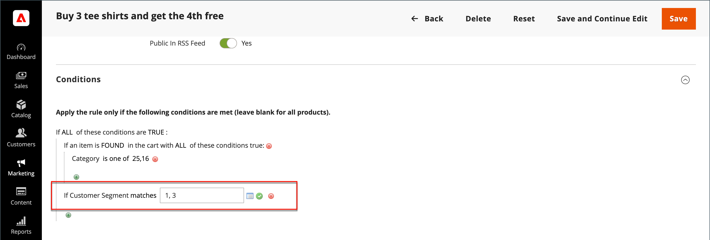
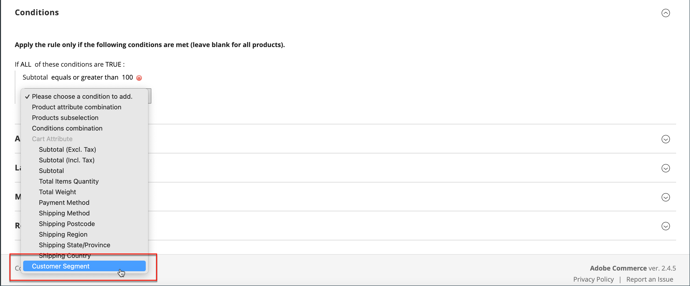

# Kundensegmente in Preisregeln

{{ee-feature}}

Ein Kundensegment kann für zielgerichtete Promotions verwendet werden, indem es mit einer [Warenkorb-Preisregel) verknüpft &#x200B;](../merchandising-promotions/price-rules-cart.md).

{width="700" zoomable="yes"}

_&#x200B;**So verknüpfen Sie ein Segment mit einer Warenkorb-Preisregel:**&#x200B;_

1. Navigieren Sie in _Admin_-Seitenleiste zu **[!UICONTROL Marketing]** > _Promotions_ > **[!UICONTROL Cart Price Rules]**.

1. Öffnen Sie eine neue oder vorhandene Regel:

   * Um eine neue Regel zu verwenden, klicken Sie oben rechts auf **[!UICONTROL Add New Rule]** .
   * Um eine vorhandene Regel zu verwenden, klicken Sie auf die Regel in der Liste, um sie im Bearbeitungsmodus zu öffnen.

1. Scrollen Sie nach unten und erweitern Sie den Abschnitt **[!UICONTROL Conditions]** .

1. Fügen Sie die Bedingung hinzu.

   * Klicken Sie auf _Symbol_ Hinzufügen), um die Liste der Bedingungen anzuzeigen. Wählen Sie dann **[!UICONTROL Customer Segment]**.

   {width="600" zoomable="yes"}

   Standardmäßig ist die Bedingung so eingestellt, dass sie eine entsprechende Bedingung findet. Klicken Sie bei Bedarf auf den Link **[!UICONTROL matches]** und ändern Sie den Operator in einen der folgenden:

   * `does not match`
   * `is one of`
   * `is not one of`

   {width="600" zoomable="yes"}

1. Um ein bestimmtes Segment anzusprechen, klicken Sie auf den Link Mehr **…** , um zusätzliche Optionen anzuzeigen. Klicken Sie dann auf das Symbol _Auswahl_ (), um die Liste der Kundensegmente anzuzeigen.

1. Aktivieren Sie in der Liste das Kontrollkästchen jedes Segments, das Sie mit der Bedingung ansprechen möchten.

   {width="600" zoomable="yes"}

1. Klicken Sie auf **[!UICONTROL Select]** , um die ausgewählten Kundensegmente in der Bedingung zu platzieren.

1. Vervollständigen Sie den Rest der Preisregel nach Bedarf.

1. Klicken Sie abschließend auf **[!UICONTROL Save]**.
