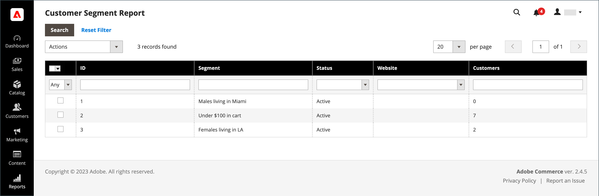

# Bericht zu Kundensegmenten

{{ee-feature}}

Der Bericht „Kundensegment“ enthält Informationen zur Anzahl der Kunden in jedem Segment.

{width="700" zoomable="yes"}

| Spalte | Beschreibung |
|--- |--- |
| **[!UICONTROL Select]** | Aktivieren Sie das Kontrollkästchen für jedes Segment, das einer Aktion unterzogen werden soll, oder verwenden Sie die Auswahlsteuerung in der Spaltenüberschrift. Optionen: `Select All` / `Deselect All` / `Select Visible` / `Unselect Visible` |
| **[!UICONTROL ID]** | Eine eindeutige numerische Kennung, die jedem Segment zugewiesen ist |
| **[!UICONTROL Segment]** | Segmentname |
| **[!UICONTROL Status]** | Segmentstatus. Optionen: `Active` / `Inactive` |
| **[!UICONTROL Website]** | Website, der das Segment zugewiesen ist |
| **[!UICONTROL Customers]** | Anzahl der einem Segment zugewiesenen Kunden |

{style="table-layout:auto"}

Sie können einen Drilldown in eine Liste von Kunden im Segment durchführen und die Daten exportieren.

{width="600" zoomable="yes"}

Um sicherzustellen, dass Sie über die neuesten Daten verfügen, müssen die Segmentdaten aktualisiert werden. Wenn die Segmentdaten nicht verfügbar oder veraltet sind, klicken Sie zum Aktualisieren in der Schaltflächenleiste auf **[!UICONTROL Refresh Segment Data]** .

1. Wählen Sie **[!UICONTROL Export to]** ein Exportformat aus:

   * CSV - Eine kommagetrennte Wertedatei, die Textdaten enthält.
   * Excel XML - Ein XML-basiertes Tabellendatenformat.

1. Klicken Sie auf **[!UICONTROL Export]**.

   | Spalte | Beschreibung |
   |--- |--- |
   | **[!UICONTROL ID]** | Eine eindeutige numerische Kennung, die jedem Benutzer zugewiesen ist |
   | **[!UICONTROL Name]** | Kundenname |
   | **[!UICONTROL Email]** | Die E-Mail-Adresse eines registrierten Kunden |
   | **[!UICONTROL Group]** | Die Debitorengruppe, der der Debitor zugewiesen ist |
   | **[!UICONTROL Phone]** | Die Telefonnummer des Kunden |
   | **[!UICONTROL ZIP]** | Die Postleitzahl, an der sich der Kunde befindet |
   | **[!UICONTROL Country]** | Das Land, in dem sich der Kunde befindet |
   | **[!UICONTROL State/Province]** | Das Bundesland, in dem sich der Kunde befindet |
   | **[!UICONTROL Customer Since]** | Datum und Uhrzeit der Erstellung des Kundenkontos |

   {style="table-layout:auto"}

1. Die generierte Datei wird automatisch auf Ihrem lokalen Computer gespeichert.
