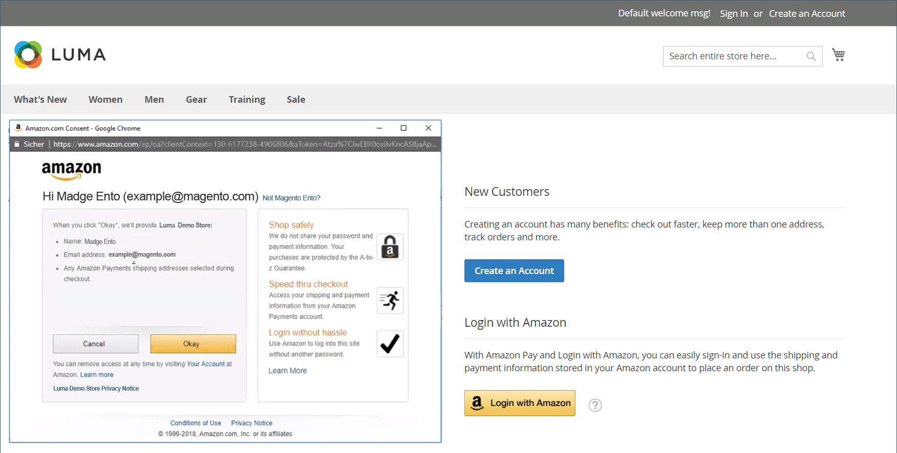

# Kunden-Anmeldung

Kunden haben von jeder Seite in Ihrem Geschäft einfachen Zugriff auf ihre Konten. Abhängig von der [Konfiguration](../customers/account-options-new.md) können Kunden zu ihrem Konto-Dashboard weitergeleitet werden oder nach der Anmeldung bei ihren Konten mit dem Einkaufen fortfahren.

Wenn [CAPTCHA](../systems/security-captcha.md) in der Konfiguration aktiviert ist, muss die Person einen Test, der sie als menschlich verifiziert, korrekt abschließen, bevor sie Zugriff auf ihre Konten erhält.

Wenn Kunden ihre Passwörter vergessen haben, wird ein Link zum Zurücksetzen an die mit dem Konto verknüpfte E-Mail-Adresse gesendet. Die Konfiguration [Kennwortoptionen](../customers/password-options.md) steuert das Kundenerlebnis für Anmeldeversuche:

- Die Häufigkeit, mit der eine Kundin oder ein Kunde versuchen kann, ein Kennwort einzugeben
- Die Anzahl der Minuten zwischen Versuchen
- Die Gesamtzahl der Versuche, bevor das Konto gesperrt wird
- Die Länge der Sperre

{width="700" zoomable="yes"}

## Bei einem Kundenkonto anmelden

1. In der Kopfzeile des Stores klickt der Kunde auf **[!UICONTROL Sign in]**.

   {width="700" zoomable="yes"}

1. Gibt die **[!UICONTROL Email]** und **[!UICONTROL Password]** ein.

1. Klicks **[!UICONTROL Sign in]**.

   >[!IMPORTANT]
   >
   >Wenn der Kunde sein Kennwort nicht mehr speichern kann, kann er auf **[!UICONTROL Forgot Your Password?]** klicken und den [Anweisungen](../customers/password-reset.md) folgen, um das Kennwort zurückzusetzen.

## Legen Sie die Umleitung zum Konto-Dashboard nach der Kundenanmeldung fest

Sie können den Store so konfigurieren, dass Kunden nach der Anmeldung zu ihrem Konto-Dashboard weitergeleitet werden, oder ihnen ermöglichen, ihren Einkauf fortzusetzen.

1. Navigieren Sie in _Admin_-Seitenleiste zu **[!UICONTROL Stores]** > _[!UICONTROL Settings]_>**[!UICONTROL Configuration]**.

1. Erweitern Sie im linken Bereich **[!UICONTROL Customers]** und wählen Sie **[!UICONTROL Customer Configuration]**.

1. Erweitern Sie den Abschnitt **[!UICONTROL Login Options]** .

1. Legen Sie **[!UICONTROL Redirect Customer to Account Dashboard after Logging in]** auf eine der folgenden Einstellungen fest:

   - `Yes` - Das Konto-Dashboard wird angezeigt, wenn sich Kunden bei ihren Konten anmelden.
   - `No` - Kunden können nach der Anmeldung bei ihren Konten weiter einkaufen.

1. Klicken Sie abschließend auf **[!UICONTROL Save Config]**.

## Mit Amazon anmelden

Bei Stores mit konfigurierter [!DNL Amazon Pay]- und [!DNL Login with Amazon] können sich Kunden bei ihrem Amazon-Kaufkonto anmelden.

1. In der Kopfzeile des Stores klickt der Kunde auf **[!UICONTROL Sign in]**.

1. Klicks **[!UICONTROL Login with Amazon]**.

   {width="700" zoomable="yes"}

1. Wenn der Kunde zur Anmeldung aufgefordert wird, gibt er die **[!UICONTROL email address]** und **[!UICONTROL password]** für sein Amazon-Kaufkonto ein.

   {width="700" zoomable="yes"}

1. Um Amazon bei der Verarbeitung von Käufen die Berechtigung zu erteilen, die folgenden Informationen aus seinem Konto für den Store freizugeben, klicken Sie auf **OK**.

   - -Name
   - E-Mail-Adresse
   - Lieferadressen

   {width="700" zoomable="yes"}

## Abmelden von einem Kundenkonto

1. Der Kunde klickt in der oberen rechten Ecke neben _[!UICONTROL Welcome, Customer Name!]_auf die **[!UICONTROL v]**.

1. Wählen Sie **[!UICONTROL Sign Out]**.

Nach der Abmeldung wird der Kunde auf die Homepage weitergeleitet.
