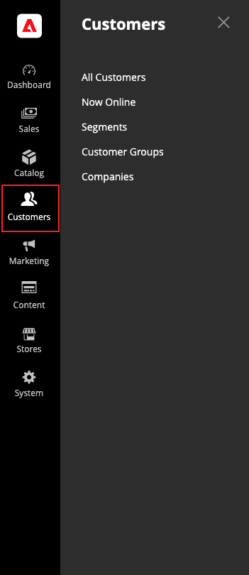

# Einführung in das Kundenmanagement

Das Menü _[!UICONTROL Customers]_&#x200B;bietet Zugriff auf Tools zur Kundenkontenverwaltung und ermöglicht Ihnen zu sehen, wer in Ihrem Geschäft online ist.

>[!BEGINTABS]

>[!TAB Adobe Commerce]

[!BADGE Nur PaaS]{type=Informative url="https://experienceleague.adobe.com/en/docs/commerce/user-guides/product-solutions" tooltip="Gilt nur für Adobe Commerce in Cloud-Projekten (von Adobe verwaltete PaaS-Infrastruktur) und lokale Projekte."}

{width="300" zoomable="yes"}

>[!TAB Adobe Commerce as a Cloud Service]

[!BADGE nur SaaS]{type=Positive url="https://experienceleague.adobe.com/en/docs/commerce/user-guides/product-solutions" tooltip="Gilt nur für Adobe Commerce as a Cloud Service- und Adobe Commerce Optimizer-Projekte (von Adobe verwaltete SaaS-Infrastruktur)."}

{width="300" zoomable="yes"}

>[!ENDTABS]

## Anzeigen des [!UICONTROL Customers]

Klicken Sie in der _Admin_-Seitenleiste auf [!UICONTROL Customers] , um die Menüoptionen anzuzeigen:

| Feld | Beschreibung |
|---|---|
| [!UICONTROL All Customers] | Listet alle [Kunden](../customers/customers-all.md) auf, die sich für ein Konto bei Ihrem Geschäft registriert haben oder vom Administrator hinzugefügt wurden. |
| [!UICONTROL Now Online] | Listet alle Kunden und Besucher auf, die sich derzeit [online](../customers/now-online.md) in Ihrem Store befinden. |
| [!UICONTROL Segments] | Listet die [Kundensegmente“ auf](../customers/customer-segments.md) die verwendet werden, um bestimmten Kunden basierend auf verschiedenen Eigenschaften dynamisch Inhalte und Promotions anzuzeigen. |
| [!UICONTROL Customer Groups] | Die [Kundengruppen](../customers/customer-groups.md) bestimmen, welche Rabatte Käufern zur Verfügung stehen und welche Steuerklasse für den Kauf gilt. |
| [!UICONTROL Companies] | (Erfordert Adobe Commerce B2B) Listet alle aktiven [Unternehmenskonten](../b2b/account-companies.md) und ausstehenden Anfragen unabhängig von der Statuseinstellung auf und bietet die Tools zum Erstellen und [Verwalten](../b2b/account-company-manage.md) von Unternehmenskonten. |

{style="table-layout:auto"}
