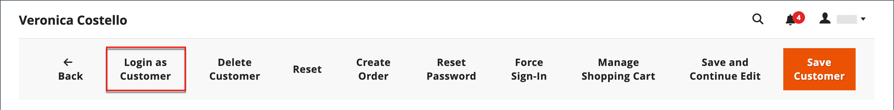

# Unterstützung von Käufern

Manchmal benötigen Kunden Hilfe bei ihrer Bestellung. Store-Administratoren können _Als Kunde anmelden_, sodass sie sehen können, was der Kunde sieht, und ihm Aktualisierungen vornehmen können.

Alle Aktionen, die bei der Anmeldung als Kunde durchgeführt werden, werden auf das Konto des tatsächlichen Kunden angewendet.

Wenn es für eine _Admin_ Benutzer, die _[!UICONTROL Login as Customer]_-Schaltfläche wird auf mehreren Seiten angezeigt:

* [Seite &quot;Kundenbearbeitung&quot;](../customers/update-account.md)
* [Seite &quot;Auftragsansicht&quot;](../stores-purchase/order-processing.md)
* [Rechnungsansichtsseite](../stores-purchase/invoices.md)
* [Seite &quot;Versandansicht&quot;](../stores-purchase/shipments.md)
* [Seite &quot;Credit Memo-Ansicht&quot;](../stores-purchase/credit-memo-create.md)

{width="600" zoomable="yes"}

## Aktivieren Sie die Anmeldung als Kunde .

Aktivieren _Als Kunde anmelden_ erfordert, dass Sie die Funktion in Ihrer Commerce-Instanz aktivieren und dann den Zugriff für Admin-Benutzer in den Benutzerrollenberechtigungen aktivieren.

### Funktion aktivieren

1. Navigieren Sie in der Admin-Seitenleiste zu  **[!UICONTROL Stores]** > _[!UICONTROL Settings]_>**[!UICONTROL Configuration]**.

1. Erweitern Sie im linken Bereich **[!UICONTROL Customers]** und wählen  **[!UICONTROL Login as Customer]**.

   {width="600" zoomable="yes"}

1. Satz **[!UICONTROL Enable Login as Customer]** nach `Yes`.

1. _(Optional)_ Satz **[!UICONTROL Disable Page Cache for Admin User]** nach `No` , um den Seiten-Cache zu aktivieren, wenn sich der Admin-Benutzer als Kunde anmeldet.

   >[!WARNING]
   >
   > Deaktivieren Sie den Seiten-Cache (`Yes` - Standard) stellt sicher, dass der Benutzer, der sich beim Kunden anmeldet, neue, nicht zwischengespeicherte Daten erhält.

1. _(Optional)_ Satz **[!UICONTROL Store View to Log in]** nach `Manual Selection` wenn Sie über eine Multi-Site- und/oder Multi-Store-Einrichtung verfügen und der Administrator die Store-Ansicht beim Anmelden als Kunde auswählen soll.

1. Wenn Sie fertig sind, klicken Sie auf **[!UICONTROL Save Config]**.

### Zugriff für Admin-Benutzer aktivieren

1. Im _Admin_ Seitenleiste, navigieren Sie zu **[!UICONTROL System]** > _Berechtigungen_ > **[!UICONTROL User Roles]**.

1. Klicken Sie auf die Rolle in der Liste.

1. Im [!UICONTROL _Rolleninformationen_] linker Bereich, klicken Sie **[!UICONTROL Role Resources]**.

1. Änderung **[!UICONTROL Role Resources]** auf der Seite zu `Custom`.

   >[!INFO]
   >
   > Wenn diese Option aktiviert ist, wird die Ressourcenhierarchie auf der Seite angezeigt.

1. Scrollen Sie zum  **[!UICONTROL Customers]** übergeordnetes Element und **[!UICONTROL Login as Customer]** Element darunter. Wählen Sie dann die Ressourcen aus, die Sie für die Rolle aktivieren möchten:

   * **[!UICONTROL Allow Login as Customer]** - Ermöglicht dem Administrator die Verwendung der _Als Kunde anmelden_ Funktion.
   * **[!UICONTROL View Login as Customer Log]** - Ermöglicht es dem Administrator, die _Als Kunde anmelden_ Protokoll.

   {width="400" zoomable="yes"}

1. Klicken **[!UICONTROL Save Role]**.

## Melden Sie sich vom Administrator als Kunde an

1. Im _Admin_ Seitenleiste, navigieren Sie zu **[!UICONTROL Customers]** > [!UICONTROL _Alle Kunden_].

1. Öffnen Sie einen Benutzer im Bearbeitungsmodus.

1. Im **[!UICONTROL Customer Information]** Bereich, wählen Sie die **[!UICONTROL Account Information]** Abschnitt.

1. Legen Sie die **[!UICONTROL Allow remote shopping assistance]** nach `Yes`.

   >[!INFO]
   >
   >Der Administrator kann sich jetzt als Benutzer ohne seine Berechtigung von der Storefront aus anmelden.

## Berechtigung für Kundenkonto für Remote-Shopping-Hilfe

Um den Kontozugriff für Mitarbeiter des Store-Supports über den Administrator zu aktivieren, muss ein Kunde die Funktion für sein Konto aktivieren:

1. Der Kunde besucht die **[!UICONTROL Account Information]** Seite.

1. Wählt die **[!UICONTROL Allow remote shopping assistance]** aktivieren.

1. Der Kunde klickt auf **[!UICONTROL Save]**.

{width="700" zoomable="yes"}

>[!WARNING]
>
>Ohne diese Berechtigung kann sich ein Administrator nicht als dieser Kunde anmelden.

## Als Kunde anmelden

>[!INFO]
>
>Verwendung _Als Kunde anmelden_ müssen Sie sicherstellen, dass Ihr Admin wie zuvor beschrieben konfiguriert ist.

_Als Kunde anmelden_ ermöglicht es Ihnen, die Site genau so anzuzeigen, wie der Kunde es tut, und Sie können Fehler beheben und andere Maßnahmen für den Kunden ergreifen. Wenn Sie über eine zugewiesene Benutzerrolle mit den erforderlichen Berechtigungen verfügen:

1. Sie können auf **[!UICONTROL Login as Customer]** auf den im vorherigen Abschnitt aufgelisteten Seiten.
1. Die Aktionen Als Kunde anmelden sind im Aktionsbericht verfügbar.

>[!WARNING]
>
>Alle Aktionen, die während der Anmeldung ausgeführt wurden [!UICONTROL _als Kunde_] (z. B. Produkte hinzufügen/entfernen) auf die tatsächliche Bestellung des Kunden angewendet werden. Auf der Storefront wird ein Banner angezeigt, wenn Sie `logged in as customer_name` , um eine Erinnerung an den Sonderstatus zu geben.

## Als Kundenprotokollierung anmelden

{{ee-feature}}

Adobe Commerce bietet eine Protokollierung für die _Als Kunde anmelden_ Aktionen. Er listet alle Sitzungen auf, in denen ein Admin-Benutzer auf die Funktion zugreift. Um auf die protokollierten Aktionen zuzugreifen, navigieren Sie zum [Admin-Aktionsbericht](../systems/action-log-report.md).

Sie können die Berichtseinstellung filtern **[!UICONTROL Action Group]** nach `Login As Customer` oben auf der Seite und klicken Sie auf **[!UICONTROL Search]**.

{width="700" zoomable="yes"}
