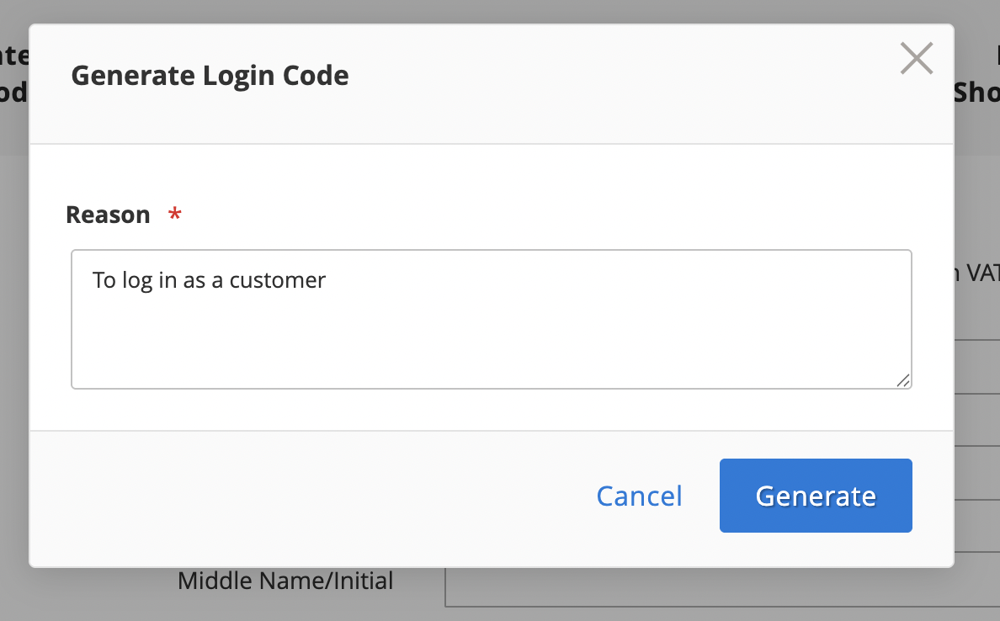
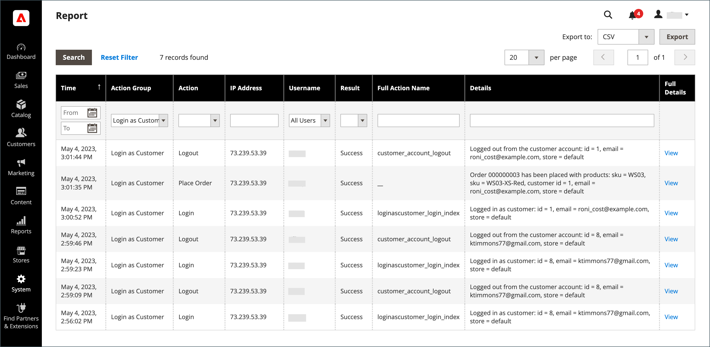

# Kundenunterstützung bereitstellen

Manchmal benötigen Kunden Hilfe bei ihrer Bestellung. Store-Administratoren können &quot;_als Kunde anmelden_ verwenden, damit sie sehen können, was der Kunde sieht, und Aktualisierungen vornehmen, um ihn zu unterstützen.

Alle Aktionen, die während der Anmeldung als Kunde durchgeführt werden, werden auf das Konto des tatsächlichen Kunden angewendet.

>[!BEGINTABS]

>[!TAB Adobe Commerce]

[!BADGE Nur PaaS]{type=Informative url="https://experienceleague.adobe.com/en/docs/commerce/user-guides/product-solutions" tooltip="Gilt nur für Adobe Commerce in Cloud-Projekten (von Adobe verwaltete PaaS-Infrastruktur) und lokale Projekte."}

Wenn sie für einen _Admin_-Benutzer aktiviert ist, wird die _[!UICONTROL Login as Customer]_-Schaltfläche auf mehreren Seiten angezeigt:

* [Seite „Kunden bearbeiten“](../customers/update-account.md)
* [Seite „Bestellansicht“](../stores-purchase/order-processing.md)
* [Seite „Rechnungsansicht“](../stores-purchase/invoices.md)
* [Seite „Lieferungsansicht“](../stores-purchase/shipments.md)
* [Seite „Gutschriftsansicht“](../stores-purchase/credit-memo-create.md)

{width="600" zoomable="yes"}

>[!TAB Adobe Commerce as a Cloud Service]

[!BADGE nur SaaS]{type=Positive url="https://experienceleague.adobe.com/en/docs/commerce/user-guides/product-solutions" tooltip="Gilt nur für Adobe Commerce as a Cloud Service- und Adobe Commerce Optimizer-Projekte (von Adobe verwaltete SaaS-Infrastruktur)."}

In Adobe Commerce as a Cloud Service verwendet die Funktion „Als Kunde anmelden“ einen **Einmalcode (OTC)-** anstelle einer direkten Anmeldung. Admins generieren einen kurzlebigen Einmalcode für einen Kunden. Dieser Code kann dann über GraphQL in ein Kunden-Zugriffstoken umgetauscht werden, sodass eine passwortlose Anmeldung als Kunden-Workflows für verkäuferunterstützte Einkaufsszenarien möglich ist.

Die Funktion umfasst die folgenden Komponenten:

* **Admin-**: Auf der Seite „Kundenbearbeitung“ können Administratoren einen einmaligen Code (OTC) anfordern, anstatt sich direkt als Kunde anzumelden.
* **[REST API](https://developer.adobe.com/commerce/webapi/rest/saas-integrations/login-as-customer/)** - Ein programmatischer Endpunkt für die OTC-Generierung, der für Admin-Skripte und Drittanbieter-Integrationen nützlich ist.
* **GraphQL-API** - Mutationen, die ein OTC-Token gegen ein Kunden-Zugriffstoken für Storefront- oder Headless-Commerce-Flüsse eintauschen.

>[!ENDTABS]

## Anmeldung als Kunde aktivieren

Für die Aktivierung _Als Kunde anmelden_ müssen Sie die Funktion in Ihrer Commerce-Instanz aktivieren und dann den Zugriff für Admin-Benutzer in den Benutzerrollenberechtigungen aktivieren.

### Funktion aktivieren

1. Navigieren Sie in der Seitenleiste Admin zu **[!UICONTROL Stores]** > _[!UICONTROL Settings]_>**[!UICONTROL Configuration]**.

1. Erweitern Sie im linken Bereich **[!UICONTROL Customers]** und wählen Sie **[!UICONTROL Login as Customer]**.

   {width="600" zoomable="yes"}

1. Legen Sie **[!UICONTROL Enable Login as Customer]** auf `Yes` fest.

1. _(Optional)_ Legen Sie **[!UICONTROL Disable Page Cache for Admin User]** auf `No` fest, um den Seitencache zu aktivieren, wenn sich ein Administrator als Kunde anmeldet.

   >[!WARNING]
   >
   > Durch Deaktivieren des Seiten-Caches (`Yes` - Standard) wird sichergestellt, dass der Benutzer, der sich als Kunde anmeldet, neue, nicht zwischengespeicherte Daten erhält.

1. _(Optional)_ Legen Sie **[!UICONTROL Store View to Log in]** auf `Manual Selection` fest, wenn Sie eine Einrichtung mit mehreren Sites und/oder mehreren Stores haben und möchten, dass die Admin-Benutzerin bzw. der Admin-Benutzer die Store-Ansicht auswählt, wenn Sie sich als Kundin bzw. Kunde anmelden.

1. Klicken Sie abschließend auf **[!UICONTROL Save Config]**.

### Aktivieren des Zugriffs für Admin-Benutzer

1. Navigieren Sie in der _Admin_-Seitenleiste zu **[!UICONTROL System]** > _Berechtigungen_ > **[!UICONTROL User Roles]**.

1. Klicken Sie auf die Rolle in der Liste.

1. Klicken Sie [!UICONTROL _linken Bedienfeld_] Rolleninformationen“ auf **[!UICONTROL Role Resources]**.

1. Ändern Sie **[!UICONTROL Role Resources]** auf der Seite in `Custom`.

   >[!INFO]
   >
   > Wenn diese Option ausgewählt ist, wird die Ressourcenhierarchie auf der Seite angezeigt.

1. Scrollen Sie zum **[!UICONTROL Customers]** übergeordneten Element und zum **[!UICONTROL Login as Customer]** Element darunter. Wählen Sie dann die Ressourcen aus, die Sie für die Rolle aktivieren möchten:

   * **[!UICONTROL Allow Login as Customer]** - Ermöglicht es dem Administrator, die Funktion _Als Kunde anmelden_ zu verwenden.
   * **[!UICONTROL View Login as Customer Log]** - Ermöglicht es dem Admin-Benutzer, das _Als Kunde anmelden_-Protokoll anzuzeigen.

   {width="400" zoomable="yes"}

1. Klicken Sie auf **[!UICONTROL Save Role]**.

## Kundenkonto-Berechtigung für Unterstützung beim Remote-Shopping

Um den Kontozugriff für Mitarbeiter des Store-Supports über die Admin zu aktivieren, muss eine Kundin oder ein Kunde die Funktion für ihr Konto aktivieren:

>[!BEGINTABS]

>[!TAB Adobe Commerce]

[!BADGE Nur PaaS]{type=Informative url="https://experienceleague.adobe.com/en/docs/commerce/user-guides/product-solutions" tooltip="Gilt nur für Adobe Commerce in Cloud-Projekten (von Adobe verwaltete PaaS-Infrastruktur) und lokale Projekte."}

1. Der Kunde navigiert zur Seite **[!UICONTROL Account Information]** .

1. Aktiviert das Kontrollkästchen **[!UICONTROL Allow remote shopping assistance]** .

1. Der Kunde klickt auf **[!UICONTROL Save]**.

{width="700" zoomable="yes"}

>[!TAB Adobe Commerce as a Cloud Service]

[!BADGE nur SaaS]{type=Positive url="https://experienceleague.adobe.com/en/docs/commerce/user-guides/product-solutions" tooltip="Gilt nur für Adobe Commerce as a Cloud Service- und Adobe Commerce Optimizer-Projekte (von Adobe verwaltete SaaS-Infrastruktur)."}

Für den Kunden muss das `login_as_customer_assistance_allowed`-Erweiterungsattribut auf &quot;**&quot;**. Dies kann auf der Seite **Kunde bearbeiten** in der Admin Console oder über GraphQL beim Erstellen oder Bearbeiten eines Kunden konfiguriert werden.

>[!WARNING]
>
>Ohne diese Berechtigung kann sich ein Admin-Benutzer nicht als dieser Kunde anmelden.

{width="600" zoomable="yes"}

Um diese Berechtigung für ein bestehendes Kundenkonto mit GraphQL festzulegen, legen Sie die `allow_remote_shopping_assistance`-Eingabe mithilfe der [`updateCustomerV2`](https://developer.adobe.com/commerce/webapi/graphql/schema/customer/mutations/update-v2/) oder [`createCustomerV2`](https://developer.adobe.com/commerce/webapi/graphql/schema/customer/mutations/create-v2/) Mutationen auf `true` fest.

>[!ENDTABS]

## Melden Sie sich als Kunde über den Administrator an

>[!BEGINTABS]

>[!TAB Adobe Commerce]

[!BADGE Nur PaaS]{type=Informative url="https://experienceleague.adobe.com/en/docs/commerce/user-guides/product-solutions" tooltip="Gilt nur für Adobe Commerce in Cloud-Projekten (von Adobe verwaltete PaaS-Infrastruktur) und lokale Projekte."}

1. Navigieren Sie in _Admin_-Seitenleiste zu **[!UICONTROL Customers]** > [!UICONTROL _Alle Kunden_].

1. Öffnen Sie einen Benutzer im Bearbeitungsmodus.

1. Wählen Sie im Bedienfeld **[!UICONTROL Customer Information]** den Abschnitt **[!UICONTROL Account Information]** aus.

1. Legen Sie die **[!UICONTROL Allow remote shopping assistance]** auf `Yes` fest.

   >[!INFO]
   >
   >Der Administrator kann sich jetzt ohne seine Berechtigung von der Storefront aus als Benutzer anmelden.

>[!TAB Adobe Commerce as a Cloud Service]

[!BADGE nur SaaS]{type=Positive url="https://experienceleague.adobe.com/en/docs/commerce/user-guides/product-solutions" tooltip="Gilt nur für Adobe Commerce as a Cloud Service- und Adobe Commerce Optimizer-Projekte (von Adobe verwaltete SaaS-Infrastruktur)."}

>[!NOTE]
>
>Anleitungen für die Implementierung dieser Funktion mithilfe von REST finden Sie in der Dokumentation [Anmeldung als Kunde](https://developer.adobe.com/commerce/webapi/rest/saas-integrations/login-as-customer/) REST-API .

### Fordern Sie einen einmaligen Code (OTC) vom Administrator an

1. Navigieren Sie zu **[!UICONTROL Customers]** und wählen Sie einen Kunden aus, um die Bearbeitungsseite zu öffnen.

1. Klicken Sie auf der Seite „Kunden bearbeiten“ auf **[!UICONTROL Generate Login Code]**.

   {width="600" zoomable="yes"}

1. Geben Sie einen **[!UICONTROL Reason]** ein (erforderlich) und klicken Sie auf **[!UICONTROL Request]**.

   {width="600" zoomable="yes"}

   >[!NOTE]
   >
   >Das **Grund**-Feld ist erforderlich. Sie wird an den OTP-Generierungsfluss übergeben und ist für die Verwendung in kommenden Audit- und Ereignisprotokollierungsfunktionen reserviert.

1. Das generierte OTC wird im Modal angezeigt. Verwenden Sie diesen Code mit der `generateCustomerToken`- oder `exchangeOtpForCustomerToken` GraphQL-Mutation zur Kundenautorisierung.

   {width="300" zoomable="yes"}

>[!IMPORTANT]
>
>Der generierte OTC-Einmalcode ist standardmäßig 60 Sekunden lang gültig und wird nach einer einzigen Verwendung ungültig. Die TTL kann durch Senden eines -Support[Tickets konfiguriert ](https://experienceleague.adobe.com/home?support-tab=home#support).

Nachdem der Einmalcode generiert wurde, können Sie ihn verwenden, indem Sie zu Ihrer Storefront navigieren und sich mit den folgenden Anmeldeinformationen anmelden:

* **Email**: Die E-Mail-Adresse des Kunden
* **Kennwort**: Der generierte einmalige Code (OTC)

>[!ENDTABS]

## Anmeldung als Kunde verwenden

>[!INFO]
>
>Um _Als Kunde anmelden_ zu verwenden, stellen Sie sicher, dass Ihr Administrator wie zuvor beschrieben konfiguriert ist.

_Als Kunde anmelden_ ermöglicht es Ihnen, die Site so anzuzeigen, wie es der Kunde tut, und ermöglicht es Ihnen, eine Fehlerbehebung durchzuführen und andere Aktionen für den Kunden durchzuführen. Wenn Ihnen eine Benutzerrolle mit den erforderlichen Berechtigungen zugewiesen wurde:

1. Sie können auf den im vorherigen Abschnitt aufgelisteten Seiten auf **[!UICONTROL Login as Customer]** oder **[!UICONTROL Generate Login Code]** klicken.
1. Die Aktionen Anmelden als Kunde sind im Aktionsbericht verfügbar.

>[!WARNING]
>
>Alle Aktionen, die während der Anmeldung [!UICONTROL _als Kunde_] durchgeführt werden (z. B. Hinzufügen/Entfernen von Produkten), werden auf die Bestellung des tatsächlichen Kunden angewendet. In der Storefront wird ein Banner angezeigt, wenn Sie an den speziellen Status erinnern `logged in as customer_name`.

## Als Kundenprotokollierung anmelden

{{ee-feature}}

Adobe Commerce stellt eine Protokollierung für die Aktionen _Als Kunde anmelden_ bereit. Es werden alle Sitzungen aufgelistet, bei denen ein Administrator auf die Funktion zugreift. Um auf die protokollierten Aktionen zuzugreifen, gehen Sie zum [Admin-](../systems/action-log-report.md)&quot;.

Sie können die Berichtseinstellung so filtern, **[!UICONTROL Action Group]** oben auf der Seite `Login As Customer` und auf **[!UICONTROL Search]** geklickt wird.

{width="700" zoomable="yes"}
