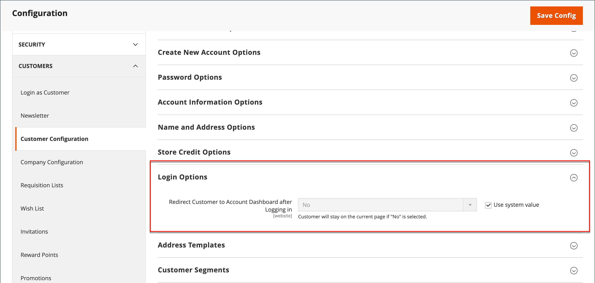

# Landingpage für Kundenanmeldungen

Sie können Ihren Store so konfigurieren, dass Kunden nach der Anmeldung zum Konto-Dashboard weitergeleitet werden oder dass sie weiterhin einkaufen können.

1. Im _Admin_ Seitenleiste, navigieren Sie zu **[!UICONTROL Stores]** > _[!UICONTROL Settings]_>**[!UICONTROL Configuration]**.

1. Erweitern Sie im linken Bereich **[!UICONTROL Customers]** und wählen **[!UICONTROL Customer Configuration]**.

1. Erweitern Sie die **[!UICONTROL Login Options]** Abschnitt.

   {width="600" zoomable="yes"}

1. Satz **[!UICONTROL Redirect Customer to Account Dashboard after Logging in]** auf einen der folgenden Werte zu:

   - `Yes` - Das Konto-Dashboard wird angezeigt, wenn sich Kunden bei ihren Konten anmelden.
   - `No` - Kunden können nach der Anmeldung bei ihren Konten weiterhin einkaufen.

   >[!INFO]
   >
   >Falls erforderlich, löschen Sie die **[!UICONTROL User system value]** aktivieren, um die Änderung vorzunehmen.

1. Wenn Sie fertig sind, klicken Sie auf **[!UICONTROL Save Config]**.
