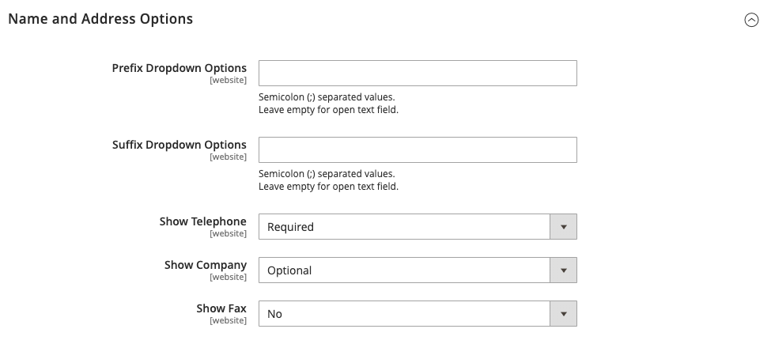
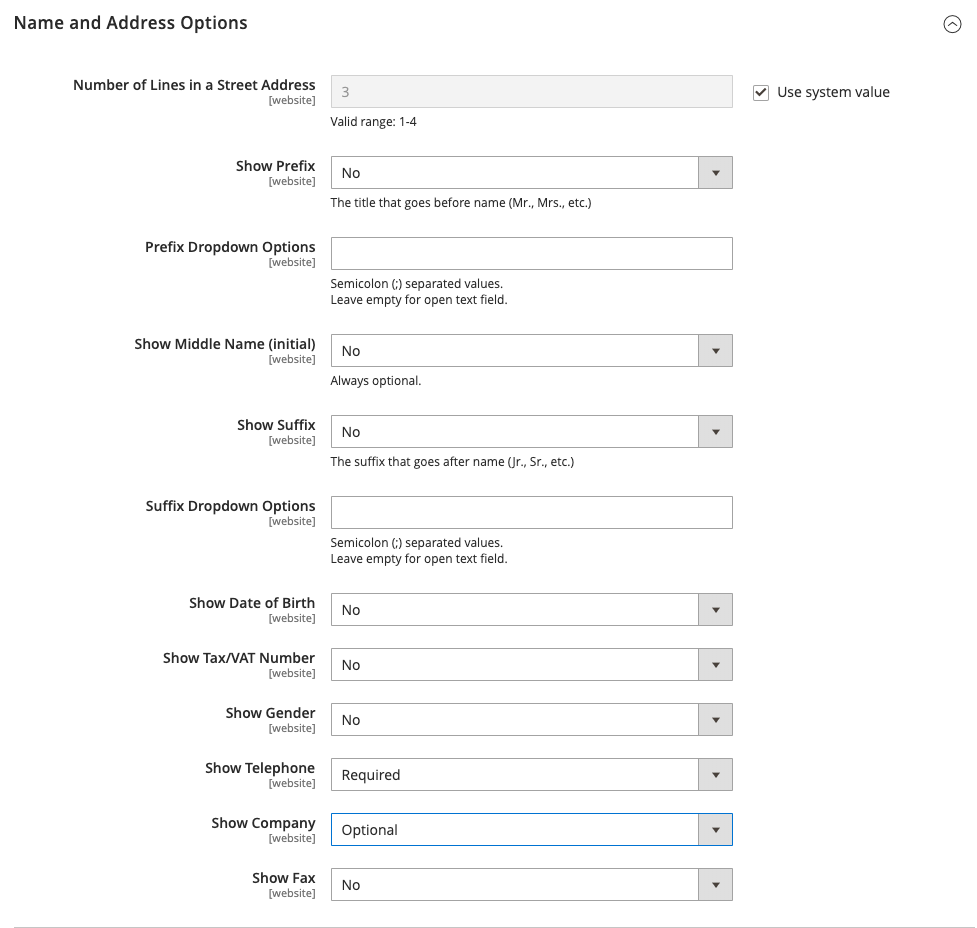

# Optionen für Kundenname und Adresse

Die _Name und Adressenoptionen_ bestimmen, welche Felder in Namen- und Adressformularen enthalten sind, wenn Kunden eine [account](../customers/account-create.md) mit Ihrem Geschäft.

{width="500" zoomable="yes"}

Die Schritte zum Konfigurieren der Namen- und Adressenoptionen unterscheiden sich je nach Adobe Commerce und Magento Open Source.

## Namen- und Adressenoptionen für Adobe Commerce konfigurieren

Sie können die Namen- und Adressoptionen konfigurieren, die Kunden auf der Storefront angezeigt werden, wenn sie ihr Konto erstellen.

### Schritt 1: Festlegen des Umfangs der Konfiguration

1. Im _Admin_ Seitenleiste, navigieren Sie zu **[!UICONTROL Stores]** > _[!UICONTROL Settings]_>**[!UICONTROL Configuration]**.

1. Erweitern Sie im linken Bereich **[!UICONTROL Customers]** und wählen **[!UICONTROL Customer Configuration]**.

1. Erweitern Sie die **[!UICONTROL Name and Address Options]** Abschnitt.

   >[!INFO]
   >
   >Beachten Sie, dass der Umfang der Namen- und Adressenoptionen auf der `website` Ebene.

1. Scrollen Sie nach oben auf der Seite und legen Sie den Umfang der Konfiguration auf einen der folgenden Werte fest:

   - `Default Config`
   - `Main Website` (oder spezifische Site für Installationen mehrerer Standorte)

   >[!INFO]
   >
   >Die _[!UICONTROL Name and Address Options]_wird nicht angezeigt, wenn der Bereich auf `Default Store View`.

   {width="700" zoomable="yes"}

### Schritt 2: Konfigurieren Sie die Namen- und Adressenoptionen.

1. Kehren Sie zu [!UICONTROL _Name und Adressenoptionen_] auf der Seite &quot;Kundenkonfiguration&quot;angezeigt.

   >[!INFO]
   >
   > Wenn Sie die Variable `Default config` Scope-Einstellung festlegen, müssen Sie die `Use Default` für jedes Feld ein, bevor der Wert geändert wird.

   {width="600" zoomable="yes"}

1. Für **[!UICONTROL Prefix Dropdown Options]** Geben Sie jedes Präfix ein, das in der Liste angezeigt werden soll (durch Semikolon getrennt).

   >[!IMPORTANT]
   >
   >Setzen Sie ein Semikolon vor den ersten Wert, um oben in der Liste einen leeren Wert anzuzeigen.

1. Für **[!UICONTROL Suffix Dropdown Options]** Geben Sie jedes Suffix ein, das in der Liste angezeigt werden soll (durch Semikolon getrennt).

1. Um die folgenden Felder in Kundenformulare einzuschließen, setzen Sie den Wert für jedes auf `Optional` oder `Required`nach Bedarf.

   - **[!UICONTROL Show Telephone]**
   - **[!UICONTROL Show Company]**
   - **[!UICONTROL Show Fax]**

### Schritt 3: Speichern und aktualisieren

1. Wenn Sie fertig sind, klicken Sie auf **[!UICONTROL Save Config]**.

1. Klicken Sie in der Nachricht oben auf der Seite auf **[!UICONTROL Cache Management]** und [Aktualisieren](../systems/cache-management.md) jeden ungültigen Cache.

## Name und Adressenoptionen für die Magento Open Source konfigurieren

Konfigurieren Sie die Namen- und Adressenoptionen, die Kunden auf der Storefront angezeigt werden, wenn sie ihr Konto erstellen.

{width="500" zoomable="yes"}

### Schritt 1: Festlegen des Umfangs der Konfiguration

1. Im _Admin_ Seitenleiste, navigieren Sie zu **[!UICONTROL Stores]** > _[!UICONTROL Settings]_>**[!UICONTROL Configuration]**.

1. Erweitern Sie im linken Bereich **[!UICONTROL Customers]** und wählen **[!UICONTROL Customer Configuration]**.

1. Erweitern Sie die **[!UICONTROL Name and Address Options]** Abschnitt.

   >[!IMPORTANT]
   >
   > Beachten Sie, dass der Umfang der Namen- und Adressenoptionen auf der `website` Ebene.

   {width="600" zoomable="yes"}

1. Scrollen Sie nach oben auf der Seite zurück und legen Sie den Umfang der Konfiguration auf einen der folgenden Werte fest:

   - `Default Config`
   - `Main Website` (oder spezifische Site für Installationen mehrerer Standorte)

   >[!NOTE]
   >
   >Die _Name und Adressenoptionen_ wird nicht angezeigt, wenn der Bereich auf `Default Store View`.

   {width="600" zoomable="yes"}

### Schritt 2: Konfigurieren Sie die Namen- und Adressenoptionen.

1. Kehren Sie zu [!UICONTROL _Name und Adressenoptionen_] auf der Seite &quot;Kundenkonfiguration&quot;angezeigt.

   >[!INFO]
   >
   >Wenn Sie die Variable `Default config` Scope-Einstellung festlegen, müssen Sie die `Use Default` für jedes Feld ein, bevor der Wert geändert wird.

1. Für **Anzahl der Zeilen in einer Straße**, geben Sie eine Zahl von 1 bis 4 ein.

   >[!WARNING]
   >
   >Standardmäßig beträgt die Straße drei Zeilen.

1. Um ein Präfix (z. B. Herr oder Frau) als Teil des Namens einzubeziehen, legen Sie **Präfix anzeigen** nach `Yes`.

   {width="600" zoomable="yes"}

   >[!INFO]
   >
   >Für **Dropdown-Optionen für Präfix** Geben Sie jedes Präfix ein, das in der Liste angezeigt werden soll (durch Semikolon getrennt). Sie können ein Semikolon vor dem ersten Wert platzieren, um oben in der Liste einen leeren Wert anzuzeigen.

1. Um ein optionales Feld für den Vornamen oder den Anfangs-Namen des Kunden einzuschließen, legen Sie **[!UICONTROL Show Middle Name (initial)]** nach `Yes`.

1. So fügen Sie ein Suffix hinzu (z. B. Jr. oder Sr) nach dem Kundennamen, setzen Sie **[!UICONTROL Show Suffix]** auf einen der folgenden Werte zu:

   - `Optional`
   - `Required`

   >[!INFO]
   >
   >Für **Suffix-Dropdown-Optionen** Geben Sie jedes Suffix ein, das in der Liste angezeigt werden soll (durch Semikolon getrennt). Sie können ein Semikolon vor dem ersten Wert platzieren, um oben in der Liste einen leeren Wert anzuzeigen.

1. Um das Geburtsdatum einzubeziehen, legen Sie **[!UICONTROL Show Date of Birth]** auf einen der folgenden Werte zu:

   - `Optional`
   - `Required`

   >[!INFO]
   >
   >Beachten Sie im Einklang mit den aktuellen Best Practices für Sicherheit und Datenschutz alle potenziellen rechtlichen und sicherheitstechnischen Risiken, die mit der Speicherung des vollständigen Geburtsdatums (Monat, Tag, Jahr) der Kunden mit anderen persönlichen Identifikatoren verbunden sind. Es wird empfohlen, die Speicherung der vollständigen Geburtsdaten der Kunden zu begrenzen und stattdessen das Geburtsjahr des Kunden zu verwenden.

   Kunden können das Kalendersymbol nach dem Feld verwenden, um das Geburtsdatum aus einem Popup-Kalender auszuwählen.

   {width="600" zoomable="yes"}

1. So lassen Sie Kunden die Eingabe ihrer Steuer oder [Mehrwertsteuer](../stores-purchase/vat.md) Zahl, festgelegt **[!UICONTROL Show Tax/VAT Number]** auf einen der folgenden Werte zu:

   - `Optional`
   - `Required`

1. Um ein Feld für das Geschlecht in das Kundenformular aufzunehmen, legen Sie **[!UICONTROL Show Gender]** auf einen der folgenden Werte zu:

   - `Optional`
   - `Required`

   {width="600" zoomable="yes"}

1. Um die folgenden Felder in Kundenformulare einzuschließen, setzen Sie den Wert für jedes auf `Optional` oder `Required`nach Bedarf.

   - **[!UICONTROL Show Telephone]**
   - **[!UICONTROL Show Company]**
   - **[!UICONTROL Show Fax]**

### Schritt 3: Speichern und aktualisieren

1. Wenn Sie fertig sind, klicken Sie auf **[!UICONTROL Save Config]**.

1. Klicken Sie in der Nachricht oben auf der Seite auf **[!UICONTROL Cache Management]** und [Aktualisieren](../systems/cache-management.md) jeden ungültigen Cache.
