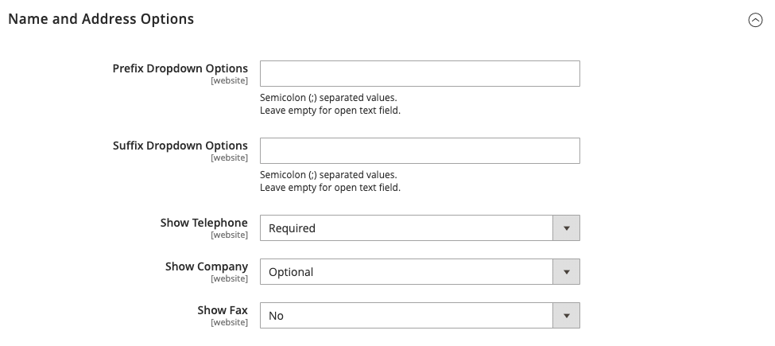
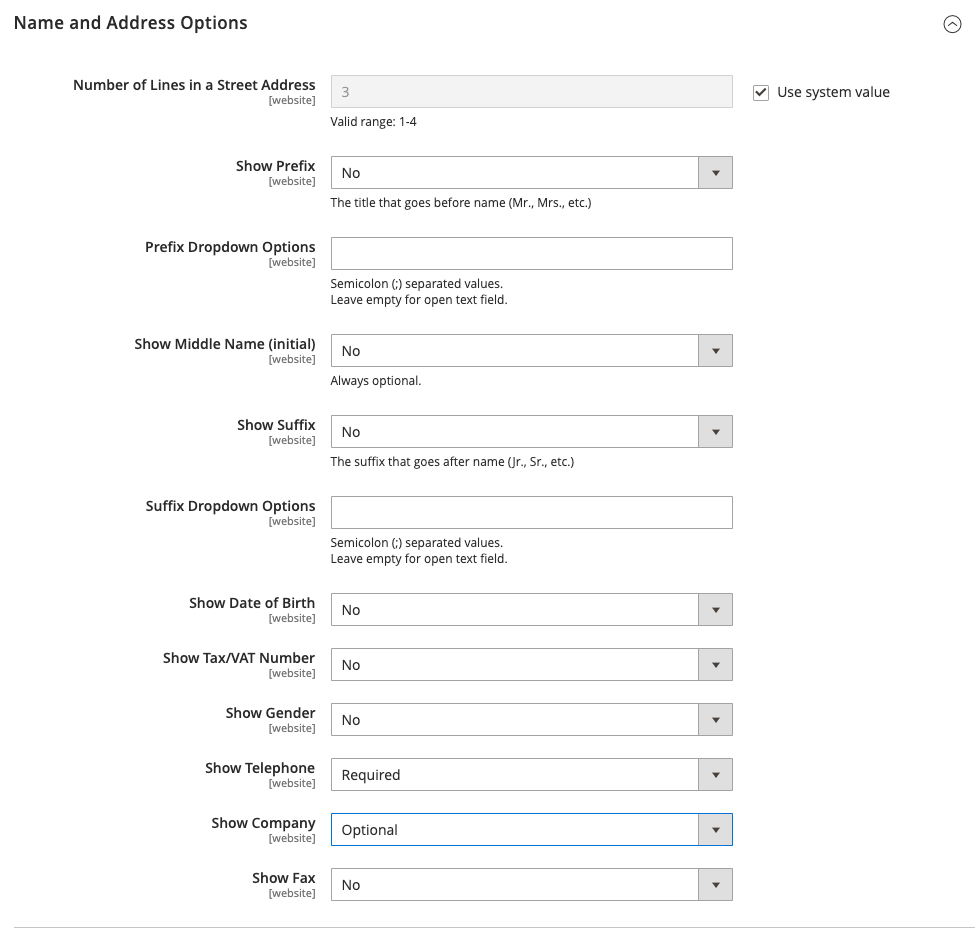
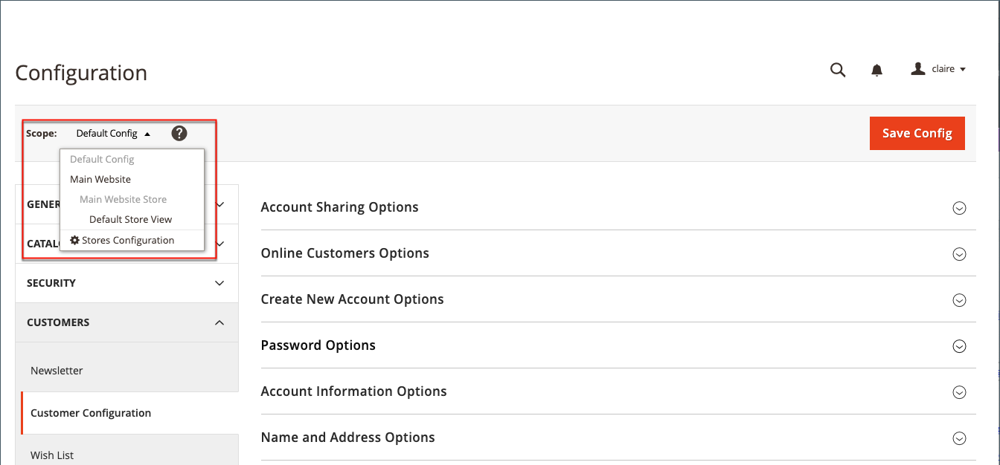

# Optionen für Kundennamen und Adressen

Die _Name- und Adressoptionen_ bestimmen, welche Felder in den Namen- und Adressformularen enthalten sind, wenn Kundinnen und Kunden ein ([) &#x200B;](../customers/account-create.md) Ihrem Geschäft erstellen.

{width="500" zoomable="yes"}

Die Schritte zum Konfigurieren der Optionen Name und Adresse sind für Adobe Commerce und Magento Open Source unterschiedlich.

## Konfigurieren von Name- und Adressoptionen für Adobe Commerce

Sie können die Namen- und Adressoptionen konfigurieren, die Kunden in der Storefront angezeigt werden, wenn sie ihr Konto erstellen.

### Schritt 1: Festlegen des Umfangs der Konfiguration

1. Navigieren Sie in _Admin_-Seitenleiste zu **[!UICONTROL Stores]** > _[!UICONTROL Settings]_>**[!UICONTROL Configuration]**.

1. Erweitern Sie im linken Bereich **[!UICONTROL Customers]** und wählen Sie **[!UICONTROL Customer Configuration]**.

1. Erweitern Sie den Abschnitt **[!UICONTROL Name and Address Options]** .

   >[!INFO]
   >
   >Beachten Sie, dass der Umfang der Optionen Name und Adresse auf `website` Ebene gilt.

1. Scrollen Sie nach oben auf der Seite und legen Sie für den Bereich der Konfiguration einen der folgenden Werte fest:

   - `Default Config`
   - `Main Website` (oder bestimmter Standort für Installationen an mehreren Standorten)

   >[!INFO]
   >
   >Der Abschnitt _[!UICONTROL Name and Address Options]_&#x200B;wird nicht angezeigt, wenn der Bereich auf `Default Store View` festgelegt ist.

   {width="700" zoomable="yes"}

### Schritt 2: Konfigurieren der Optionen für Name und Adresse

1. Kehren Sie zum Abschnitt [!UICONTROL _Name und Adressoptionen_] der Seite Kundenkonfiguration zurück.

   >[!INFO]
   >
   > Wenn Sie die Einstellung für den `Default config` nicht verwenden, müssen Sie das Kontrollkästchen `Use Default` für jedes Feld deaktivieren, bevor Sie den Wert ändern.

   {width="600" zoomable="yes"}

1. Geben Sie **[!UICONTROL Prefix Dropdown Options]** jedes Präfix ein, das in der Liste angezeigt werden soll (durch ein Semikolon getrennt).

   >[!IMPORTANT]
   >
   >Setzen Sie ein Semikolon vor den ersten Wert, um einen leeren Wert oben in der Liste anzuzeigen.

1. Geben Sie **[!UICONTROL Suffix Dropdown Options]** jedes Suffix ein, das durch ein Semikolon getrennt in der Liste angezeigt werden soll.

1. Um die folgenden Felder in Kundenformulare einzuschließen, setzen Sie den Wert von „each“ auf `Optional` oder &quot;`Required`&quot;, sofern erforderlich.

   - **[!UICONTROL Show Telephone]**
   - **[!UICONTROL Show Company]**
   - **[!UICONTROL Show Fax]**

### Schritt 3: Speichern und aktualisieren

1. Klicken Sie abschließend auf **[!UICONTROL Save Config]**.

1. Klicken Sie in der Meldung oben auf der Seite auf **[!UICONTROL Cache Management]** und [aktualisieren](../systems/cache-management.md) auf jeden ungültigen Cache.

## Konfigurieren von Name- und Adressoptionen für Magento Open Source

Konfigurieren Sie die Namen- und Adressoptionen, die Kundinnen und Kunden in der Storefront angezeigt werden, wenn sie ihr Konto erstellen.

{width="500" zoomable="yes"}

### Schritt 1: Festlegen des Umfangs der Konfiguration

1. Navigieren Sie in _Admin_-Seitenleiste zu **[!UICONTROL Stores]** > _[!UICONTROL Settings]_>**[!UICONTROL Configuration]**.

1. Erweitern Sie im linken Bereich **[!UICONTROL Customers]** und wählen Sie **[!UICONTROL Customer Configuration]**.

1. Erweitern Sie den Abschnitt **[!UICONTROL Name and Address Options]** .

   >[!IMPORTANT]
   >
   > Beachten Sie, dass der Umfang der Optionen Name und Adresse auf `website` Ebene gilt.

   {width="600" zoomable="yes"}

1. Scrollen Sie zurück nach oben auf der Seite und legen Sie für den Bereich der Konfiguration einen der folgenden Werte fest:

   - `Default Config`
   - `Main Website` (oder bestimmter Standort für Installationen an mehreren Standorten)

   >[!NOTE]
   >
   >Der Abschnitt _Name und Adressoptionen_ wird nicht angezeigt, wenn der Umfang auf `Default Store View` festgelegt ist.

   {width="600" zoomable="yes"}

### Schritt 2: Konfigurieren der Optionen für Name und Adresse

1. Kehren Sie zum Abschnitt [!UICONTROL _Name und Adressoptionen_] der Seite Kundenkonfiguration zurück.

   >[!INFO]
   >
   >Wenn Sie die Einstellung für den `Default config` nicht verwenden, müssen Sie das Kontrollkästchen `Use Default` für jedes Feld deaktivieren, bevor Sie den Wert ändern.

1. Geben **für „Anzahl der Zeilen in einer**&quot; eine Zahl zwischen 1 und 4 ein.

   >[!WARNING]
   >
   >Standardmäßig umfasst die Straßenadresse drei Zeilen.

1. So fügen Sie ein Präfix ein (z. B. Herr oder Frau) Legen Sie als Teil des Namens **Präfix anzeigen** auf `Yes` fest.

   {width="600" zoomable="yes"}

   >[!INFO]
   >
   >Unter **Dropdown-Optionen für Präfixe** geben Sie jedes Präfix ein, das in der Liste angezeigt werden soll, getrennt durch ein Semikolon. Sie können ein Semikolon vor dem ersten Wert platzieren, um einen leeren Wert oben in der Liste anzuzeigen.

1. Um ein optionales Feld für den zweiten oder ersten Vornamen des Kunden einzuschließen, setzen Sie **[!UICONTROL Show Middle Name (initial)]** auf `Yes`.

1. Um ein Suffix einzuschließen (z. B. Jr. oder Sr.) Legen Sie **[!UICONTROL Show Suffix]** nach dem Kundennamen auf einen der folgenden Werte fest:

   - `Optional`
   - `Required`

   >[!INFO]
   >
   >Unter **Dropdown-Optionen für Suffixe** geben Sie jedes Suffix ein, das in der Liste angezeigt werden soll, getrennt durch ein Semikolon. Sie können ein Semikolon vor dem ersten Wert platzieren, um einen leeren Wert oben in der Liste anzuzeigen.

1. Um das Geburtsdatum einzuschließen, setzen Sie **[!UICONTROL Show Date of Birth]** auf einen der folgenden Werte:

   - `Optional`
   - `Required`

   >[!INFO]
   >
   >Gemäß den aktuellen Best Practices für Sicherheit und Datenschutz sollten Sie sich über potenzielle rechtliche und Sicherheitsrisiken im Zusammenhang mit der Speicherung des vollständigen Geburtsdatums der Kunden (Monat, Tag, Jahr) mit anderen persönlichen Kennungen im Klaren sein. Es wird empfohlen, die Speicherung der vollständigen Geburtsdaten von Kundinnen und Kunden zu begrenzen und alternativ ein Kundenjahr zu verwenden.

   Kunden können das Kalendersymbol nach dem Feld verwenden, um das Geburtsdatum aus einem Popup-Kalender auszuwählen.

   {width="600" zoomable="yes"}

1. Um Kunden die Eingabe ihrer Steuer- oder [MwSt](../stores-purchase/vat.md)-Nummer zu ermöglichen, setzen Sie **[!UICONTROL Show Tax/VAT Number]** auf einen der folgenden Werte:

   - `Optional`
   - `Required`

1. Um ein Feld für das Geschlecht in das Kundenformular aufzunehmen, legen Sie **[!UICONTROL Show Gender]** auf eine der folgenden Einstellungen fest:

   - `Optional`
   - `Required`

   {width="600" zoomable="yes"}

1. Um die folgenden Felder in Kundenformulare einzuschließen, setzen Sie den Wert von „each“ auf `Optional` oder &quot;`Required`&quot;, sofern erforderlich.

   - **[!UICONTROL Show Telephone]**
   - **[!UICONTROL Show Company]**
   - **[!UICONTROL Show Fax]**

### Schritt 3: Speichern und aktualisieren

1. Klicken Sie abschließend auf **[!UICONTROL Save Config]**.

1. Klicken Sie in der Meldung oben auf der Seite auf **[!UICONTROL Cache Management]** und [aktualisieren](../systems/cache-management.md) auf jeden ungültigen Cache.
