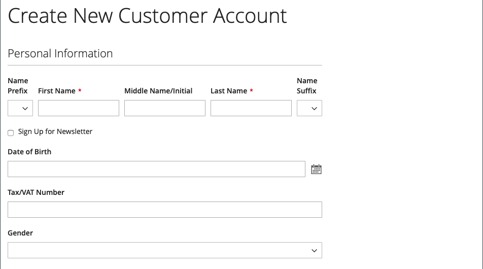
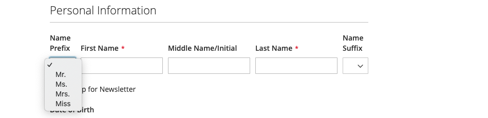

# Optionen für Kundenname und Adresse

Die _Name- und Adressenoptionen_ bestimmen, welche Felder in den Namen- und Adressformularen enthalten sind, wenn Kunden ein [Konto](../customers/account-create.md) für Ihren Store erstellen.

{width="500" zoomable="yes"}

Die Schritte zum Konfigurieren der Namen- und Adressenoptionen unterscheiden sich je nach Adobe Commerce und Magento Open Source.

## Namen- und Adressenoptionen für Adobe Commerce konfigurieren

Sie können die Namen- und Adressoptionen konfigurieren, die Kunden auf der Storefront angezeigt werden, wenn sie ihr Konto erstellen.

### Schritt 1: Festlegen des Umfangs der Konfiguration

1. Wechseln Sie in der Seitenleiste _Admin_ zu **[!UICONTROL Stores]** > _[!UICONTROL Settings]_>**[!UICONTROL Configuration]**.

1. Erweitern Sie im linken Bereich den Wert **[!UICONTROL Customers]** und wählen Sie **[!UICONTROL Customer Configuration]** aus.

1. Erweitern Sie den Abschnitt **[!UICONTROL Name and Address Options]** .

   >[!INFO]
   >
   >Beachten Sie, dass der Umfang der Namen- und Adressenoptionen auf `website` -Ebene gilt.

1. Scrollen Sie nach oben auf der Seite und legen Sie den Umfang der Konfiguration auf einen der folgenden Werte fest:

   - `Default Config`
   - `Main Website` (oder spezifische Site für Installationen mehrerer Sites)

   >[!INFO]
   >
   >Der Abschnitt _[!UICONTROL Name and Address Options]_wird nicht angezeigt, wenn der Umfang auf `Default Store View` festgelegt ist.

   {width="700" zoomable="yes"}

### Schritt 2: Konfigurieren Sie die Namen- und Adressenoptionen.

1. Kehren Sie zum Abschnitt [!UICONTROL _Name und Adressenoptionen_] auf der Seite &quot;Kundenkonfiguration&quot;zurück.

   >[!INFO]
   >
   > Wenn Sie die Bereichseinstellung `Default config` nicht verwenden, müssen Sie das Kontrollkästchen `Use Default` für jedes Feld deaktivieren, bevor Sie den Wert ändern.

   {width="600" zoomable="yes"}

1. Geben Sie für &quot;**[!UICONTROL Prefix Dropdown Options]**&quot;jedes Präfix ein, das in der Liste angezeigt werden soll (durch Semikolon getrennt).

   >[!IMPORTANT]
   >
   >Setzen Sie ein Semikolon vor den ersten Wert, um oben in der Liste einen leeren Wert anzuzeigen.

1. Geben Sie für &quot;**[!UICONTROL Suffix Dropdown Options]**&quot;jedes Suffix ein, das in der Liste angezeigt werden soll (durch Semikolon getrennt).

1. Um die folgenden Felder in Kundenformulare einzuschließen, setzen Sie den Wert für jeden auf `Optional` oder `Required`.

   - **[!UICONTROL Show Telephone]**
   - **[!UICONTROL Show Company]**
   - **[!UICONTROL Show Fax]**

### Schritt 3: Speichern und aktualisieren

1. Klicken Sie nach Abschluss des Vorgangs auf **[!UICONTROL Save Config]**.

1. Klicken Sie in der Meldung oben auf der Seite auf **[!UICONTROL Cache Management]** und [refresh](../systems/cache-management.md) jeden ungültigen Cache.

## Name und Adressenoptionen für die Magento Open Source konfigurieren

Konfigurieren Sie die Namen- und Adressenoptionen, die Kunden auf der Storefront angezeigt werden, wenn sie ihr Konto erstellen.

{width="500" zoomable="yes"}

### Schritt 1: Festlegen des Umfangs der Konfiguration

1. Wechseln Sie in der Seitenleiste _Admin_ zu **[!UICONTROL Stores]** > _[!UICONTROL Settings]_>**[!UICONTROL Configuration]**.

1. Erweitern Sie im linken Bereich den Wert **[!UICONTROL Customers]** und wählen Sie **[!UICONTROL Customer Configuration]** aus.

1. Erweitern Sie den Abschnitt **[!UICONTROL Name and Address Options]** .

   >[!IMPORTANT]
   >
   > Beachten Sie, dass der Umfang der Namen- und Adressenoptionen auf `website` -Ebene gilt.

   {width="600" zoomable="yes"}

1. Scrollen Sie nach oben auf der Seite zurück und legen Sie den Umfang der Konfiguration auf einen der folgenden Werte fest:

   - `Default Config`
   - `Main Website` (oder spezifische Site für Installationen mehrerer Sites)

   >[!NOTE]
   >
   >Der Abschnitt _Name und Adressenoptionen_ wird nicht angezeigt, wenn der Umfang auf `Default Store View` festgelegt ist.

   {width="600" zoomable="yes"}

### Schritt 2: Konfigurieren Sie die Namen- und Adressenoptionen.

1. Kehren Sie zum Abschnitt [!UICONTROL _Name und Adressenoptionen_] auf der Seite &quot;Kundenkonfiguration&quot;zurück.

   >[!INFO]
   >
   >Wenn Sie die Bereichseinstellung `Default config` nicht verwenden, müssen Sie das Kontrollkästchen `Use Default` für jedes Feld deaktivieren, bevor Sie den Wert ändern.

1. Geben Sie für **Anzahl der Zeilen in einer Straßenadresse** eine Zahl zwischen 1 und 4 ein.

   >[!WARNING]
   >
   >Standardmäßig beträgt die Straße drei Zeilen.

1. Um ein Präfix (z. B. Herr oder Frau) als Teil des Namens einzufügen, setzen Sie **Präfix anzeigen** auf `Yes`.

   {width="600" zoomable="yes"}

   >[!INFO]
   >
   >Geben Sie für &quot;**Präfix-Dropdown-Optionen**&quot;jedes Präfix ein, das in der Liste angezeigt werden soll (durch Semikolon getrennt). Sie können ein Semikolon vor dem ersten Wert platzieren, um oben in der Liste einen leeren Wert anzuzeigen.

1. Um ein optionales Feld für den Vornamen oder den Anfangstitel des Kunden einzuschließen, setzen Sie **[!UICONTROL Show Middle Name (initial)]** auf `Yes`.

1. So fügen Sie ein Suffix hinzu (z. B. Jr. oder Sr.) nach dem Kundennamen, setzen Sie **[!UICONTROL Show Suffix]** auf einen der folgenden Werte:

   - `Optional`
   - `Required`

   >[!INFO]
   >
   >Geben Sie für **Suffix-Dropdown-Optionen** jedes Suffix ein, das in der Liste angezeigt werden soll, getrennt durch Semikolon. Sie können ein Semikolon vor dem ersten Wert platzieren, um oben in der Liste einen leeren Wert anzuzeigen.

1. Um das Geburtsdatum einzubeziehen, setzen Sie **[!UICONTROL Show Date of Birth]** auf einen der folgenden Werte:

   - `Optional`
   - `Required`

   >[!INFO]
   >
   >Beachten Sie im Einklang mit den aktuellen Best Practices für Sicherheit und Datenschutz alle potenziellen rechtlichen und sicherheitstechnischen Risiken, die mit der Speicherung des vollständigen Geburtsdatums (Monat, Tag, Jahr) der Kunden mit anderen persönlichen Identifikatoren verbunden sind. Es wird empfohlen, die Speicherung der vollständigen Geburtsdaten der Kunden zu begrenzen und stattdessen das Geburtsjahr des Kunden zu verwenden.

   Kunden können das Kalendersymbol nach dem Feld verwenden, um das Geburtsdatum aus einem Popup-Kalender auszuwählen.

   {width="600" zoomable="yes"}

1. Um Kunden die Eingabe ihrer Steuer oder [Mehrwertsteuer](../stores-purchase/vat.md)-Nummer zu ermöglichen, setzen Sie **[!UICONTROL Show Tax/VAT Number]** auf einen der folgenden Werte:

   - `Optional`
   - `Required`

1. Um ein Feld für das Geschlecht in das Kundenformular einzuschließen, setzen Sie **[!UICONTROL Show Gender]** auf einen der folgenden Werte:

   - `Optional`
   - `Required`

   {width="600" zoomable="yes"}

1. Um die folgenden Felder in Kundenformulare einzuschließen, setzen Sie den Wert für jeden auf `Optional` oder `Required`.

   - **[!UICONTROL Show Telephone]**
   - **[!UICONTROL Show Company]**
   - **[!UICONTROL Show Fax]**

### Schritt 3: Speichern und aktualisieren

1. Klicken Sie nach Abschluss des Vorgangs auf **[!UICONTROL Save Config]**.

1. Klicken Sie in der Meldung oben auf der Seite auf **[!UICONTROL Cache Management]** und [refresh](../systems/cache-management.md) jeden ungültigen Cache.
