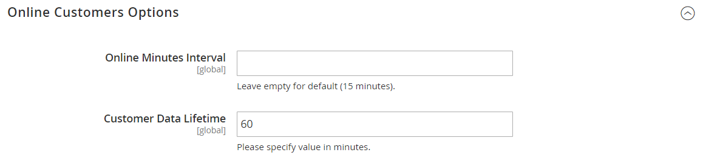

# Kunden jetzt online

Die Option **[!UICONTROL Now Online]** im Menü [!DNL Customers] listet alle Kundinnen und Kunden sowie Besucherinnen und Besucher auf, die derzeit in Ihrem Geschäft online sind. Das Zeitintervall, in dem Kundinnen und Kunden angezeigt werden, während der sie aktuell online sind, wird in der Konfiguration festgelegt und bestimmt, wie lange die [!DNL Customer's] Aktivität von der Administratorin bzw. vom Administrator sichtbar ist. Standardmäßig beträgt das Intervall 15 Minuten. Die Sitzung endet, wenn die Tastatur während dieser Zeit nicht verwendet wird und sich Kunden erneut bei ihren Konten anmelden müssen, um den Einkauf fortzusetzen. Beachten Sie, dass der Inhalt der Warenkörbe für den späteren Zugriff gespeichert wird.

{width="700" zoomable="yes"}

Der Online-Status von Kundinnen und Kunden wird nur bei der Kundenanmeldung, Registrierung oder einem anderen Statusänderungsereignis aktualisiert. Dazu gehören Warenkorb-bezogene Ereignisse, z. B. das Hinzufügen, Entfernen und Ändern von Produkten.

>[!NOTE]
>
>Bei Seitenbesuchen allein wird der Online-Status des Kunden nicht aktualisiert. Um solche Informationen zu erfassen, wird empfohlen, [Google Analytics einzurichten](../merchandising-promotions/google-analytics.md) (allein oder mit [Google Tag Manager](../merchandising-promotions/google-tag-manager.md)) oder andere Analytics-Software mit Adobe Commerce zu verwenden.

## Alle derzeit online verfügbaren Kunden anzeigen

Navigieren Sie in der _Admin_-Seitenleiste zu **[!UICONTROL Customers]** > **[!UICONTROL Online Now]**.

>[!TIP]
>
>Informationen zur Unterstützung eines Online-Kunden beim Abschluss eines Kaufs finden Sie unter [Shopping-Hilfe](../stores-purchase/introduction.md#shopping-assistance).

## Konfigurieren des Zeitintervalls

1. Navigieren Sie in _Admin_-Seitenleiste zu **[!UICONTROL Stores]** > _[!UICONTROL Settings]_>**[!UICONTROL Configuration]**.

1. Erweitern Sie im linken Bereich **[!UICONTROL Customers]** und wählen Sie **[!UICONTROL Customer Configuration]**.

1. Erweitern Sie den Abschnitt **[!UICONTROL Online Customers Options]** und gehen Sie folgendermaßen vor:

   {width="600" zoomable="yes"}

   - Geben Sie **[!UICONTROL Online Minutes Interval]** die Anzahl der Minuten ein, die die Kundensitzung vom Administrator eingesehen werden soll. Lassen Sie das Feld leer, um das Standardintervall von 15 Minuten zu akzeptieren.

   - Geben Sie **[!UICONTROL Customer Data Lifetime]** die Anzahl der Minuten ein, nach denen vom Kunden eingegebene nicht gespeicherte Daten ablaufen.

1. Klicken Sie abschließend auf **[!UICONTROL Save Config]**.

## Spaltenbeschreibungen

| Spalte | Beschreibung |
| --- | --- |
| **[!UICONTROL ID]** | Die Kunden-ID eines registrierten Kunden. |
| **[!UICONTROL First Name]** | Der Vorname eines registrierten Kunden. |
| **[!UICONTROL Last Name]** | Der Nachname eines registrierten Kunden. |
| **[!UICONTROL Email]** | Die E-Mail-Adresse eines registrierten Kunden. |
| **[!UICONTROL Last Activity]** | Datum und Uhrzeit der letzten Aktivität des Kunden in Ihrem Geschäft. |
| **[!UICONTROL Type]** | Optionen: `Customer` / `Visitor` |
| **[!UICONTROL Last URL]** | Die letzte URL, die der Kunde besucht hat. |
| **[!UICONTROL Company]** | Der Name des Unternehmens, dem der Benutzer angehört. |

{style="table-layout:auto"}
