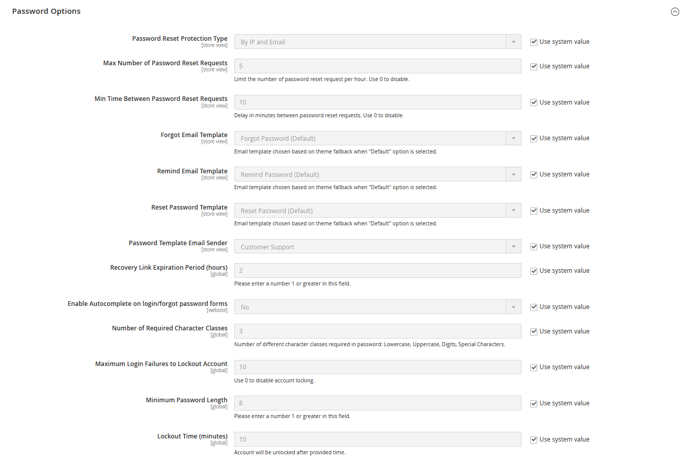

# Optionen für Kundenkennwörter

Die Optionen für das Kundenkennwort bestimmen die Sicherheitsstufe, die für Anforderungen zum Zurücksetzen des Kennworts verwendet wird, die für die Kundenbenachrichtigung verwendeten E-Mail-Vorlagen und die Lebensdauer des Kennwortwiederherstellungs-Links. Sie können Kunden gestatten, ihre eigenen Kennwörter zu ändern oder verlangen, dass nur Store-Administratoren dies tun können.

## Optionen für das Kundenkennwort konfigurieren

1. Wechseln Sie in der Seitenleiste _Admin_ zu **[!UICONTROL Stores]** > _[!UICONTROL Settings]_>**[!UICONTROL Configuration]**.

1. Erweitern Sie im linken Bereich den Wert **[!UICONTROL Customers]** und wählen Sie **[!UICONTROL Customer Configuration]** aus.

1. Erweitern Sie den Abschnitt **[!UICONTROL Password Options]** .

   {width="600" zoomable="yes"}

1. Setzen Sie &quot;**[!UICONTROL Password Reset Protection Type]**&quot;auf die Methode, die Sie zur Überprüfung von Kennwortrücksetzanforderungen verwenden möchten:

   - `By IP and Email` - Überprüfen Sie, ob Sie zuvor versucht haben, das Kennwort für eine bestimmte E-Mail oder von einer bestimmten IP-Adresse zurückzusetzen.
   - `By IP` - Überprüfen Sie, ob Sie zuvor versucht haben, das Kennwort von einer bestimmten IP-Adresse zurückzusetzen.
   - `By Email` - Überprüfen Sie, ob Sie zuvor versucht haben, das Kennwort für eine bestimmte E-Mail zurückzusetzen.
   - `None` - Schutz deaktiviert (keine Beschränkungen für das Zurücksetzen des Kennworts).

   Die **[!UICONTROL Max Number of Password Reset Requests]** und **[!UICONTROL Min Time Between Password Reset Requests]** werden anhand dieser Konfiguration berechnet.

1. Gehen Sie wie folgt vor, um die Anzahl der pro Stunde gesendeten Anforderungen zum Zurücksetzen des Kennworts zu begrenzen:

   - Geben Sie für &quot;**[!UICONTROL Max Number of Password Reset Requests]**&quot;die maximale Anzahl von Anforderungen zum Zurücksetzen des Kennworts ein, die pro Stunde gesendet werden können.

   - Geben Sie für &quot;**[!UICONTROL Min Time Between Password Reset Requests]**&quot;die Mindestanzahl von Minuten ein, die zwischen Anforderungen verstreichen muss.

1. Gehen Sie wie folgt vor, um die E-Mail-Benachrichtigung zum Zurücksetzen des Kennworts zu konfigurieren:

   - Setzen Sie **[!UICONTROL Forgot Email Template]** auf die Vorlage, die für die an Kunden gesendete E-Mail verwendet wird, die ihr Passwort vergessen haben.

   - Setzen Sie **[!UICONTROL Remind Email Template]** auf die Vorlage, die verwendet wird, wenn ein Kundenkennwort von einem Admin-Benutzer zurückgesetzt wird.

   - Setzen Sie **[!UICONTROL Reset Password Template]** auf die Vorlage, die verwendet wird, wenn Kunden ihr Passwort ändern.

   - Setzen Sie **[!UICONTROL Password Template Email Sender]** auf den [store contact](../getting-started/store-details.md) , der als Absender kennwortbezogener Benachrichtigungen angezeigt wird.

1. Führen Sie die folgenden Sicherheitsoptionen für das Zurücksetzen des Kennworts aus:

   - Geben Sie für &quot;**[!UICONTROL Recovery Link Expiration Period (hours)]**&quot;die Anzahl der Stunden ein, bevor der Link zur Passwortwiederherstellung abläuft.

   - Wenn Sie möchten, dass die Felder in der Kundenanmeldung automatisch ausgefüllt werden und die Kennwortformulare aus früheren Einträgen nicht ausgefüllt werden, setzen Sie **[!UICONTROL Enable Autocomplete on login/forgot password forms]** auf `Yes`.

   - Geben Sie für **[!UICONTROL Number of Required Character Classes]** die Anzahl verschiedener Zeichentypen ein, die basierend auf den folgenden Zeichenklassen in ein Kennwort einbezogen werden müssen:

      - `Lowercase`
      - `Uppercase`
      - `Numeric`
      - `Special Characters`

   - Geben Sie für &quot;**[!UICONTROL Maximum Login Failures to Lockout Account]**&quot;die Anzahl fehlgeschlagener Anmeldeversuche ein, bis das Kundenkonto gesperrt ist. Geben Sie für unbegrenzte Versuche null (`0`) ein.

   - Geben Sie für &quot;**[!UICONTROL Minimum Password Length]**&quot;die Mindestanzahl von Zeichen ein, die in einem Kennwort verwendet werden können. Die Zahl muss größer als null sein.

   - Geben Sie für &quot;**[!UICONTROL Lockout Time (minutes)]**&quot;die Anzahl der Minuten ein, nach denen ein Kundenkonto nach zu vielen fehlgeschlagenen Anmeldeversuchen gesperrt wird.

1. Klicken Sie nach Abschluss des Vorgangs auf **[!UICONTROL Save Config]**.
