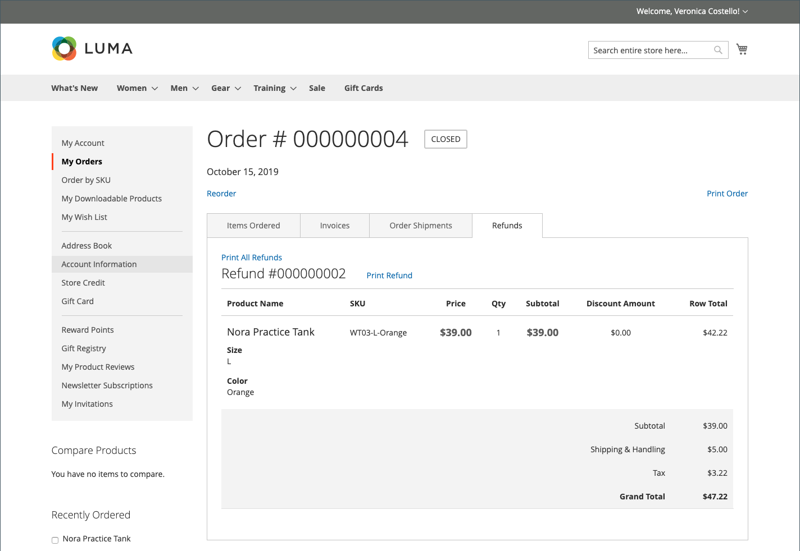

# Rückerstattungen im Dashboard des Kundenkontos

{{ee-feature}}

Wenn eine Rückerstattung für eine Bestellung ausgestellt wurde, können Kunden die mit der Bestellung verbundenen Rückerstattungsinformationen in ihrem Konto-Dashboard anzeigen. Wenn Sie die Option [!UICONTROL _Shop-Kreditverlauf für Kunden anzeigen_] für [Store-](../customers/credit-configure.md) aktiviert haben, können Kunden auch auf ihren [Shop-](../customers/store-credit.md) zugreifen.

## Eine Rückerstattung auf der Storefront anzeigen

1. In der Storefront meldet sich der Kunde bei seinem Konto an.

1. Ermittelt die Reihenfolge mithilfe einer der folgenden Methoden:

   * Suchen der Bestellung in der Liste der **letzten Bestellungen** und Klicken auf **[!UICONTROL View]**.
   * Wählen Sie im linken Bedienfeld **[!UICONTROL My Orders]** aus. Suchen Sie dann die Reihenfolge in der Liste und klicken Sie auf **[!UICONTROL View]**.

1. Der Kunde klickt auf die Registerkarte **[!UICONTROL Refunds]** , um die Details der Rückerstattung anzuzeigen.

   {width="700" zoomable="yes"}

## Anzeigen des Kontostands und des Verlaufs des Shops in der Storefront

Methode 1: **Vom Kundenkonto-Dashboard**

1. In der Storefront meldet sich der Kunde beim Konto an.

1. Wenn die Rückerstattung für das Speichern von Guthaben angewendet wurde, wählen Sie im linken Bedienfeld **[!UICONTROL Store Credit]** aus.

1. Der Betrag, der an das Store-Guthaben zurückerstattet wurde, wird in der Liste mit Datum und Uhrzeit der Aktion angezeigt.

   {width="700" zoomable="yes"}

   >[!INFO]
   >
   >Die Store-Kreditseite enthält auch einen Link für den Kunden zum Einlösen einer [Geschenkkarte](../stores-purchase/product-gift-card-workflow.md#check-status-and-balance-of-the-gift-card).

Methode 2: **Von der Seite _Überprüfung und Zahlungen_**

1. Der Kunde fügt dem Warenkorb ein Produkt hinzu.

2. Wechselt zur Seite _Checkout_.

3. Übergibt den **[!UICONTROL Shipping]** Schritt.

4. Wenn ein Warenkorb verfügbar ist, klickt der Kunde auf **[!UICONTROL Use Store Credit]**.

   {width="700" zoomable="yes"}

5. Wenn der Kunde die Verwendung des Gutscheins im Geschäft anders überlegt, klickt auf **[!UICONTROL Remove]** im Abschnitt _Bestellzusammenfassung_.

## Zahlungsaktionen in der Admin-Instanz

Sie können Zahlungsaktionen für Ihre spezifische [Zahlungsmethode](../configuration-reference/sales/payment-methods.md) konfigurieren. Jede Zahlungsmethode verfügt über einen anderen Satz von Zahlungsaktionen.

| Zahlungsaktion | Beschreibung |
|--- |---|
| [!UICONTROL Capture Online] | Wenn die Rechnung eingereicht wird, erfasst das System die Zahlung vom Zahlungs-Gateway eines Drittanbieters. Ein Administrator kann dann eine Gutschrift erstellen und die Rechnung annullieren. |
| [!UICONTROL Capture Offline] | Wenn die Rechnung übermittelt wird, erfasst das System die Zahlung nicht. Es wird davon ausgegangen, dass die Zahlung direkt über das Gateway erfasst wird und nicht über Adobe Commerce erfasst werden kann. Ein Administrator kann dann eine Gutschrift erstellen, die Rechnung jedoch nicht annullieren. (Obwohl für die Bestellung eine Online-Zahlung verwendet wurde, handelt es sich bei der Rechnung im Wesentlichen um eine Offline-Rechnung.) |
| [!UICONTROL Not Capture] | Wenn die Rechnung übermittelt wird, erfasst das System die Zahlung nicht. Es wird davon ausgegangen, dass die Zahlung später über Adobe Commerce erfasst wird. In der [!UICONTROL _Rechnung befindet sich_] Schaltfläche „Erfassen“. Vor der Erfassung können Sie die Rechnung stornieren. Nach der Erfassung können Sie eine Gutschrift erstellen und die Rechnung stornieren. |

{style="table-layout:auto"}

>[!WARNING]
>
>Wählen Sie die [!UICONTROL _Nicht erfassen_], es sei denn, Sie sind sicher, dass Sie die Zahlung später über Adobe Commerce erfassen werden. Eine Gutschrift kann erst erstellt werden, nachdem die Zahlung mit der Schaltfläche &quot;[!UICONTROL _&quot; erfasst_].
